# Ghidra and Emotion Engine Extension
An example using Tales of Destiny DC.

## Prerequisites
1. Download [Ghidra](https://ghidra-sre.org/)
2. Download [Ghidra-Emotion Engine extension](https://github.com/beardypig/ghidra-emotionengine/releases)
3. Download and install [Adopt OpenJDK 11 (LTS)](https://adoptopenjdk.net/)

## Instructions
Extract Ghidra and double-click on `ghidraRun.bat`  
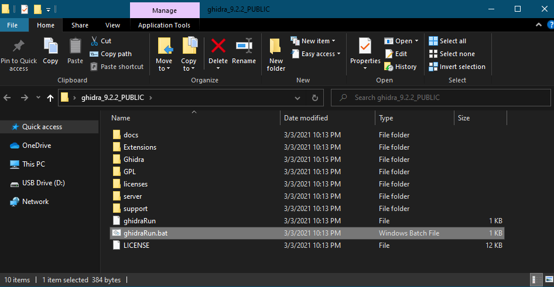

File > New Project  
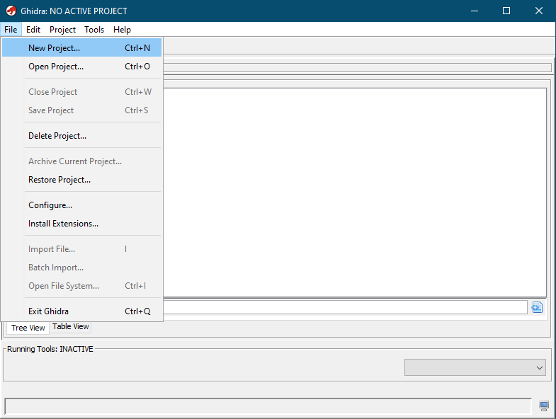

Non-Shared Project > Next  
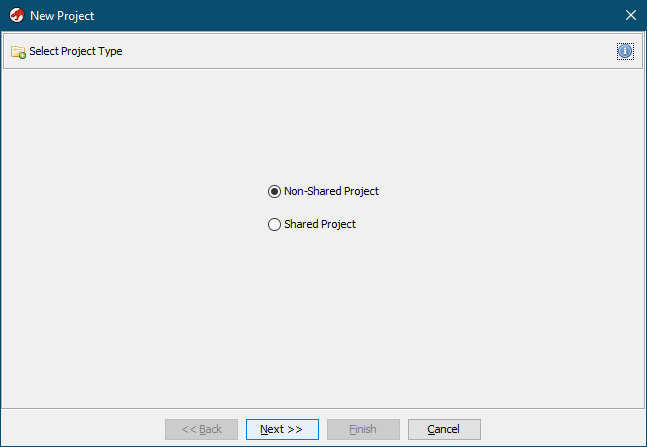

Select Project Directory and give the project a name  
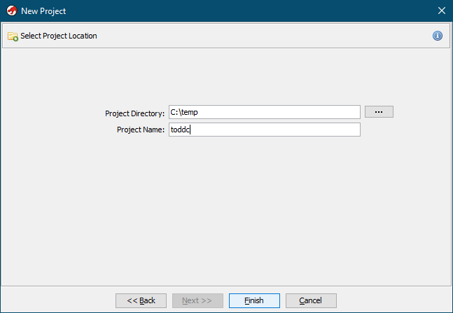

File > Install Extension > Select ghidra-emotionengine folder
You may need to close and re-open the program for the extension to work.  
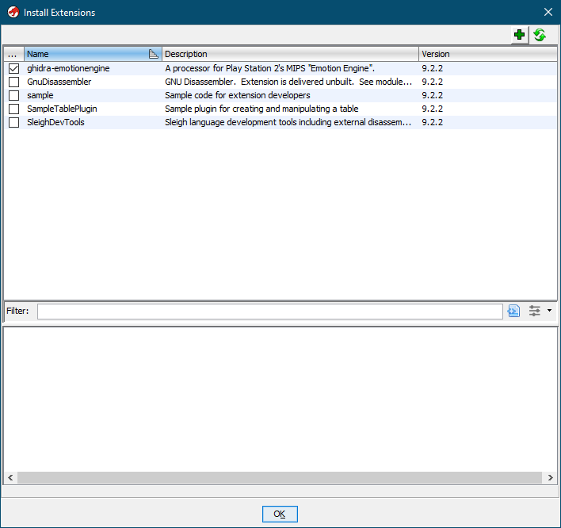

File > Import File... > Select SLPS_258.42  
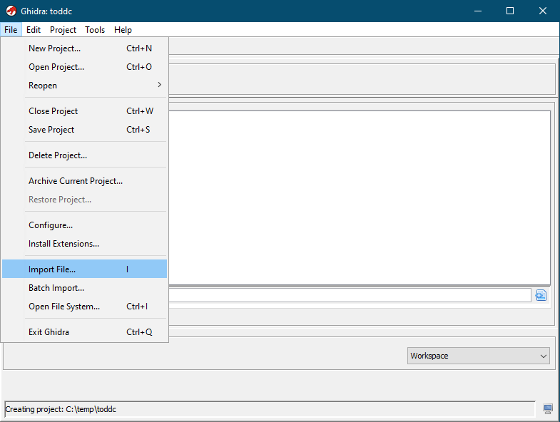

Click OK  
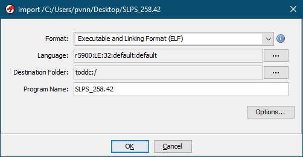

Click OK  
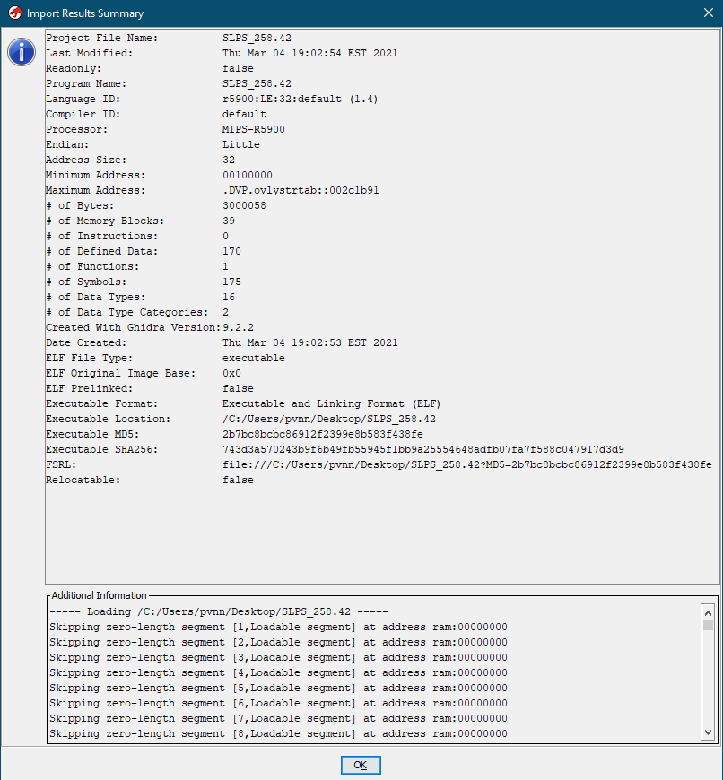

Click the Code Browser button (green dragon icon)
If no code shows up, close and re-open program to Auto-Analyze  
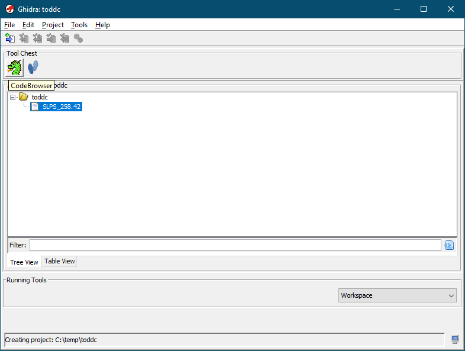

If no code shows up automatically, go to File > Open...  
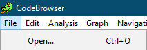

Select SLPS_258.42 and click OK  
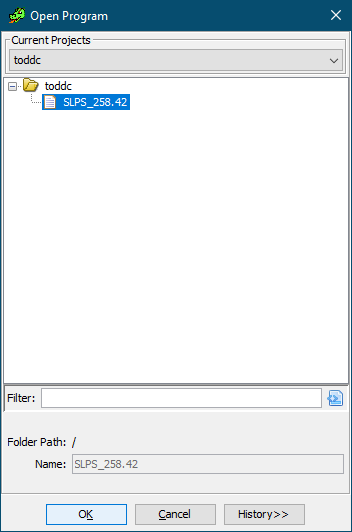

Click Yes to Analyze  
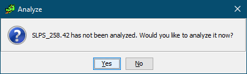

You only need **Data Reference** but you can select the other analyzers as well.  Click **Analyze** when done.  
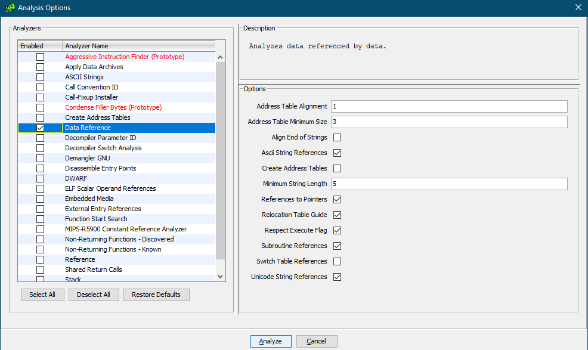

For SLPS_258.42 specifically, click .data on the left to see some pointer data.  Hover the cursor over the offsett and take note of the Byte Source Offset: `SLPS_258.42 + D7C80`
Use a Hex caluclator and do `1D6C80 - D7C80` to get the base pointer `FF000` to be used with `abcde`, `atlas`, and `cartographer`.  
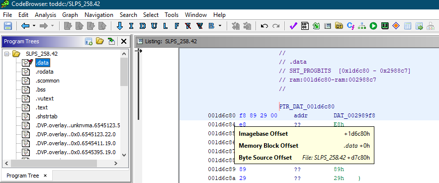
