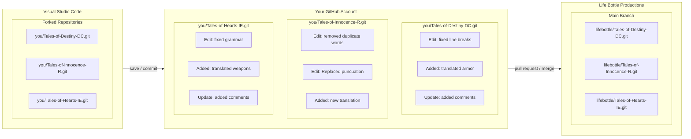

# GitHub Desktop
Here's how to setup Github Desktop to be able to contribute to the Story and skit on these project.

## Prerequisites
1. Create an account on https://github.com/
2. Download Github Desktop https://desktop.github.com/
3. Download Visual Studio Code https://code.visualstudio.com/ 
4. You have to fork the repository to your GitHub account in order to contribute.  For example, the Tales of Destiny DC repository link is https://github.com/lifebottle/Tales-of-Destiny-DC.git

## Github Desktop 
1. Click on "File" in the top left corner
2. Select "Clone Repository..." (a new window will open)
3. Select the URL tab and paste the link to the (forked) repository.  
4. In the local path, under the place where you pasted the above link, you need to select where you want the folder to be on your computer
5. Afterward, click on the "Clone" blue button, this will download a local copy on your computer.  This is where you will make changes.

## Visual Studio Code
1. Now is the time to  open the folder we created  with Github Desktop
2. Select the Blue button "Open Folder" and  navigate to the place where you've clone the repostory with GitHub in the previous steps.
3. Now you are ready to make an edit in the file you want.

## GitHub
1. After you save your edit, you need to create a "Pull Request" with Github Desktop
2. First, press on the "Fetch origin" button
3. Then Click on the "Branch" Button on the top bar and select "Merge into Current Branch" and click on "Upstream/Master"
4. Press on  "Push Origin" 
5. Click on the "Branch" Button on the top bar and select "Create a Pull Request" this will take you to the GitHub website
6. Write a  desciption  of the change you made and send the pull request. 

CONGRATS, YOU'VE MADE YOUR FIRST EDIT!