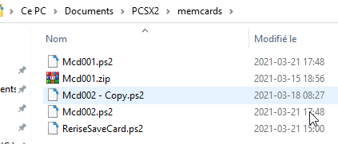
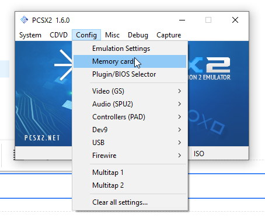
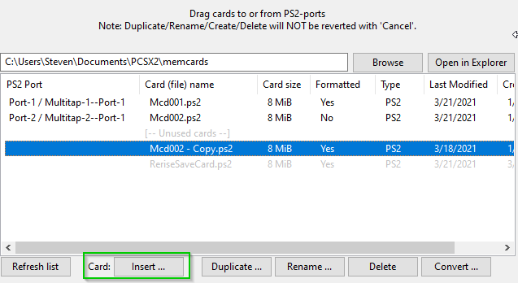
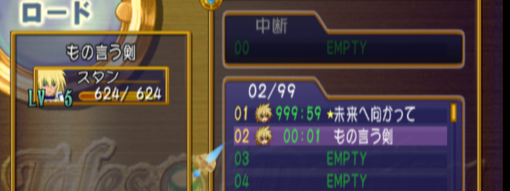

# Import PS2 Save Files
In this example, we import save files to a PS2 memory card to start with a 100% Save file for Tales of Destiny DC.  These instructions apply for other PS2 save files as well.

## Example with Tales of Destiny DC
It's really usefull when we want to validate all the translations of different elements of the menu or just validate some Skits (Katz village).  Download the save file [here](https://mega.nz/file/LxwngaLJ#CmTP61PiOpom_KkHepxEYo953jem_OcO_jPUswcxpH4) or [here](https://gamefaqs.gamespot.com/ps2/942208-tales-of-destiny-directors-cut/saves).  The first link is a save file where you start close the Kats village. The second link is an alternative in case the first doesn't work anymore.

Find this folder for PSCX2 emulator and put the save file in there
Path should looks like this  My PC / Documents / PCSX2 / memcards  

Open PCSX2 emulator and select Config > Memory card  

Find your memory card (probably in the unused section) and click insert. You'll be asked to select a Target memory card, just select port 1.  

Now if you open the game, you should be able to see the 100% save file  

It's a good idea to use this memory card as your main card  and just create your new game under it. This way you avoid to always switch between 2 memory cards to test stuff