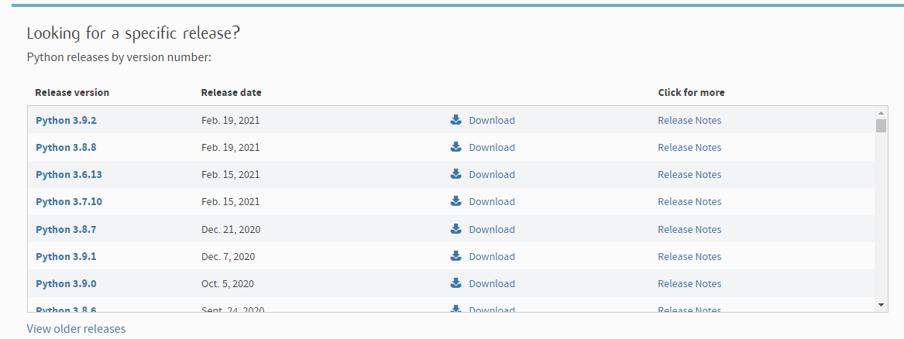
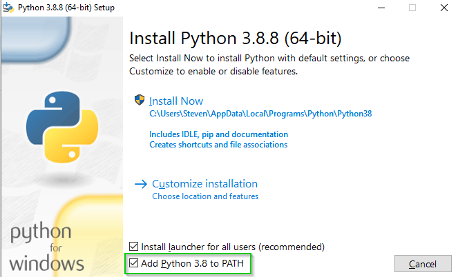

# Python

## Installation (Windows)
1.  Go to https://www.python.org/downloads/

2. Find the latest version of Python and click on Download  

3. Scroll down and find the installer (32-bit or 64-bit depending on your machine)  

4. Choose Install now and make sure to check "Add Python to PATH"  

You should now have Python installed