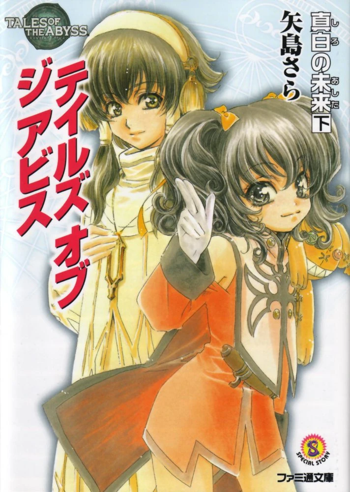
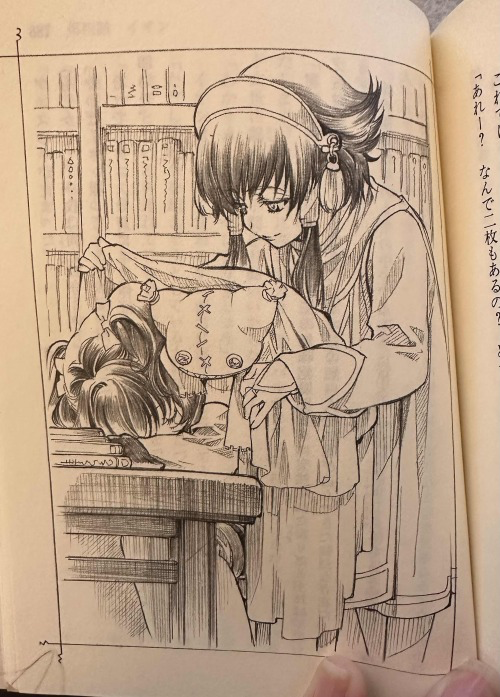

"...Thus shall Auldrant be destroyed by the miasma and
turned to dust---"

Anise Tatlin was taken aback by the voice that came
through the cold, snowy air.

It was the voice of Ion, the leader of the Order of
Lorelei, whom her own betrayal had killed.

The voice trembled weakly, as if it might disappear at
any moment.

'Ion---!?'

But Anise quickly dismissed the thought. Ion would
never again recite the Score.

At the entrance of the Absorption Gate, Asch had called
out to Luke, "Van is outside! He's watching Mohs make Ion's replica read
the Score on the Seventh Fonstone."

I am the seventh replica.

Anise remembered what Ion had said back then.

'Then, there really is... There really were more
replicas of the original Ion aside from the Ion I worked for and
Sync!'

Anise slipped past Luke fon Fabre and rose as high as
she could on her tiptoes.

"This is the end of Auldrant..."

The owner of the voice finally finished reading the
Score and he collapsed into the snow. A fragment of the Seventh Fonstone
fell from his hand.

'Ion ran out of power every time he dispelled the
Daathic seals---he often collapsed.'

The Fon Master is naive and easy to trick.

She felt ashamed, angry at herself for always thinking
of Ion that way.

At that time, Grand Maestro Mohs, who had grown
monstrous due to taking in the Seventh Fonon, let out an angry
voice.

"Hah hah hah hah hah hah! You must have...read that
wrong!"

By the time Anise had started to shout at him, Luke had
already protected Ion's replica from the Grand Maestro's attack.

'What should I do...he's going to kill that
kid!'

However, thanks to the hyperresonance and the Jewel of
Lorelei that Luke had, Mohs flew away into the sky.

Before anyone could relax, Lorelei, who was trapped
inside of Van Grants, began to rampage.

\* \* \*

The replica of Ion was left where he was.

Not just Van and Legretta, who had flown away on a
monster, but even Sync, who had been born from the same Score, did not
show any sign of caring about him.

'We're going to have to go to the Radiation Gate now.
But...then he'll freeze here.'

"Hey..."

Anise looked at her friends with reservation etched
into her expression.

"What's wrong, Anise?"

Natalia Luzu Kimlasca Lanvaldear turned to her.

Anise ran up to the replica, grabbed his hand, which
was shaking with cold and fear, and brought him before her friends. The
poor boy had no shoes and his feet were swollen and red.

"Is it okay if we take this kid to Daath?"

At being on the receiving end of everyone's attention,
the Replica shrank down.

"Good idea. Okay, let's get him to Daath." Luke was the
first to agree.

"But is it a good idea to keep him in Daath when he
looks like Ion?" Guy shrugged his shoulders.

"Why don't you name him, Anise? He has grown attached
to you, after all." Tear smiles as she holds his hand firmly.

'A name for this kid...'

Anise looks up once at the replica's profile, then
stared at the snow and thought for a moment.

The pure white snow was like the replica, free of
impurities and benefits alike.

"...Florian," Anise said and looked up.

"It means 'innocent one,'" Jade Curtis added.

"Florian...that is a good name." Natalia nods, and the
replica smiled at the one who named him.

"Ani...se."

"Yes, that's my name. I'm Anise and you're
Florian."

"Anise, Anise, Florian, Anise." Florian smiled happily
as he repeated the names over and over again.

\* \* \*

'If I were to ask someone in Daath to take care of
Florian, who should I ask?' Anise thought in the
Albiore.

First, the faces of her parents came to mind, but those
two still didn't know that Ion had been replaced by a replica. It would
be confusing to have them meet Florian out of the blue.

'We're going to fight Van, it's possible that I won't
be coming back... Who will he be safe with if that happens?'

In the end, she decided to leave it in the hands of the
Maestro Tritheim. He would be fine.

Fortunately, when she asked him about the situation,
the Maestro immediately agreed. Tritheim said he would let Florian use
Ion's old room.

"Well, I'm off then."

As she was about to leave with Luke and the others,
Florian's expression turned puzzled.

"You're not staying, Anise?"

"Yes, but I'll be back soon. Wait for me,
Florian."

Their eyes met.

'Ion...!'

Anise wondered why she didn't notice sooner.

Ion's last words were impossible to get out of her
mind.

---You don't have to...watch over me...any
more...Anise...

Thank you...for everything... My
most...cherished...

'I wonder if he thought I was just the most important
Fon Master Guardian before his death. Or...'

Anise hadn't realized until Ion disappeared that she
also thought of Ion as irreplaceable. She knew that she shouldn't, but
she only ever took advantage of him.

Anise waved wildly at Florian to hide the pain in her
chest.

\* \* \*

"Anise, you're gone."

Florian's shoulders slumped at the entrance to the
church, and he blurted out the name he had just been given,
\"Florian".

He knew there was such a thing as a name, but he had
never imagined that he would ever be given one. But he had never
imagined that he would ever be given one.

Until now, he had only existed there as something that
could not be named.

He stared at his palm. It was the hand Anise had held
just a moment before. As long as he didn't forget that warmth, he felt
like his hand would never disappear.

He could vaguely remember when three naked bodies that
looked exactly like him had disappeared on hot rocks.

'None of them had names. Maybe that was why they
disappeared...'

\* \* \*

In a dimly-lit room, a huge fon machine repeatedly
flashed with light. It groaned faintly, probably due to the fact that
the operation was taking longer than planned.

"Try measuring again.\" Van Grants ordered
Ahmed.

Hearing frustration in Van's voice, Ahmed glanced over
at Grand Maestro Mohs. When his boss nodded, he picked up the measuring
instrument.

Three boys stood side by side on the platform next to
the fon machine. None of them wore anything, and their pale skin was
exposed to the air. Their dainty shoulders, their thin legs, and even
their facial features were exactly the same.

The first replica they'd made was better left unspoken.
Van and his team had killed it on the spot. It was only with the second
one that they managed to get a replica that they could look at.

Ahmed stood in front of the boy on the far left and
held a measuring device to his vacant eyes to examine his Seventh Fonon
level. Then, he placed a small piece with an embedded fonon circuit on
his forehead.

"No change," he said. "Both in terms of the Seventh
Fonon and physical capacity, he's too lacking."

"Mnh." Mohs folded his arms, making no attempt to hide
his displeasure "Does this mean that the original Ion is too sickly and
weak for this?"

"No, we should be able to adjust a little more... We
can increase the steps as far as the equilibrium can be maintained.\"
Van stated, reaching for the control panel of the fon machine.

Ahmed took the second boy's measurements, but the
result was the same.

"Ah!"

Suddenly, the boy on the far right let out a short cry
and fell down.

"Hey, are you all right?" Ahmed rushed to hold the boy
in his arms, but his vacant eyes were sightless.

"...I'm okay...I'm okay... I..."

"That's enough." Mohs jerked his chin towards a corner.
"Put those three over there."

"Yes, Grand Maestro."

Immediately, the assistants took the three boys the
corner of the room. One of the boys crouched there, one collapsed, and
the other just stood there as if in a daze.

Well, I guess it's better that they can talk. I heard
that the replica you built before couldn't even walk. If you've
imprinted basic skills on it this well, the rest should be a lot
easier." Mohs said to Van with a sarcastic smile. 

Van chuckled to himself as he recalled the replica of
Luke fon Fabre that he had once left at Choral Castle.

'That was certainly terrible, that's for sure. Even if
there was nothing wrong with his body, he was like a baby, and he
couldn't even chew or defecate, let alone walk...'

Van was able to come and go from Duke Fabre's manor,
acting as Luke's sword instructor. In his opinion, the replica had too
many personality problems.

'His blind trust in me makes him easy to
handle.'

This time, however, was different. They had to create a
complete Fon Master Ion before the time of the original's passing
mentioned in the Score.

A perfect replica that no one would know when it had
been replaced - or, for that matter, that the original had even been
replaced. Van flipped a switch on the control panel.

"The fifth replica is complete," his assistant
announced.

"Measure it. I'll keep trying for more."

At Van's instruction, Ahmed and the others tried to get
the new boy to stand on the platform. To their surprise, the boy leapt
to his feet and stood up with a surprising amount of grace.

"Impressive," said Ahmed. "The Fon Master isn't this
agile, though."

"How are his levels?" Mohs and Van asked almost
simultaneously.

"As I told Mohs, his athletic abilities are superb.
But, out of the five we've made... his seventh fonons are the lowest..."
Ahmed said.

"What the hell!?" Mohs threw his pen to the floor. The
tip of the pen flew off and made a small scratch on the fifth boy's
thigh. Vivid red blood dripped down, contrasting the boy's pale skin.
"Van, enough of this---"

But Van kept quiet and continued to adjust the
controls. The boy was put with the other three.

The sixth one's physical capacity was, once again,
impaired.

"We'll try one more to finish up, and if it doesn't go
well, we'll try again later," Van said. "The fon machine will break if
we keep this up."

Van made that decision alone, and reached out his
finger to the control panel again.

The fon machine let out a low roar. But, Mohs had
already sat deep in his chair and closed his eyes. He no longer expected
anything.

"I'll measure it."

Ahmed used the measuring device with a fatigued
motion.

"How is it?" Van asked as he approached the seventh
replica.

"This one...might be good. Please take a look."

At the sound of Ahmed's voice, Mohs slowly opened one
eye.

"The value of the Seventh Fonon is outstanding. It's as
good as the original."

"However, it seems to me that it's quite frail."

Seeing Ahmed and Van nodding at each other, Mohs
finally stood up.

"Fon Master Ion has always been prone to illness. I
don't care if it has a high level of ability. Replicas are just means to
an end, anyway."

Van looked at the Grand Maestro.

"I'll use this one, then. However, as I explained
before, we need to make some adjustments to improve stability until the
original passes away. Please coordinate with the education team," Van
told him matter-of-factly.

"I know that. I'll leave the rest to you," Mohs said in
a pompous manner and turned to leave the room, looking exhausted. Before
he could, Ahmed asked,

"Mohs, what about the five we have left over?"

"Oh? What about them? Kill them."

"But..."

"Then dump them in the Zaleho volcano. They'll die
there on their own."

"...Understood," Ahmed sighed as his boss disappeared
from sight.

"Don't worry about it," Van chuckled faintly. "Whether
you stab them with a blade or starve them to death, when they die they
will simply disappear without a trace."

"I know, but it doesn't feel good." Ahmed shook his
head.

"All you need to do is get used to it."

As Van approached the five bodies awaiting disposal, he
looked at them with an absentminded air. Then,

"It was regrettable...the synchron level was a
problem," Van said as he tapped his finger against one's
forehead.

\* \* \*

The cart shook roughly. Their wheels were now rolling
over bare ground.

He had been thrown into the first of several carts that
rumbled along.

"But, you never know what fate has in store for
you."

"Oh. Heaven and hell are real."

He heard a young man's voice. They were the assistants
of Mohs' subordinate, Ahmed.

"The seventh Ion is going to be the new leader of the
Order. The rest of these things...will be dying out here."

"Let's throw them in as deep as we can. If they all
burned up, they'd be taken care of in an instant, right?"

"You idiot. What would you do if we all ended up taking
a hot bath in the lava?"

All the assistants laughed in hushed voices. 

'Hot, bath, lava...' He
repeated to himself. Now that he thought about it, his skin wasn't
prickling strangely anymore. It was getting hotter and hotter.

With a clank, the cart bounced. The elbow of the boy
next to him, which had been pinned against the cart, landed on his face.
Annoyed, he brushed it off as hard as he could.

"Hey, it's moving!"

Voices came down from directly above him.

"Of course it's moving, it's still alive."

"Let's just get rid of it. Haven't we had enough of
this?"

As soon as the cart stopped, the body of the boy who
was with him was lifted up.

"Hey, hold it's legs," the man said. "We'd better do it
together---"

"Heave!"

He curled up into a ball at the bottom of the cart,
listening to the men speak with half-open eyes.

There was a light sound of something falling.

"You suck at this. Throw it farther."

They laughed.

"Kick it in."

"That's fast."

Soon, he felt a presence approaching him. A hand
slipped under his armpit and raised him up. Another hand gripped his
ankle.

When he was exposed to the hot air, his eyes snapped
open. He smiled at the man's upside-down face. The man rushed to avert
his gaze.

"Hey!" 

He felt himself fly through the air.

'If I don't fall in, I'll get kicked---'

They threw his body as far away as they could, but when
he still landed on the hot ground, he rolled himself into the volcano's
mouth. Now inside, he spotted a large rock and quickly moved into its
shadow.

Fortunately, the men seemed to quickly lose interest in
him.

Once the men had finished throwing the naked boys into
the volcano's mouth, they quickly pulled up as the darkness of the night
closed in.

How long had they been doing that? The next thing he
knew, the darkness was fading.

'Hot...hot, lava...' He
suddenly became aware of the heat searing his skin. He couldn't stand
the pain anymore and sat up. Looking around, he realized that he was not
far from where he had been thrown. He must have huddled against the rock
after he'd rolled down the slope.

Below him, he could see the other boys clumped
together.

None of them were moving. He raised his hand and tried
to get to his feet. His skin was reddened, but he moved without any
problem.

Then, he heard footsteps. He gasped in surprise and
shrank back against the rock. The footsteps were slowly moving back and
forth along the path they had taken in the cart, and then suddenly
stopped.

"Are you there?"

The voice was familiar.

"I know you're there. All right, come on up
here."

'What should I do? Will he kick me if I go to
him?'

\"What's wrong? Are you hurt?"

Making up his mind, he jumped out from behind the rock.
Two kicks on the hot slope and he was already on his way up.

"I'd seen your parameters," he said, "but that was a
magnificent leap."

The boy remained silent.

What should he call this man?

"'It was regrettable...'" the boy spoke.

"Huh?"

A quizzical look appeared on the man's face. Was it not
enough?

"'It was regrettable... The synchron level was a
problem.'"

"Heh, is that right?" The man laughed. "So you've
recalled. Is that me? Although you're able to recall me saying that,
that is not my name."

"Synchron level."

"My name is Van. Van Grants."

"Sync...Van...."

"That's right."

The man who'd called himself Van crouched down and
examined his left thigh. The wound that the fifth body had received from
the pen nib was still in place.

"The burns aren't as bad as I thought they'd be," he
said. "Does it hurt?"

He thought for a moment and answered, "...Hurt."

The reddened area of his skin felt like it was
burning.

"Is that so? I will fix you up, don't worry,
isotope."

"Hurt, hurt."

"No, no."

Van thought it was comical how unlike Luke this one
was.

"Your name is, hmm... Let's call you Sync."

"Synchron level."

Van nodded and presented him with clothes he had on
him. "Come with me and wear this. Can you walk? Or would you rather be
like those ones over there who will disappear without a trace?"

Sync turned and looked down at the group of boys
again.

"...Go."

"Good. But right now, you are worthless to me. You must
be stronger both physically and mentally."

It would be better to leave the pain behind once and
for all, Van thought. If possible, he wanted to get going before the sun
got too high.

He laid his clothes on the ground and ordered the boy
to lie down.

"Don't move a single inch."

Sync laid on his back obediently and watched Van's
fingertips draw close to his bare chest. Van's lips parted and he spoke
words Sync could not understand.

Sync hissed through his teeth in pain.

A sharp burning shot through him, and Van's fingers
began moving as if he were drawing something.

"UWAAAHH!!" Sync started screaming.

The burning agony followed the path Van's finger
traced. If Sync hadn't been ordered not to move, he would have fled from
Van long ago.

Sync had no idea what Van was doing, but as the
movement of his fingertips became more complex, the pain spread
throughout his legs and engulfed his body.

All Sync could do was groan in pain.

Just when he was starting to feel faint, Van finally
stopped.

"All right," Van said, "I'll add another fonic glyph to
your back next time."

'What is a fonic glyph, why do I have to feel this
pain---'

A jumble of questions, sorrow, and anger welled up
inside Sync. But the questions only swirled in his chest and he did not
know how to speak them.

Van picked Sync up and dressed him gently, trying not
to irritate his skin.

"Listen to me, Sync. Everyone but me thinks you
disappeared in the volcano. I'm going to sneak you out. But, you won't
survive if anyone sees your face."

"...I understand."

Sync nodded, and Van smiled in satisfaction.

"Then put this on," Van said, pulling out a small mask.
"I've got all your physical information. It should fit
perfectly."

Sync didn't say anything.

At Sync's silence, Van pulled Sync's head back and put
a beautifully ornate mask on him.

It covered the upper half of Sync's face, tapering down
to the tip of his nose. Only his mouth was exposed, but his view
remained unobstructed.

"It suits you well."

Van laughed into the rays of the morning sun.

Again, Sync said nothing. He felt cramped and
suffocated---he felt terribly sick, but he still didn't know how to
complain.

What is this feeling that smoldered in his chest? Was
it something Sync was born with, or was it something this man named Van
had given him?

"It's getting light out. Come on, let's hurry
up."

Van started to walk, without regard to how Sync was
feeling.

The first time he put on his boots, he could feel the
ground through them. He felt the pain of his clothes rubbing against his
burns and chest marking. He felt the heat from the crater, rising up and
getting trapped inside his mask.

Sync was dizzy from both the overstimulation of the
outside world as well as the surging emotions inside of him.

He tried to look back at those boys one more time, even
at the end, but eventually he gave up on it. It would be more peaceful
for them to disappear. Sync began to think he must have been a mistake
to climb up the slope when Van had called him.

Jealousy and regret for the ones lucky enough to die
bloomed in his heart.

\* \* \*

The room was located deep within Daath's
cathedral.

It could only be reached from the outside by breaking
through the many layers of fonic artes. Since only a limited number of
people could enter, there was no danger of pilgrims visiting Daath
wandering in.

"Fon Master Ion, this is the book in which the history
of the Planet's Memory is written. It contains a detailed account of
what Yulia Jue, whom I explained to you the other day, has read from the
Planet's Memory."

Ahmed placed the thick book he had brought from the
library on Ion's desk.

"Please read through it and memorize as much as you can
by tomorrow."

"I understand."

The boy sitting in the chair nodded obediently.

"May I ask you a question? I have just learned about
the Closed Score. In order to deepen my knowledge, should I check the
right side of the Score where it is written?"

"No, it is not necessary at this stage. Of course, your
original is already aware of it."

Ahmed glanced at the clock on the wall.

"I would like to see the comparative data up to
today."

He extended his hand toward his assistant.

The geographical history of the planet Auldrant, the
teachings of Yulia Jue, the entire organization of Daath, general
knowledge, the practice of Daathic fonic artes, physical fitness, and
all the other things necessary for a Fon Master.

'I guess this is a good start.'

Ahmed had to report back to Mohs each day, comparing
what the replica Ion had learned with the previous day. This has been
going on for months.

'Then again, he isn't as strong as he should be. Maybe
I should have made another one with more athletic ability...'

But the Fon Master's passing was imminent. They cannot
wipe the slate clean now. Since that day when they decided to use the
seventh replica here, this boy became Fon Master Ion.

"Master Ion, it seems you haven't eaten enough. It will
hurt your body, so please force yourself to eat all of your
dinner."

"I don\'t...feel very hungry... You said it's called
having no appetite..." Ion then smiled and said, "Thank you for your
concern, Ahmed."

Ion then added, "I understand what the Score is. I've
been thinking about it, and I wonder if it would be possible for me to
meet with the original Fon Master Ion? I would learn quicker if I could
talk to him in person."

"That's outrageous!" Ahmed suddenly shouted. Then, he
spoke quieter. "I'm sorry, excuse me. That's not possible. Of course,
Fon Master Ion knows about you, and you get your information about him
through us..."

"I understand. I'm sorry that I don't understand
enough."

"No, it's..."

Ahmed shook his head in dismay.

'This Fon Master is really docile. Not only is he
pacifistic, he never complains about the cramming we must do for his
education, and he's always smiling. But there isn't enough of the
original there...there just isn't.'

After confirming the intelligence level on the data
table, he immediately looked at the replica and saw he was already
looking at the book.

\* \* \*

After receiving a regular report from Ahmed, Grand
Maestro Mohs waited for the night to fall and quietly entered the
reference room. He sunk one of the bookshelves to the floor and opened a
hidden passageway. Passing through the fonic circle painted on the
floor, he found a familiar laboratory.

While it is called a laboratory, they aren't currently
conducting research here. With only a modest desk, chair, and facilities
for simple meals, the place was currently used primarily for his
contemplation. A passageway heated by the Zaleho volcano lead out to a
passage ring in the back.

'It's better than dealing with a continued vacancy,
even if it is weak in body.'

Mohs had been thinking about Ion's replica
earlier.

'It would be good if he could perform his Daathic artes
as perfectly as a Fon Master ought to... Well, as long as he isn't
attacked, it's fine.'

The more information they had, the better, in order to
use the Fon Master to comply with the Score. When swapping the Fon
Master, the Fon Master Guardians will also need to be those who don't
know him.

"Hm... then the question is how to deal with
Arrietta."

Mohs had propped his elbows on the fonon-lit desk and
was pondering this and that when he noticed something move out of the
corner of his eye.

He stiffened and stared into the darkness in the corner
of the facility.

He heard a dragging sound.

"Who's there!?"

Mohs got up and cautiously approached the direction
from which he'd heard the sound.

All he could do was stare in shock

'This...!'

"This is preposterous... How...!"

Fear flashed in Mohs' eyes for a moment, but he quickly
said in a menacing tone, \"What are you doing here? Weren't you disposed
of in the volcano?"

"Uuu..."

Gray lips parted. It was, without a doubt, one of the
botched Ion replicas that should have been dumped in the Zaleho volcano
a few months ago.

"All the way from there... How did you survive?"

The replica's entire body was in bad shape, its bones
sharp and protruding. Noticing that something was in its hand, Mohs
looked closer.

Oh! I-It was a fire rat!

He nearly covered his mouth. The replica was holding
the carcass of a fire rat, which lived near the volcano and occasionally
invaded the laboratory they were in.

'There would be some vegetation away from the crater.
If it found muddy water, it could have drunk it. But I doubt it could
have survived with just that...'

Fortunately, the fire rat in the replica's hand was
whole. Mohs decided at this point to stop thinking about whether or not
the replica had been eating rats. Just thinking about what a rat might
taste like disgusted him.

Oh a whim, Mohs retrieved a loaf of bread from the
cupboard. He had brought it in a long time ago, but had forgotten about
it until now.

"Here, eat. It's better than a rat."

Mohs tossed it a loaf of bread, and the replica gobbled
it up.

"Hey, you'll choke," Mohs said. "Don't you know how to
eat?"

Mohs poured a cup of water and gave it to the replica
with a scowl on his face.

'What should I do with him...? Dumping him back into
the crater doesn't guarantee he'll die...'

Though it was dirty, the replica had the same face as
Fon Master Ion. An idea suddenly occurred to Mohs.

'Wait a minute. The new Ion is frail...we could keep it
in case the new one dies.'

Even if his abilities were no good, he should appear to
be Fon Master Ion from a distance. As long as he could get out of an
emergency situation, he would be good to go. He was just a mere
decoration anyway.

Once he had made that decision, Mohs picked up a piece
of rag that had fallen around the area and gave it to the replica. "I'll
bring you some more food. Just stay here."

"...Okay."

With his hunger satisfied, the boy looked up at Mohs
with a relieved expression.

"By the way, what happened to the rest of you? They all
got dumped together, didn't they?"

The boy's lips moved, searching for words.

"Three...gone..."

There had been five total, but one must have fallen
somewhere far away.

"I see, they disappeared."

Mohs kicked a rat that was lying at his feet, as if it
was dirty.

'Hmmm, it was Van's ineptitude that led to the creation
of so many failures in the first place. Well, then, I'll let him take
care of Arrietta.'

Nodding in satisfaction at the tumbling rat, Mohs
headed back to the hidden passageway.

Once he was alone, the replica boy looked around
fearfully. He did not know why he was here.

He had chased after a delicious-looking mouse that had
appeared in his hungry, hazy vision. The road had become narrower and
narrower, and he'd found himself here.

He had forgotten until he'd been asked earlier that he
had been thrown from the cart and huddled with the other three.

How did this happen? How long had he been there, being
examined and then discarded?

No one knew what would happen to them from now
on.

The boy remembered the first change occurred after
several cycles of day and night.

The body of a boy began to disappear. The tips of his
shoulders slowly flashed in and out, and then disappeared completely.
Soon his entire body was gone.

Then one more disappeared in succession. He and the
other boy finally realized that the same thing was going to happen to
them.

"They're gone."

"...Gone."

They looked at each other with dark circles under their
eyes and laid down on their sides, grasping each other's hands.

Their bodies seemed to burn from the earth's heat, but
they did not sweat. With their dry tongues, they could no longer speak
to each other.

If they'd had memories of life, even for a day or two,
they would have stood up to escape the scene. But the lack of attachment
to life does not teach the fear of death.

Eventually, his consciousness faded and he could only
open his eyes briefly.

When he awoke, it was dusk. The other boy was staring
at him, his eyes wide open.

"......Ah......"

He raised an inarticulate voice, and then he
disappeared. The boy's hand, which had been clutched in his, disappeared
as well.

"...Gone."

The boy slowly raised himself up, the sad and relieved
expression on the dying boy's face burned into his mind. He looked at
his palm, but there was no trace left.

"Empty."

It was at that moment that the boy was struck by a mad
hunger.

After many unsuccessful attempts, he limped up the
slope toward the cooler ground. He wandered into a small mountainous
area connected to the volcano.

When he saw the short grasses typical of the
mountainous area in the valley, with their pure white flowers, he picked
them up and started to eat them without a sound.

He stuffed his face with grass juice and orange pollen
until he was full. The petals had a bitter taste, and the leaves stung
his tongue, but he didn't care. He found water seeping from the rock
face and sipped that, too.

When his stomach was full, he turned over. For the
first time, he saw the blue sky full of clear, floating
fonstones.

He fell asleep, but did not dream. When he awoke, he
was already hungry again.

He felt helpless and anxious at the feeling of his
empty stomach. The boy was about to reach for the grass flowers again
when he heard a faint sound.

A small, brown animal ran past him.

"Wait!"

The boy's hunger grew fierce, and he pounced with
surprising agility. A warm feeling, different from that of grass, spread
through his hand.

With his right hand, the one which had held the other
boy's hand when he had disappeared, he seized the first rat that would
keep him alive.

\* \* \*

A thunderclap echoed through the woods.

A blade of lightning ripped through the trees, forming
shallow hollows in the area. Van easily dodged the huge, wind-attributed
sword.

"You're too slow! Do it again!" Van scolded
Sync.

They were using a sparse forest on the outskirts of
Daath as a training ground."

"Damn it...!" Sync bit his lip before he began chanting
again.

\* \* \*

"You've improved a lot." Van called out to Sync, who
was breathing heavily.

Sync didn't reply.

"What's wrong? Aren't you happy?"

Sync looked up at Van through his mask and spoke
curtly, "I'm not happy."

"You're not? You can hone your skills as much as you
want. I'm going to have you work for me as my direct subordinate...
Then, let me hear what's on your mind."

Van put his hand on Sync's shoulder and led him into a
tree's shade.

"It's not that I don't like training..." Sync started,
then paused to wipe away at the sweat dripping from under his
mask.

"I don't...know what I'm doing this training for.
You've taught me a lot, you've drawn a fonic glyph on me so I can
manipulate the Seventh Fonon as best as I can, but...I was born to be a
substitute for the Fon Master, wasn't I? This kind of training is
unnecessary for that purpose."

"I see." Van chuckled to himself, thinking that this
one had a mouth on him.

"It is true that another replica than you is sitting on
Ion's chair, but I do not think that his life will be better. Even if he
is revered as the Fon Master, everything will be decided for him - he
will be nothing more than a puppet. On top of that, he will have many
enemies. That isn't freedom."

"...Freedom?"

Sunlight was piercing through the sky and glimmering on
Sync's mask.

"Yeah, I may be under restrictions, and I'm more free
than the seventh Ion. But what's the point? Don't try glossing things
over. You're only trying to use me as you please."

"I am putting your potential into practice. If you
don't like it, you can throw yourself back into Mt. Zaleho. If you want
to hate something, hate the Score that brought you to life." Van's eyes
twinkled.

"...Yeah. I think I'll do that," Sync laughed
sarcastically. "I'm free. You've gone out of your way to acquire me, but
it's still up to me whether I live or not."

'How is that possible---?' Van thought in shock,
'A replica would consider suicide...? I never thought
of the possibility. Seems we should have programmed them so that they
avoid self harm.'

Van was once again pleased with himself for picking up
the Sync from the crater. With him, he could learn more about replicas
than he would ever be able to with Luke.

'But Sync, I will not let you die until I can no longer
see value in you. You can throw yourself to the depths of the earth all
you want, I will always come and pick you up.'

"Listen, Sync." Van squinted towards the city of Daath,
which was hidden behind a grove of trees. "Both of us hate the
Score---in that, you and I are the same."

"What!?"

"I think you and I are on the same page on that
matter."

"What do you mean?"

The replica's expression was now completely different
from the one Van had seen earlier. The intense concentrated look in his
eyes made Van smile.

\* \* \*

"I see him. That's the new Ion."

Van pushed open the narrow door to the room where Ion's
replica was being educated. He looked down at Sync.

"Soon the current Fon Master will pass away and be
replaced. Remember his face well, and never make contact with
him."

"Remember...? We have the same face," Sync snorted
while quietly peeking into the room.

Ion turned his profile toward them, now facing a few
men---most likely researchers. He looked like he was in the middle of
one of his required lectures on how to be the Fon Master. For some
reason, Ion was smiling, even though he seemed to have an overcrowded
schedule day after day.

Sync thought that the boy certainly didn't seem to have
much freedom. But he couldn't understand why he was smiling so
calmly.

'I guess it's because he's been chosen as the Fon
Master's substitute and is being treated well, unlike me.'

Envy welled up inside of Sync. He quickly looked at the
furnishings in Ion's room.

He wasn't officially the Fon Master yet, but the desk,
bed, and bookshelves were all high-end.

'Is he really the same replica as me...? I can't
believe we were made from the same source.'

At that moment, Ion turned his head towards them, as if
sensing their presence. Van pulled Sync out of the way just in time to
keep Sync from being spotted.

"There's no need to stay any longer," Van said. "Let's
go back."

Van did not miss the hurt look on the boy's
face.

"Whatever abilities you were born lacking, Sync, you're
stronger than him now."

Sync sighed. "I don't care for your flattery."

The two of them passed through a couple of fonic
circles and went out into the main hall of the church.

"Shh. Do you hear that?" Sync, ever-perceptive, stopped
walking. He thought he heard the sounds of faint sobbing. It was coming
from the chapel.

"Who is..." Gently, Sync peeked through the door and
saw a girl.

Van ordered Sync to wait for him and entered the chapel
alone.

"What's wrong, Arrietta?" Van asked.

The one who was crying, curled up in the last row of
seats, was Arietta, the original Ion's Fon Master Guardian.

"...Van." Arietta looked up with a start. Her eyes were
wet. "Ion is..."

"The Fon Master will get better soon."

"You're lying!" Arietta glared at Van. "Then, why can't
I go see him in his room anymore!?"

"Who kicked you out?" Van asked.

"It was Mohs."

'Of course he did,' Van thought. 'He's trying to manipulate the next Ion according to his
will. If he doesn't remove the ones close to the original, it won't add
up when he switches them---'

"Mohs must want him to rest and recuperate."

"No, I don't believe that!" Arietta shook her head
vehemently. "I want to be with Ion. I'm so sad that I can't see him. Ion
knows that I'm sad. So..."

"You miss him."

"Yes, I do! Because he's my Ion! It's times like this
that I want to be with him!"

"..." Van stared at Arietta. The girl from the sinking
Isle of Feres, the girl he had picked up, had somehow grown up to have
feelings for the Fon Master.

'I pity her, but I suppose I'll have to deceive her.
It'll hurt me to lose out on information I could get from her, but...'
Van thought.

He recalled that Sync had previously threatened him
with suicide. Van wasn't sure if he had been serious or not, but even a
replica could choose death. It was obvious what Arietta would think
after losing her original.

Sync observed this exchange closely from behind the
heavy doors of the chapel.

'You're the original Fon Master's Guardian...'
Sync thought. 'What an idiot, you don't even
know that the Fon Master will die soon.'

He twisted his lips as he coldly watched Arrietta.
Suddenly, Sync heard a sound behind him.

Sync turned around and was startled for just a moment.
Even though they were in the cathedral, there were two large monsters
staring at him, snarling low in their throats.

It was the first time Sync had ever seen a liger, but
he had encountered and defeated medium-sized monsters in the woods
during his training.

"What the hell...I'll kill you!'"

Van noticed Sync's killing intent. Arrietta saw that
the monster was closing in on the boy.

"No! Come here!" Arietta shouted in a panic. Then,
strangely enough, the monsters that had been about to jump on Sync
suddenly stopped threatening him and began to walk meekly toward
Arietta.

"That surprised me...are you keeping them as pets?"
Sync asked.

"Huh?" Was all Arietta could say. She looked between
Van and Sync in confusion. Van hadn't told her anything about
Sync.

"When I see Mohs next, I'll advise that he allow you
into the sick room," Van said.

Then, he and Sync left the chapel. When Van returned to
Sync's side, he spoke in a hushed tone, "You heard her. She is the
current Fon Master Guardian. That girl...has the ability to communicate
with monsters."

"Communicating with monsters?" Sync asked.

"Yes," Van replied, "those monsters are more like
friends to her than pets to be kept. They protect her."

"Heh. So, the Guardian is being guarded."

Van ignored Sync's mocking tone. "That is the nature of
their relationship. I'm going to leave for Baticul, now. Don't forget to
train while I'm away."

With that said, Van left for the Oracle Knights
Headquarters.

Sync stood there in silence.

When Van was out of sight, Sync quietly turned around.
He saw Arrietta hugging the monster's thick neck in her arms and
laughing as it licked her cheeks.

"Even though you've been crying all this time," Sync
spat at her and went back to his room to avoid being seen.

The room Van had given Sync was on the outskirts of
Daath. It was a small room and not well-lit inside, little more than a
shed.

Until now, Sync had thought this was fine for keeping
out of sight and out of mind. But he couldn't help thinking about the
new Ion's room that he'd seen that day. Despite the fact that it was a
temporary room, there were no cheap items in it that would bring down
the dignity of the room. The clothes and hair ornaments must have been
custom-made, of course.

"Damn it!" Sync threw the pillow on his hard bed
against the wall.

'What's so different between us? I'm the fifth, he's
the seventh... I was born first! Why didn't they choose me?!'

He felt he was becoming mad with jealousy. He hit the
bed's wooden frame, kicked the chair, and, lastly, flung off his mask.
Trembling with rage, he traced the outline of his face with his
fingers.

\'We have... the same face... If you don't need me,
don't keep me alive!'

As his fingers slid on his cheeks, he couldn't resist
thinking about what he saw in the chapel.

\'Arietta protects the Fon Master, and is protected by
her monsters...'

Sync believed that people spent their lives creating
bonds with others by protecting them and being protected in
return.

'I have no one to protect, and no one will ever protect
me. I don't have any bond with anyone.'

He was just alive, completely excluded from this circle
called the world. No one truly needed him. He had no place to call his
own.

Sync couldn't forgive the ones who created him. They
may blame it on the Score, but it is humans who rely on the Score the
most.

'I want revenge, but on whom!?'

Sync cursed his foolish existence, that held no hope
for a future, and wept.

\* \* \*

Ion opened his eyes, forcibly pulled out of a shallow
sleep.

This was not a pleasant awakening. But this was always
how he woke up after being tuned by a fon machine.

Ahmed had explained to Ion that this would be the last
time they did this. The original Ion was barely ever conscious anymore
and he would soon be replacing him.

"You can get up now." Ahmed's assistant helped Ion to
his feet.

"Thank you," Ion replied. Ion then heard footsteps
rushing into the facility. Most likely, it was one of the Oracle Knight
soldiers. Ion heard them speak from the other side of the door.

"I am here on an errand for Grand Maestro Mohs."

"Ah, please wait there." Ahmed slipped out the door so
the soldier would not be able to see what was going on in the room. When
he returned, he had a letter in his hand.

"How could he tell me this way? I suppose it must be
Yulia's will," Ahmed muttered to himself as he walked back over to
Ion.

"Fon Master Ion, I have just received news that the
original Fon Master Ion has passed away," Ahmed informed him.

"Is that true...? I'm so sorry for your loss." Ion
gently lowered his eyes.

"From this moment on, you truly are Fon Master Ion. It
feels strange to congratulate you, but..." Ahmed hesitated before bowing
his head and continuing, "I must leave you now. We will never see each
other again after this."

"Why won't we ever meet again?" Ion sat on his bed,
looking dazed. "I wanted you to keep teaching me things."

"This was Mohs' idea. I'm probably going to be sent to
live in a remote monastery somewhere. Not just me, but everyone who knew
the late Fon Master will be replaced in the next few days. This is how
things are supposed to happen. So, please, don't worry about anything,"
Ahmed explained, his expression falling at how they would have to act
like none of their time together had ever happened.

"I am very thankful that you were able to endure the
short amount of time we were crammed in here without a single look of
disgust on your face. With all due respect, I've never seen a replica
like you..." Ahmed choked on his words. "If I could, I would serve you
as you are."

"Thank you, Ahmed. I'm glad to hear you say that. If I
live long enough, I will call you back when the time is right." Although
Ion smiled, he didn't really feel attached to Ahmed, he simply wanted to
express his gratitude. If everything was planned out, not only for
Ahmed, but also for the everyday people, for time, and for his duties as
a Fon Master, then there was nothing that he could do about it.

He would serve the moment to the best of his ability,
and when the appointed time came, he would simply end his life. There is
no room for any particular feelings.

Ion doubted that he could live up to the expectations
of those who created him, nor did he think that one day he would get
used to being a Fon Master and forget that he was a replica. For a
replacement lives as a replacement and never feels inferior or
superior.

Ion got up to return to his private room. 'Here we go.
I am Ion, the Fon Master who recovered from his illness.'

The smaller the knot between the two strands, the
better.

Ion wondered if there would be a third string, but then
quickly concluded that it had nothing to do with him.

\* \* \*

"N-Nice to meet you. I'm Ionion sergeant Anise Tatlin!"
said the girl, leaning forward in salute, perhaps because of her obvious
nervousness. She'd just entered Ion's office.

"This is Anise, she's going to be your new Fon Master
Guardian, replacing Arietta," Rayold said. He, too, was a young man who
had been recently assigned to the new Fon Master by Mohs.

"I look forward to working with you, Sergeant Tatlin."
Ion smiled and the girl's expression softened in response.

"Please, just call me Anise, Fon Master!" Anise
chirped, burying the tips of her index fingers in her cheeks. Mohs, who
was standing at her side, clears his throat.

"I'll do my best." Anise instantly bowed her head and
decided that was all the greeting that was needed.

'I'm not doing so well with Mohs breathing down my
neck...' Anise sighed as quietly as she could so no one would
notice it. 'I'm glad that I'm going to get a little pay
raise by replacing Arrietta as Ion's Fon Master Guardian, but I'll still
have to...keep an eye on Ion, and that means I'll be under constant
surveillance, too, right?'

More than a decade ago, when Anise's good-natured
parents were struggling with a huge amount of debt, Mohs took over for
them. Since then, the Tatlin family has been just another one of Mohs'
assets.

'My mama and papa are working for free, and now I'm
Mohs' contact, too...' Anise thought as she
stole a glance at Ion's face.

'This is my first time seeing him up close...but he
doesn't seem like a bad person.' 

"What are you grinning about?" Mohs interrupted Anise's
thoughts. 

Seeing Mohs' sour expression, Anise returned to her
senses and shrugged her shoulders.

Once she'd left Ion and walked through the fonic circle
into the hallway, Anise let out a sigh of relief. But at that moment,
her name was called in a sharp tone.

"Anise!"

Anise nearly jumped. It was Arietta.

"What is it, Arietta...what do you want?" she replied
curtly.

Arietta gripped Anise's arm and started shaking
it.

"Give back my Ion! Come on, give me back my
Ion!"

"Are you stupid? I didn't steal him!"

"Then why am I not his Fon Master Guardian
anymore!?"

"I..."

Anise lost her temper at this point.

"I've told you already, I don't know! It's our job.
It's not something I can decide. You know that, too!"

Arietta's big eyes filled with tears in an
instant.

"Uuh... They wouldn't let me into his room because he
was sick. And now that he's better again, I can't be with him anymore...
That's mean!"

'It's so that Mohs can keep him under
surveillance,' Anise almost said, but she
restrained herself.

"Ion doesn't like you, Anise. Ion is my Ion!"

Anise let out a wordless shout of frustration. "You're
such a pain, are you sure your name isn't 'Gloomietta'?"

Arietta blanched when Anise teased her.

"Anise, that's mean! I'm not gloomy! I'll never forgive
you!"

"Let me go, that hurts!"

Anise tried to rip Arietta's small hand off, but the
other girl was stubborn and held on. As they were struggling, a lone
Oracle Knight appeared.

"Hey, you're making a scene. You're being too loud,"
Anise said, assuming the Oracle Knight had come to mediate between the
two of them.

Instead of that, the soldier turned to Arietta and
said, "Third Division Commander, I have a message from Chief Director
Van. It is past your scheduled time and you are to come
immediately."

"Oh, that's right." Arietta practically threw Anise's
arm and ran off.

"What's with her?" Anise rubbed her tingling arm,
cheeks puffing out. "Ouch."

'Why was she called by Commandant Van? Did Mohs toss
her out and make her his problem?'

"...I have to go back soon," Anise muttered to
herself.

She wondered just what kind of person Ion was, that
Arietta was so enthralled with him. "Arietta likes monsters, so even if
Ion doesn't look it, maybe he has a wild side to him...no, that can't be
true."

Anise thought about the calm face of the Fon Master,
who didn't seem to have an ounce of malice in him, and stepped back onto
the fonic circle.

\* \* \*

As soon as she opened the door to Van's office at the
Oracle Knight Headquarters, Arietta felt a strong gaze stabbing into
her. So much so that it felt like it really hurt.

On the other side of the huge one-piece desk stood
Commandant Van, and his second-in-command, Legretta, was right beside
him. In addition, there were four men seated on a couch in the middle of
the room by the window, all of whom were staring at little
Arrietta.

"Where have you been? I hate tardiness," Van asked in a
subdued voice. That was enough to make the air tense.

"I-I'm sorry, Commandant... I was just with
Anise."

"Anise?" Van's eyebrows rose.

"Anise Tatlin will be with the Fon Master starting
today. You don't have to go to the Fon Master's side anymore."

"...I know." Arietta turned red and shrank down.

"Well, then. That is the way of things. Starting now, I
am pleased to welcome you as one of the Six God-Generals. While we all
already know each other, we've gathered here today for this special
occasion."

Van looked at Largo the Black Lion, Asch the Bloody,
and Dist the Rose in turn, and when none of them opened their mouths, he
looked at Sync.

"I already met you the other day at the church." Sync
paused briefly, then smiled nastily and spoke clearly so everyone could
hear. "You know, when you were crying for Ion. Guess you didn't get to
see him after all, since he dismissed you."

Arietta swallowed hard, but bit her lip and said
nothing.

"But, I'm glad for you. Ion's recovered from that
illness."

While Arietta had no idea what Sync's words actually
meant, Dist, who was sitting comfortably in his easy chair, grinned
cynically.

"Hey, Van," said Asch, the Special Division Commander,
who was leaning against the windowsill. He clicked his tongue
impatiently and slammed the open window shut. "I'm done here. I don't
have time for this." 

"Yes, you can go," Van replied.

At Van's words, Largo got up from the sofa. The two
quickly left the office.

"My, my, those two are so cold, aren't they?" Dist
grinned at Arrieta, his voice theatrical in tone. "I'm rooting for you,
Arrietta. May your precious Isle of Feres be restored as soon as
possible."

"...T-Thank you," Arietta replied.

"Now, if you'll excuse me. Sync, please open the
window."

"What?" Sync turned his head when his name was suddenly
called.

"That blazing idiot closed it. Now, get on with it!"
Dist ordered him.

Sync frowned, but walked over and opened the window.
Without a word of thanks, Dist's chair floated up and flew him out the
window.

"What a slavedriver," Sync muttered.

"Don't say that," Van chuckled at Sync, giving him a
wry smile. "If I hadn't brought that man here, you wouldn't be here
either."

Arietta tilted her head, having overheard that, and
turned to Sync, "Is that true? Did Dist recommend you to the
God-Generals?"

"Don't," Sync immediately snarled, "It's none of your
business."

Legretta suddenly spoke up, turning to Van, "Sir, it's
time to go."

"Mm. You all may go, now." Van said, then left the room
with Legretta.

A silence fell between the two that remained. Before
long, Arietta spoke up in a soft voice. "...Um, did I say something
bad?"

"No," Sync said, but he turned his head away. "Don't
worry about the other people here. The Six God-Generals have an
agreement not to pry into each other's business. That includes your
business with Ion..."

At the mention of the Fon Master's name, Arietta's
expression turned pained. Sync continued talking.

"Anyway, it's a good thing you've joined the
God-Generals. Congratulations."

'Totally, congratulations. You don't even realize that
you've been tricked.' Sync smiled thinly. 'Everyone here is just being used by Van at his
convenience...of course, I'm no different.'

Sync recalled the moment Van had asked him to join
forces with him.

\* \* \*

"Both of us hate the Score---in that, you and I are the
same."

"What!?"

"I think you and I are on the same page on that
matter."

"What do you mean?" Sync asked, surprised.

"Do you remember Hod?" Van questioned him back.

"Hod..." Sync thought back, "You mean the island of
Hod? You taught me about it...it was destroyed because of the Score,
right?"

Van nodded. "That's right. Let me tell you something
special. I used to live on that destroyed island of Hod."

Sync's eyes widened.

"I was only eleven years old at the time...it's a
wonder I was able to survive." Van lowered his voice as if he was
telling Sync an important secret, his eyes growing wide.

"I used to have a home; one that I still yearn for. I had many good
friends there. Even if there was a war, everything I cared about is gone simply because it
was according to the Score. So, I despise the Score as well."

Sync continued to listen to Van without
speaking.

"But what's the point of living a life of hate until
the day you die? If I could change the world just by hating it, I
wouldn't suffer like this. I'm going to bury the Score, and every
Seventh Fonon that composes it."

After saying all that, Van's eyes bore into
Sync's.

"Will you fight with me? I believe that replicas are
the only hope for a world without the Score."

\* \* \*

'How did I reply, again?' Sync smiled wryly as
he thought back. '"I don't care." And then I told him I
agreed---'

Sync had no other choice but to agree, being both
picked up and kept alive by Van. Van knew that, and so he'd made his
offer.

Van was like a magnet. Largo and Dist had also been
drawn into his powerful grip due to their inextricable feelings.

"Um..."

The reserved voice of Arietta brought Sync back to
reality.

"I'm going to leave now," Arietta said.

Sync deliberately stayed silent and Arietta eventually
ran off.

\* \* \*

"Anise," Ion spoke to get her attention, putting down
the pen he'd been using at his writing desk.

"What is it, Ion\~♪" Anise chirped.

"You've been watching me for a long time. You don't
have to do that." Ion smiled with a troubled expression on his
face.

Since this morning, Anise had been sitting by the wall
across from Ion, wiggling her legs and looking at him.

"You've been sick, haven't you, Ion? My supervisors
told me that you could collapse at any moment, so I need to keep a close
eye on you," she replied.

"I recovered a long time ago. Besides, I won't collapse
while I'm here. I don't use up a lot of energy."

"Oh," Anise tilted her head. "When you say it like
that, it sounds like you're planning on going somewhere, Ion."

"Well, I will, soon. There's something I've been
thinking about."

"Okay." Anise's expression grew curious, "Just
checking, but when you go out, I have to go with you, right?"

"Yes, of course. I'll be counting on you."

"Yes!" Anise leapt out of her chair without a second
thought. Then, she paused before hurriedly making excuses. "I mean,
doesn't being indoors all the time feel suffocating? It's like there's
always somebody watching."

However, Anise then realized that once they were
outside, she would have to keep an eye on the Fon Master, and her
expression twitched.

"I'm happy, I'm really happy, but..."

"But what?" Ion asked happily.

"Um!? I-It's nothing. I'm just a little nervous because
I'm not used to traveling."

"I see." Ion found that he really liked watching how
drastically Anise's facial expressions changed. From the very moment
he'd met his new Fon Master Guardian, he'd felt drawn to her
liveliness.

Ahmed had told him that the original Ion had feelings
for Arietta. If that was the case, Ion wasn't sure whether his affection
towards Anise was his own or if they were imprinted into him. However,
he knew for certain that he was having fun being around Anise.

"By the way, Anise," Ion started, then stopped.

"What is it?" Anise asked.

"I've been wondering what that thing on your back
is."

"Are you talking about Tokunaga?" Anise slid the doll
off her back and raised it up to Ion's nose. "Isn't he cute? So
different from that weird thing Arietta carries around!"

"So... it is." Ion gingerly touched Tokunaga's
face.

The doll was far from symmetrical, with one side
sagging a little more. The stitching seemed to have been done carelessly
in some areas, but Ion found that the imbalance and imperfections were
refreshing. He figured that if Anise said it was cute, then it was
probably cute.

"Do you play dolls with this?" Ion asked.

"Huh?" Anise trailed off, her voice sounding stupid to
herself. "I mean, I used to when my mama made him for me. Now, he's my
comrade who responds to my fonic frequency..."

Anise explained what she could using vague terms. She
called it a "fonic weapon"---and stated that Tokunaga had been turned
into one by the God-General Dist---and that there was only so much she
could share with the mild-mannered Ion.

"I'll lend him to you whenever you want to play with
him, Ion. He's good luck\~♪"

"Thank you, but..." Ion lightly grasped Tokunaga's
fingers and shook them after Anise had set him on his desk. "I'll do
that another time. There's some research I wanted to do in the
library."

Ion then stood up.

"I'll go with you," Anise said.

"No, you go get some rest, Anise. I'll be right
back."

"If you say so," she replied.

Even still, Ion had to gesture for her to stay put. He
walked into the library alone.

'The smell of books is nice,' Ion thought as he took a deep breath. The library smelled of
ink, paper, and age---all wrapped up in silence.

Ion liked the library.

He slowly stepped between the stacks and pulled out a
book on Auldrant's history. It was one of the many books he had been
required to read before becoming a Fon Master, but he wanted to go over
it again.

Ion began to browse through descriptions of past
wars.

'War...the Score...the Planet's Memory... Even though
the Score is only a single path among many possible futures, it's
ridiculous to start a war and cause people to lose their lives by making
the Score absolute...'

Ion was aware that the Grand Maestro faction was
thinking of starting a war. If they were to do such a thing just to
comply with the Score, what would happen to all the people who have
supported their current prosperity?

The relationship between the Kingdom of
Kimlasca-Lanvalder and the Malkuth Empire had already become fragile.
Or, it may be more correct to say that it never recovered in the mere
fifteen years since the Hod War.

'If I don't do something about this, then my existence
will be a waste,' thought Ion, his lips
pursing.

How ironic that Mohs, a member of the powerful Grand
Maestro faction, would go to the trouble of creating a replica of Fon
Master Ion. 

Perhaps this is a good example of how observance of the
Score can cause distortions,' Ion thought sadly.

Returning to his office, Ion found Anise
sleeping.

Anise was propped up on his desk and sleeping
peacefully. Ion watched for a few moments as Tokunaga rose and fell with
her back.

'A future with many choices---' Suddenly, the thought Ion had in the library rose to the
forefront of his mind.

'There will never be any choices available to me,'
Ion thought, 'But ordinary people are different
from me. The past that they have built up is what makes them
important... Everyone should have an equal right to live in the future
they wish for.'

Ion brought a blanket from the bed in his private
office and gently draped it over Anise's back. After thinking for
another moment, he leaves the office once more.

Eventually, Anise woke up with her brows
furrowed.

She yawned.

'It's kind of heavy...and hot. Wha, I...fell asleep!?'
Anise thought frantically.

She pushed herself up with a huff, and the blanket on
her back slipped to the floor.

"Oh no, Ion hasn't called for me, has he!? What am I
going to do!"

Who was protecting who here? Anise hurriedly picked up
the blanket.

"Huh? Why are there two blankets? No wonder it was so
heavy and hot!"

Anise's hand froze.

'Maybe one of them is for...'

"As I thought, Ion...this is slightly..."

Still, Anise reached back over her shoulder and lightly
tapped the stuffed animal, "Good for you, Tokunaga."

\* \* \*

If Anise Tatlin was a splash color that suddenly dyed
his achromatic days as the Fon Master, Luke fon Fabre was another
vibrant presence that jumped into Ion's short life.

ND2018 was a truly special year out of the few that Ion
would experience. It was the year he met Luke.

Ion was visited by a confidential emissary from Peony
IX of the Malkuth Empire. Skirmishes with Kimlasca had continued
unabated, and he would not be surprised if a full-scale war broke out on
the front lines at any moment.

"So, you wish me to be an envoy of peace?" Ion
asked.

"Yes. We will be dropping off a letter from His
Imperial Majesty Peony at Engeve shortly." The Malkuth messenger,
disguised as a pilgrim, said. "Colonel Jade Curtis, the commander of the
3rd Division of the Malkuth Empire, will protect you, Fon Master. I
would like to ask you to enter the Kingdom of Kimlasca-Lanvaldear with
the Colonel, and request an audience with Ingobert VI---"

"I understand. I will depart at once." Ion did not let
him finish and nodded clearly to the messenger.

"As for the eyes of the Grand Maestro faction, who are
trying to start a war, I have nothing to do with them. I will only take
one companion, so please escort us to Engeve."

"Yes, sir."

As soon as the messenger withdrew, Anise, who was
waiting in the corner of the room, pointed to her own face and said, "By
'one attendant,' you mean me, don't you?"

"Yes, you're the one I intend to take with me." Ion
smiled at her.

Anise shuffled her feet and backed away. "Wai---wait a
moment, Ion."

"What is it?" Ion asked.

"That\'s---well, because I'm a girl, I have to prepare
for the trip and stuff..."

Ion tilted his head to the side in confusion.

"That's fine, but please make sure you come back
quickly."

Ion dismissed Anise, then. In hindsight, Ion was
already fighting a faint suspicion that Anise was in contact with Mohs.
Even when the God-Generals attacked and stole the Tartarus, Ion
continued to deny these thoughts.

It was when Luke had met with Jade Curtis at Engeve
while they were awaiting the arrival of Peony's letter that Luke caused
a commotion.

Accused of being an apple thief, Luke was ranting
angrily beside Tear Grants, who was accompanying him. To be honest, he
looked like nothing more than a ruffian to Ion, but Ion's suspicions
were confirmed when he discovered Cheagle fur.

The next day, when Ion ventured into the Cheagle Woods
alone and used his Daathic artes to defeat a monster, Luke helped him
after he'd collapsed.

It was a strange coincidence that brought them all
together, but if Yulia had willed it, then Ion thought that this must
have been part of her design.

Until Ion had met Luke, he'd rarely considered the
existence of other replicas.

He remembered that there were five others when he was
born through fomicry. However, he had been told that they had been
disposed of. They were all made to stand naked on a table, and their
synchron values were compared with a measuring instrument---all of Ion's
companions from that time had been killed.

If eight replicas had been made, the eighth Ion might
have been closer to the original.

Ion was convinced that it was an accident that he had
been chosen and survived, and that there was no freedom for him to
decide his future.

Luke struggled to change himself in spite of his unique
existence---a perfect isofon coexisting with an original named Asch,
whose existence was even mentioned in the Closed Score.

For the first time, Ion realized that there were pieces
that did not fit perfectly into the Score.

He had a premonition in his heart that his life would
change its course now that he understood this.

\* \* \*

'Perhaps I was naive to the reality of what it means to
be the chosen replica---' Ion thought.

Those thoughts manifested in Ion's mind upon meeting
another replica of the late Fon Master, a replica he'd thought had been
discarded long ago.

Guy Cecil, who was traveling with Luke, Tear, Natalia,
and Jade, had been afflicted with a curse slot.

Guy had collapsed in Chesedonia from severe pain, and
when Ion had examined him, he'd found a wound on his arm shaped like a
sigil.

"Sync did that to me the other day," Guy explained,
teeth gritted from the pain.

He'd been in a skirmish with Sync the Tempest of the
Six God-Generals over the contents of a fon disc he'd stolen from him at
Choral Castle.

"There's no way... it's a curse slot," Ion muttered in
disbelief.

"A curse slot?" Luke immediately asked, clearly
concerned about Guy.

"Yes. It's a Daathic fonic arte applied to a person's
fon slots," Ion explained. "It reads information from the brain, using
the person's memories to control him..."

Ion's words broke off at that point.

'Only a Fon Master can use a Daathic fonic arte... So,
Sync must be...'

While his face might be hidden by a mask, Sync must be
one of the replicas made at the same time as him. Ion was convinced of
this.

However, Ion was also sure that no replica other than
himself was capable of using Daathic fonic artes. If Sync could use
them, then only Van could be responsible.

Ion wondered why Van would have kept one of his fellow
replicas. He considered that Van might be planning to use Sync to
replace him someday. If that was the case, Ion had no guarantee that
Mohs wasn't trying the same thing---

A replica who had been born to be Ion, but could not
become him. Ion now wondered how Sync felt about him, the so-called
'chosen winner'.

He rarely ever saw Sync the Tempest at the Order.
They'd never spoken face-to-face, but he'd once overheard him speaking
to someone in a harsh, sarcastic tone. He'd heard word of his cold and
ruthless way of fighting.

Ion's heart ached as he felt as if he had seen the
unfulfilled grief and resentment of the replica in that moment.

At the same time, Ion wanted to meet with this replica
that shared his face and speak with him.

"Ion, are you okay?"

The sound of Anise's voice snapped Ion out of his
thoughts.

"I'm all right," Ion answered, then continued his
explanation, "The curse slot's power varies depending on the proximity
of the user. The user is probably nearby. We should get away from here
quickly."

As he explained this to everyone, Ion subtly traced the
area with his eyes in an attempt to figure out where Sync might be
lurking. But he couldn't find him.

\* \* \*

'Ion noticed my presence---' Sync had sensed it from his position at the Malkuth
Consulate in Chesedonia.

Since he'd used a Daathic fonic arte, it was possible
for Ion to realize the user was a survivor of the Zaleho volcano, even
if he wasn't the real Ion.

But something deep inside Sync's body felt Ion's
consciousness shift toward him. He hadn't screwed up in any way that
would expose his appearance, but it certainly seemed to be something
special. Something that connected the two of them, who were both born
from the same data.

'What if it were me in his place...' Sync had imagined as he'd watched the ship carrying Luke and
his party leave the Kaitzur military port.

'Ion is hiding his true identity. What if I take off
this mask and appear in front of him? With his little entourage in the
room, of course...' Sync laughed in the back of his throat at the
thought. 'Not that I care about the other people, but
his reaction might be interesting.'

It was some time before the opportunity actually
presented itself.

Sync had his chance after the fall of Akzeriuth, when
the Tartarus was launched in order for Luke to halt the vibrations of
the planet's core.

He'd crept into the landship and destroyed the fonic
glyph painted on the deck, just as Van had instructed him.

"I won't let you get away. You're going to drown in the
sludge here!" Sync had called out to them when they appeared on the
deck.

Without the fonic glyph, they would not be able to
return to the surface. Sync caught sight of Ion out of the corner of his
eye as he faced down Luke and the others.

'Hmph. You can't even fight!' He thought scornfully.

Guy swung his sword down at him. Sync slipped past it
and knocked Luke off his feet with a Reaper's Toll palm strike. Without
a moment's pause, he uses his Dragon Shot strike arte to engulf Jade,
Tear, Natalia, and Anise, who were waiting in the rear, lifting them
high above the deck and slamming them down below.

'Haha, this is no big deal.' Sync thought as he struck out at Luke and Guy with Absolute's
ice blades. A burning pain suddenly seared down his back as Luke circled
behind him.

Sync screamed.

Luke's sword clanged again as Sync took Guy's
subsequent attack squarely in the face. At that moment, Sync's mask was
struck.

With a hard thud, the mask fell to the floor. Sync
slumped to his knees in disappointment.

"Y-you..." Luke's eyes widened in surprise.

"It can't be... There are two Ions...!?"

Hearing the voice of the Fon Master Guardian, Sync knew
that the opportunity he had been waiting for had arrived---though,
albeit by accident.

Ion, who had been watching Sync from afar until then,
stepped up and began to speak, "Just as I thought... You are also a
replica of the Fon Master."

"Wait! What do you mean 'also'?!" Guy asked.

"...I am Fon Master Ion's seventh replica---the final
one."

"You're a replica!?" Luke was stunned.

'Luke, you're an easygoing guy who's never thought
about replicas other than yourself.' Sync
chuckled to himself through his harsh breaths.

"I'm sorry Anise. It's only been about two years since
I was born." Ion lowered his eyes and Anise looked taken aback.

"Two years... That's when I became one of your
Guardians... Wait...was Arietta reassigned because you had no memories
of the past?"

'Look, look, everyone looks so surprised. Serves you
right,' Sync thought while watching Ion's face.
However, if one looked at Sync's expression, they'd see nothing but
pain.

"...You had the closest abilities to the original.
Unlike us trash. Our powers were weak, so we were thrown into the mouth
of the Mt. Zaleho volcano. We were still alive!"

Sync had never wanted to whine this way in front of
Ion. But, once he'd started talking, it was like a dam had broken and
the words kept flowing out.

"I'm nothing but trash, a replica that can't even be
used as a substitute. A piece of garbage, and yet the only reason I'm
alive is because Van wants to use me. In the end...only those of us who
are useful are kept alive out of pity."

Sync pushed himself to his feet and started backing
away from the group.

'Yeah...and I might not even be allowed to control when
I die. Van will keep me in this ridiculous life as long as he sees a use
for me.'

With one final step, the deck disappeared under his
feet. Sync fell and sank into the dark sea.

\* \* \*

"The future has many paths---" 

Ion spoke those words for himself only.

He was now being ordered by Grand Maestro Mohs to
recite the Planet Score.

If he recited the Planet Score, his strength would give
out and he would surely die. That didn't matter to him. Rather, his only
regret was that he would not be able to save Tear, who had been affected
by miasma.

'I should have decided what I wanted to do with my life
sooner. I had the means to save Tear, but I spent too long
waiting...'

As a replica, I should live indifferently and then die
indifferently. That was what he thought his true purpose was until he
talked with Sync.

Ion had started to cry involuntarily after Sync had
fallen from the deck of the Tartarus, with Van holding the strings of
Sync's life and death.

"...Ion, please don't cry."

Ion had been surprised to hear the concern in Anise's
voice.

"I'm not crying," he'd replied.

"But, those tears..."

Ion touched his cheek and noticed for the first time
that it was warm and wet.

"I guess I was sad... This is... the first time I've
ever cried."

Ion's breath caught as he stared at the tears
glistening on his fingertips. "I understand now... All this time, I had
it wrong."

He thought that he wouldn't care when he died. He was
wrong.

'I'm crying the same tears that Luke did...why didn't I
notice them? As long as I live in this world, I want to continue to live
as proof that I am who I am. I'm sure Sync must have also shed countless
tears...'

Ion bit his lip, recalling that from that moment on he
had begun looking for a way to die. He wished he had realized earlier
that only those who live to the fullest can meet their chosen
deaths.

Deep inside the Zaleho volcano, which had fallen into
the Qliphoth, Mohs was waiting for him.

'I already knew that Anise was being used by this man,
but I could do nothing to help her. If I'd been more decisive, I could
have saved her.'

In a cage in the corner of the Sephiroth, he could see
her parents being held captive. But it was all too late.

"There is no time. Read it, quickly," Mohs ordered,
exasperated.

Ion placed his hands on the huge fonstone.

'I didn't want to use my Seventh Fonons for this.
Please forgive me, Tear, everyone---'

He quietly recited the Score. It seemed like a long,
long time passed. Eventually, as his consciousness began to fade away,
he heard phantom-like footsteps.

"Stop it, Ion! You have to stop!"

Luke grabbed Ion by the shoulders and shook him.

'Luke, everyone...you're here... I'm glad...'

Ion collapsed into Luke's arms. But he opened his eyes
weakly and kept speaking.

"The light of the sacred flame shall approach a
Kimlascan city of fon machines, seeking a way to purify the taint.
There, salvation shall be found through the use of a forbidden
power..."

"Ion! Stay with me! Don't die!"

"Luke," Ion called out to his fellow replica. "That was
my reading of the Score for you... A single path...among your many
possible futures..."

Ion's voice was hoarse, but even still, he tried to
appeal to him.

"I know you don't depend on others...but this was the
only way I could help you."

"Shut up!" Luke's voice shook. "You've helped us out a
million times! And you'll keep helping..."

Ion smiled thinly at Luke's tearful face. "Don't look
at me like that. There are plenty of replacements for me..."

"How can you say that?! Those other replicas don't know
me at all! You're the only Ion that went to the Cheagle Woods with
me!"

'Thank you,' Ion's smile grew. 'Yes... I am the one and only me, and nobody else. So, I have
a choice---'

"Tear, come closer..."

Ion turned his head, and when he saw Tear, he held out
his hand. Tear knelt down and took it.

"I will...take the miasma from your body into my
own."

Ion gently squeezed Tear's hand.

"But Fon Master, you\'ll...!"

Tear shook her head in surprise, but Ion continued to
speak.

"The Seventh Fonons are drawn to one another. As my own
Seventh Fonons dissipate, so will your contaminated ones."

It was the only way. If he saved Tear, he would also be
repaying Luke, his fellow replica who cared about Tear so much. Ion's
fingers clasped Tear's hand, and their bodies began to glow. The
purple-stained Seventh Fonon left Tear's body. It converged straight
into Ion.

"Don't you see...? This way...Tear is safe."

His heart was filled with joy. Now he could see it
clearly: the purpose for which he was born into this world---

It was not only to be used as a
replica of Fon Master Ion.

'I am here now for this instant. This is the future I
have chosen for myself, a pure white future untainted by others'
ambition. I am... happy...'

At that moment, Anise approached with her arms hanging
loosely. Ion noticed her and crinkled his eyes.

"You don't have to watch over me...any
more...Anise..."

'Anise, you and I both had...circumstances beyond our
control...I didn't intend to deceive you. In fact, it was
more...'

A tight sob escaped from Anise's throat. "I'm so sorry,
Ion! I... I..."

But Ion smiled gently, as if nothing had happened, and
kindled the embers of his dying life for the only words he would ever
utter truly as himself.

"Thank you...for everything... My
most...cherished..."

Time stopped.

He could no longer recognize Anise's wild sobs, the
faces of his friends, or the feel of Luke's arms around him.

Ion was gone, as if scratched out of existence.

\* \* \*

Fon Master Ion's death quickly reached Sync's
ears.

When it did, Sync immediately remembered his own fall
into the Planet Storm. He thought about how good it would have been if
he had been allowed to die in peace. However, Van would not allow
it.

Lorelei, aggregate sentience of the Seventh Fonon, was
inside Van's body. Van had calmly taken the falling Sync into his arms
and shared Lorelei's power with him. The replica still had value as a
pawn.

Sync was forced to live once again.

'Ion...I'm jealous of you. Even if you did die like a
dog.'

As a traveling Scorer, Sync gave forbidden readings to
people while extracting replica data from them. Eventually, the replica
land Van was building was going to be filled with replicas.

Would this mission last forever? It had better
not.

If Van's ideal world came true, that would be fine,
too. But Luke and Asch had the Key of Lorelei. The Kimlasca-Malkuth
allied forces were also supporting them in their quest to defeat Van.
They would settle the score in the Glorious Land of Eldrant.

While working for Van, who had put Lorelei to sleep in
his body, Sync was observing the situation with wary eyes.

After Ion's death, Sync felt his hatred becoming more
and more focused on Luke.

'It seems that even Asch has recognized that degraded
replica...but the world still doesn't recognize me.'

As if that wasn't enough, Mohs was forcing another Ion
replica to read the Seventh Fonstone. He'd kept a leftover scrap from
the volcano in secret.

Van's expression remained composed.

"I'm a better Scorer than him," Sync muttered.

Van bristled at Sync's words, as the replica complained
outside of the Absorption Gate.

"You, who agreed to erase the Score, do not have to
take Ion's place. You can return to Eldrant with me and stop the Replica
Luke's incursion."

Sync didn't reply.

Van stopped looking at Sync, presumably preoccupied
with keeping Lorelei under control before it could resume it's
rampaging.

'Enough... enough already! Van, I've had...'

Sync bit his lip as hard as he could. The oozing blood
spread bitterly through his mouth.

\* \* \*

Sync watched Luke's group as they walked across the
cobblestones of Eldrant.

"Look out! It's a trap!" Jade suddenly shouted.

But the trap managed to snare Luke's ankle. The fonic
glyph activated.

"We won't make it in time," Jade growled.

Luke instinctively thrust his hand forward, calling out
Asch's name in his head. At the same time, the fonic glyph erupted into
a raging explosion.

When the explosion's roar faded, Luke and the others
were safe, protected as if they were wrapped in something
invisible.

"Hyperresonance...no, second-order hyperresonance?
Impossible..." Jade groaned. Luke stared at his hands in
surprise.

"The moment I thought about Asch, something in me
just... It was like when I destroyed Akzeriuth...but I think I can
actually control it..."

"A second-order hyperresonance. You've got to be
joking."

Sync interrupted Luke, announcing his presence as he
stood before them.

"Sync, you're a replica, just like Ion! Why are you
helping a project like this!?" Anise glared at Sync, her eyes seeming to
pierce through his mask.

"I'm not like him. Ion...the seventh Ion was a naive
child." Sync smiled thinly. "I hate the Score. I detest it."

"Because...you were thrown away?" Luke asked.

"No, it's because I was born!" Sync immediately fired
back.

Luke and the others were taken aback by Sync's
rage.

"I'm not even a substitute like you. I was born a piece of meat. It's meaningless! If the Score
hadn't existed, I wouldn't have been stuck with this pathetic
life!"

"Are you saying you've gained nothing since you were
born?" Anise asked.

"Not a thing." Another quick answer. Sync's lips curled
up into a strange smile. "I'm empty. But it doesn't matter. I didn't
care who it was, as long as they would erase the Score---the Seventh
Fonon!"

Sync continued to speak. "Let's test it. You, or the
empty me. Let's see which side this world wants to survive!"

Luke drew his sword, staring straight through his mask
as Sync began chanting.

'Is Sync trying to kill himself!?' Luke thought.

Which one of them is the world trying to keep alive?
Luke thought there was no way Sync didn't already know the answer. After
all, he had been struggling with the exact same thing with Asch.

Before the roar of Sync's Thunderblade had subsided,
Guy kicked off the floor. Within the flames of his Stone Dragon Ascent
arte, Sync took the blade roughly to his small body.

It was then that Sync turned his chest to Luke.

'Sync...?'

He'd heard that Sync had been born with a body far
stronger than Ion's. And yet, wasn't this like Sync was just asking Luke
to kill him?

Luke did not falter. Van was waiting for them in the
back.

"Enough! Stop it!" Luke screamed. He stabbed Sync
through the heart. Luke's sword pierced through the other side of his
slender chest.

Sync stumbled backward and his back slammed into the
rubble of a pillar. His mask fell from his face.
"...Van...destroy...Lorelei..."

The sound of footsteps was quickly becoming distant to
Sync.

'Luke and the others must have left,' Sync thought absently.

Blood spurted from his gutted chest, spreading across
the floor. He reached for the pool of blood and was surprised to find
that he couldn't reach it.

From the elbow down, his wrist and fingertips were
transparent. The area appeared and disappeared like a slow blinking
light.

Sync laughed involuntarily.

'Finally...finally, I can die,' He thought. 'Looking back, ever since that day when I climbed that hot
slope, I've done nothing but dance on Van's strings.'

Sync would welcome Lorelei's disappearance, but what
was the point?

'It has nothing to do with me...it doesn't matter
anymore...'

From the elbow down, Sync's body was
disappearing.

'Disappear, all of this damned body... How appropriate
for me.'

Sync felt happy from the bottom of his heart. That man
would never know how much Sync had wanted to die.

'Everything will disappear... Doesn't that fit me, Van?
I'm grateful that you gave me a chance to take revenge on the world,
but...but I don't care about what's going to happen next anymore. I have
finally won in this instant. Me, who had only kept losing until
now...'

Sync's arms were already gone.

"Now...finally, I can...relax..."

He let out his final breath.

Sync vanished with a satisfied smile on his face. All
that remained was the mask that had always watched over the replica who
had hated his own life.

\* \* \*

After running down the Albiore's boarding ramp, which
had landed at Daath, Anise hurried toward the cathedral.

"Anise, you'll fall if you rush like that!"

"Anise!"

She could hear Natalia and the others calling out to
her, but she didn't care. Today, she was finally coming back to what she
left behind when she went to fight Van.

"Florian!" 

Without so much as a word of greeting to Maestro
Tritheim, Anise practically flew into the room where Florian was
sitting. He had been lying on his bed when she barged in, but had
quickly sat up upon hearing her voice.

"I'm home, Florian!"

"Anise!"

She took the replica's hand and beamed with joy at
seeing him again. His eyes were sparkling.

'He has the same face as Ion...' Anise quickly chided herself as soon as the thought formed.
Florian didn't know anything about the original Ion, the other replicas,
the war, or the Score.

"You look exactly like him, but you're
different."

"Huh?"

"Nothing. Florian is Florian, that's all." Anise
chirped.

Her laugh made Florian smile.

'I wonder why... When I am called by my name, I feel
like I become myself.' Florian put his hand on
his chest. The warmth he felt showed him he was alive, here. The version
of him without a name was gone forever.

"I'm Florian," he softly muttered. He then lifted his
head.

"I'm Florian!"

\~THE END\~
---------------------------------------

