## Tear Flower

Hint:  It seems there's a beautiful but dangerous flower that grows in the vicinity of Josaia.

Description: Flower resembling a white lily. Its sap can be used to make  a dangerous medicine.

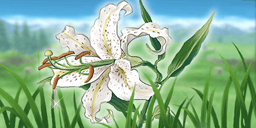  

---

## Liarpecker

Hint:  There's talk of an interesting creature from the children in the village on the way to Straylize Temple.

Description: Sharp-beaked bird that deceitful children
 are warned of by their parents.
 

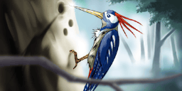  

---

## Big Horned Beetle

Hint:  It seems there's an insect on the Outer Sell. It's probably near the city with a research lab. 

Description: Rhinoceros beetle with a horn three
 times its body size. It looks strong,
 but it's weak.

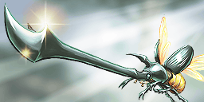  

---

## Cashaconda Skin

Hint:  It seems something was found on the way to Straylize Temple that'll fill your wallet up.

Description: Skin from a snake 10 meters in length.
 Rumor has it those who possess it are
 met with great fortune.

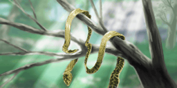  

---

## Gloomdrop

Hint:  There's a plant said to be a beacon of hope in a darkened world. Seems it's on an island off at sea.

Description: Flowering plant that blooms under the
 new moon. The faint glow it gives off
 is almost magical.

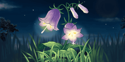  

---

## Hot Dog

Hint:  There's some sort of creature that's got the whole town talking about its feats. Seems to have something to do with the locale.

Description: Dog that skillfully slides down snowy mountains. Many cry out "He's really hot-doggin'!" upon seeing it in action.

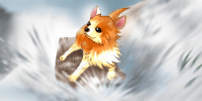  

---

## Mouse to Mouse

Hint:  It gets cold even outside the land of snow. Seems there's some animals that are always cuddled together past the border towards Seinegald.

Description: Mice with especially great chemistry. They appear to always be huddled together and locked in a kiss.

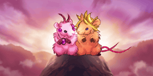  

---

## Candle Tree

Hint:  The incident two years ago took a toll on tourism numbers, but they're flocking once again. Seems the citizens are thanking some mystery prankster.

Description: Tree decorated with multicolored ornaments and candles. Who would do such a thing...? 

  

---

## Venus Birdtrap

Hint:  It seems the tranquility of Fitzgald's countryside is no reason to let your guard down. Particularly in the face of on particularly terrifying plant.

Description: Plant that mimics insects to attract birds, then never lets them go. 

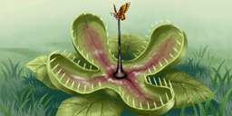  

---

## Treefrost

Hint:  There seems to be a natural phenomenon outside of a snowy city that makes you appreciate both the harshness and beauty of nature.

Description: A type of hoarfrost formed when water droplets freeze on trees. Gives them the appearance of being in bloom.

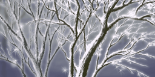  

---

## Diamond Dust

Hint:  Despite the incident two years ago taking a toll on even the vegetation around the city, it's said there's still something precious there that nobody can take away.

Description: Natural phenomenon in which sunlight shines through small ice particles suspended in the air. The twinkling lights are a sight to behold.

  

---

## Snowball Bracken

Hint:  There are reports from merchants coming from Seinegald of a curious plant that play tricks on those trying to cross the border.

Description: Rare plant that hurtles snow at passersby. Usually remains furled. 

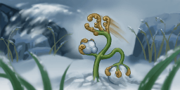  

---

## Seven-Colored Clover

Hint:  If you've got a wish you want granted, you might want to take a look around Neustadt for a certain dazzling plant.

Description: Plant said to grant any wishes to those who find it. Also used as a traveling charm.

  

---

## Kaguya Bamboo

Hint:  There seems to be a mystical plant that's the subject of a strange myth near Moreau. 

Description: Legends speak of shining bamboo that birthed gold and a beautiful princess. Flexible, yet quite firm.

  

---

## Golden Butterfly

Hint:  Some of the islands out at sea are said to be home to rare insects, protected by an environment isolated from the outside world.

Description: Swallowtail butterfly with magnificent glittering golden wings. Highly sought-after by collectors. 

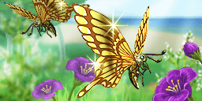  

---

## Natural Hot Spring

Hint:  Frostheim is famous for its hot springs, but it seems there's a secret spring in a remote area that can cure all diseases.

Description: Hot spring formed naturally by groundwater heated to perfection by geothermal energy. A dip inside is good for more than just warmth.

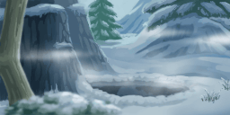  

---

## Gleemu Eggs

Hint:  At a glance it might not seem like anything could survive in the desert, but it appears there are traces around Cherik that would show otherwise.

Description: Eggs of an enormous flightless bird.
 Considered priceless in the world of egg
 art due to their size and beautiful colors.

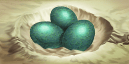  

---

## Fasthopper

Hint:  There seems to be insects around Cresta that when caught, will earn you great respect from the local children due to the difficulty involved.

Description: Grasshopper that jumps at high speeds. Catch one and you'll win the hearts of children. 

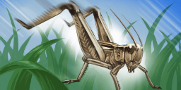  

---

## Sacred Tree

Hint:  There appears to be a plant venerated by the people near Shiden. It supposedly has some sort of distinguishing marker.

Description: Great tree over 1000 years old. Its vitality is longed for by many, and it became an object of worship.

  

---

## Sand Geoduck

Hint:  There's said to be a creature with a strange legend related to the ocean on the shore, but the details are unclear. 

Description: This shellfish's dance is said to wake the sea,
 summon the winds and raise the waves. Sailors
 use it as a charm to prevent shipwrecks.

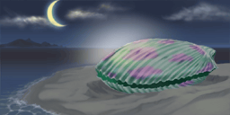  

---

## Tricorn

Hint:  It is said that somewhere in the ocean there lives an animal with interesting horns, but its scarcity makes it a rare sight.

Description: Cetacean with 3 long protruding teeth
 that resemble horns. Its figure does
 not actually resemble a hat.

  

---

## Flying Manta

Hint:  Seems there's a spot out at sea where the sky suddenly darkens. Stories about it are famous among sailors.

Description: Giant ray whose great fins allow it to catch the wind and glide. It's said to be able to travel distances of up to 500 meters before landing.

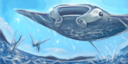  

---

## Glowmoss

Hint:  There appears to be a plant with a wondrous aura in the vicinity of Rodeon. 

Description: Plant that reflects a dim green light
 off its lens shaped cells. It does not
 produce light itself.

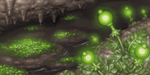  

---

## Will-o'-the-Wisp

Hint:  It seems there's a spot near Deimos where the grudges left by earthly creatures wander through the air.

Description: Eerie fireballs that burns with a pale light.
 Caused by the spontaneous combustion of
 gases produced by buried animal remains.

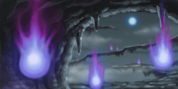  

---

## Skull Crag

Hint:  It is said that there is a place near Dycroft where horrible screams can be heard, but one has ever been able to confirm its source.

Description: Crag that looks like a screaming skull. The wind passing through sounds just like a scream.

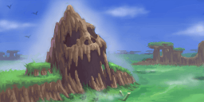  

---

## Black Worm

Hint:  There seems to be a very fast creature near Josaia, but it's said to be so fast it's impossible to catch. 

Description: Earthworm that mutated on the Outer Shell. Jet-black in color and nimble in movement. 

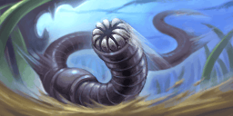  

---

## Blazequine

Hint:  It seems there's an animal that's as captivating as it is ferocious near Terazzi. 

Description: Horse with a fiery red mane. Quick as a flash, but its violent temperament makes it hard to handle.

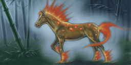  

---

## Sage's Peach

Hint:  There seems to be a fruit that grows near Terazzi that can supposedly grant peoples' deepest desires. 

Description: Precious peach said to grant immortality. Its price is as high as its nutritional value. 

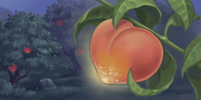  

---

## Enigmatic Ark

Hint:  They say a massive structure was found near  Calviola that could never be used on land. Could it be a mirage?

Description: Massive ark built from Cypress wood. Why it is inland is a mystery. 

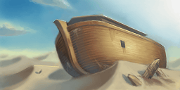  

---

## Tin Doll

Hint:  The citizens of Junkland supposedly brought something back from the desert that spooked them so much they threw it back.

Description: Human-sized doll excavated by chance. There are unsettling rumors that it moves by itself at night.

  

---

## Luminescent Plankton

Hint:  There seems to be vista on the beaches near Lienea that's so beautiful it draws you in for hours. 

Description: Plankton that emits light when disturbed. Time flies watching the glowing waves amidst the pitch black sea.

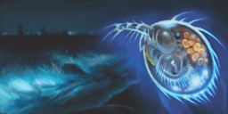  

---

## Stelladybug

Hint:  It seems someone was struck with something scalding near Armeida, but the encounter was too sudden to determine its features.

Description: Bug whose mass emergence in spring foretells a heat wave that year. Quite hot to the touch. 

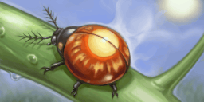  

---

## Giant Snowman

Hint:  There's apparently an enormous mass of snow that appeared overnight near Frostheim. 

Description: Giant snowman found the morning after a great blizzard. Theorized to be a cosmic  prank, but no definitive proof exists.

  

---

## Blushing Squirrel

Hint:  There's a creature near Neustadt that's said to be a hit with young men. It should be easy enough to identify upon spotting it.

Description: Squirrel with pink fur. A rare mutated species, said to grant true love to any who witness it gliding.

  

---

## Dango Crab

Hint:  There seems to be a prolific creature on the shores near Neustadt that makes an excellent ingredient.

Description: Small crab that seems to be making dangos while feeding. Small, but makes a nice soup base.

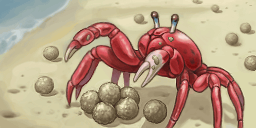  

---

## Singing Sand

Hint:  It seems there's a beach near Lienea where a tune can be heard amid the abounding natural beauty.

Description: Sandy beach that produces a strange glassy sound due to the movement of small quartz particles mixed into the sand. Remains silent if dirtied.

  

---

## Ocean Lungfish

Hint:  There seem to be many eyewitness reports from fisherman of a strange creature, but the only thing they agree on is that it's from the sea.

Description: Ancient fish that eats and breathes air with its three pair of external gills. 

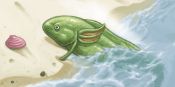  

---

## Draglue Fruit

Hint:  There seems to be a plant that grows near Junkland that the citizens fashion into a glue 

Description: Cactus fruit that can be picked year round. In Calvalese its juices are used as a powerful adhesive.

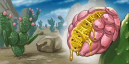  

---

## Calviola Viola

Hint:  It seems there's a flower that blooms near Calviola that's given in place of confessions. 

Description: Drought-resistant annual plant found in Calviola. Short in height with small-sized flowers. In the language of flowers it means "Please think of me."

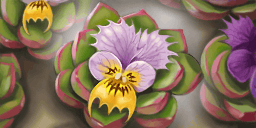  

---

## Snowplow Salmon

Hint:  There's apparently a fish with a real steel will that can be found in the river between Seinegald and Phandaria.

Description: Salmon that travels up cold and snowy rivers to
 lay its eggs. It cuts a striking figure as it breaks
 through frozen rivers with its stiff snout.

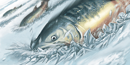  

---

## Ancient City Ruins

Hint:  Something incredible has apparently been unearthed by the bombardment from Belcrant. 

Description: Ancient city ruins that appeared in a crater formed by Belcrant's bombardment. Smells of adventure.

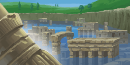  

---

## Great Wooden Horse

Hint:  There seems to be a strange wooden figure near Neustadt with an unknown purpose. 

Description: Giant wooden horse that can fit up to 50 people within it. Its purpose is unknown.

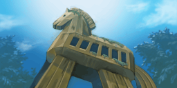  

---

## Golden Mask

Hint:  It's said that a flickering light was spotted near Lienea, but its source was unfortunately not found. 

Description: A mask made of gold measuring 60cm by 110cm. Adorned with 90 metallic feathers. 

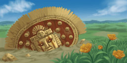  

---

## Quick Cricket

Hint:  It seems there's an insect near Deimos that makes you appreciate the fragility of life. 

Description: Insect that will perish unable to feed continually. The life of males end upon mating, the life of females upon laying their eggs.

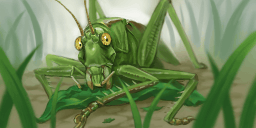  

---

## Sea Skater

Hint:  There's apparently a bug on an island somewhere that's an exceptional surfer. 

Description: Bug that glides along the waves near beaches. Will fly into the air to escape large waves. 

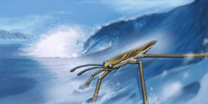  

---

## Head Statues

Hint:  There's said to be ruins near Cresta that prove the existence of ancient civilizations that are worth visiting.

Description: Temple ruins with giant head statues once used
 to memorialize royalty scattered about. The state
 of the former rulers is rather ominous.

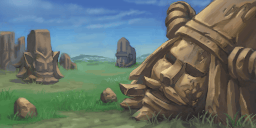  

---

## Tablet of Laws

Hint:  For some unknown reason, a relic of the Phandarian royal family that went missing seems to have reappeared near Ignasea.

Description: Emerald slab engraved with a King's laws. Lost by the Phandarian royal family during the recent chaos.

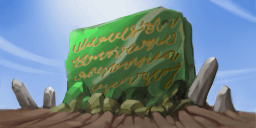  

---

## Celestial Hand Mirror

Hint:  There seems to be a thin beam of light pointing towards the sky near Straylize Temple. 

Description: A precious hand mirror made from a stone that amplifies light. Prized by ancient queens due to its functioning even under moonlight.

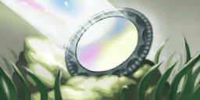  

---

## Burning Mallet

Hint:  There's apparently a blazing heat near the city that held the Lumina Draconis' control center, but the intenseness made ascertaining its origin too difficult.

Description: An unburnable wooden mallet. Releases intense heat for all but its chosen user. 

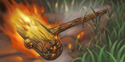  

---

## Mountaineer's Flower

Hint:  It seems a flower familiar to mountaineers grows near the city that used to be a military base. 

Description: Flower that only blooms at high elevations. Means "Attack!" in the language of flowers. A plant familiar to alpinists.

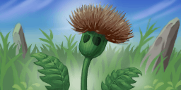  

---

## Moist Mouse

Hint:  There seems to be a rare creature that lives near Rodeon that's never been seen before on the surface 

Description: Rodent that mutated after being lifted
 up to the Outer Shell. Its long body hair
 is constantly wet.

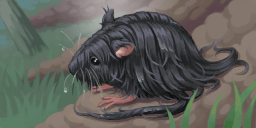  

---

## Platinum Turtle

Hint:  It seems there's an endangered creature you might encounter while traveling out in the ocean.

Description: Rare turtle with a shell that shines
 like platinum. Endangered due to being
 poached for its tough shell and eggs.

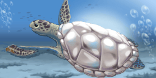  

---

## Salt Millstone

Hint:  There's a mysterious item in the shoals that seems like it's straight from a fairy-tale. 

Description: Mysterious millstone that continues to release
 salt even underwater. Legends say it is the
 source of the ocean's salty taste.

  

---

## Leech Frog

Hint:  There's apparently a dangerous creature near Dycroft, so take care when traveling around it. 

Description: Bloodsucking frog that mutated on
 the Outer Shell. Slow in spite of its
 small size.

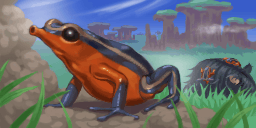  

---

## Methane Hydrate

Hint:  They say there's a shore somewhere where the love child of the fire and ice spirits can be found. 

Description: Curious substance that leaves nothing but water after it's burned. Said to be the child of the fire and ice spirits. Also known as fire ice, it is cold to the touch.

  

---

## Boarambutan

Hint:  There seems to be a rather loud and annoying creature near Moreau that makes for a rather tasty meal.

Description: Swine with backsides that look exactly like a rambutan fruit. Very loud and annoying. 

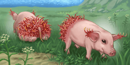  

---

## Foundation Stone

Hint:  It seems there's a structure near Darilsheid that's used as a meeting place between merchants. 

Description: Stone monument build to celebrate the founding of the Kingdom of Seinegald. 

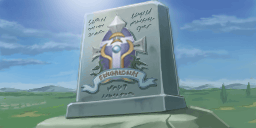  

---

## Lucky Cat

Hint:  There's apparently a rare creature near Shiden that's beloved by sailors. 

Description: Unusual six-toed cat. Loved by sailors for its mouse-catching prowess.

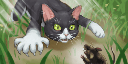  

---

## Rashweed

Hint:  It seems great care needs to be taken near a certain city due to plants overflowing from an experimentation plant.

Description: Perennial plant lined top to bottom
 with irritant-laced stinging hairs.
 Sharply painful to the touch.

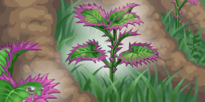  

---

## Happiness Bird

Hint:  There is supposedly a creature that lives near a city with a research facility that is said to be able to grant peoples' desires.

Description: Blue bird said to lead those who obtain it
 to happiness. Even if captured and taken
 care of, it will eventually disappear.

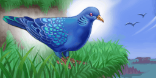  

---

## A ship once known for its heroics.
 The ship has resurfaced once again to carry
 out the blitzkrieg strategy used in the Aeth'er War.

Hint:  nan

Description: nan

  
