## Torn's Cabin

A hut in a snowy mountain forest. Home to master archer  Torn.

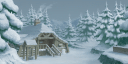  

---

## Janos

A border town in the northern part of Phandaria. Phandaria owns the south and Seinegald owns the north.

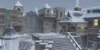  

---

## Heidelberg

The capital of Phandaria. The snow on the streets absorbs  the hustle and bustle of the city.

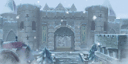  

---

## Darilsheid

Capital of Seinegald. This well-developed town is filled with people.

  

---

## Cresta

A city in the eastern part of Seinegald. Like other suburban towns, time passes slowly.

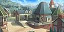  

---

## Oberon's Hidden Factory

An Oberon factory built on an island in the northeastern waters of Seinegald. It's currently closed.

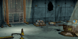  

---

## Lienea

A village in the northern region of Fitzgald. Most of the villagers engage in agriculture or cattle farming.

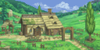  

---

## The Hidden Temple 

An archaeological site located in the northern inner bay of Fitzgald.

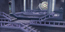  

---

## Cherik

A port town in the southern region of Calvalese.
 Supplies from other countries flow through here,
 making it a lifeline against the harsh environment.

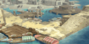  

---

## Calviola

Capital of Calvalese. The store roofs are covered with colorful neon lights that glow at night.

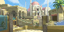  

---

## Junkland

A city in the western region of Calvalese. The people there live by reusing piles of industrial waste from long ago.

  

---

## #WRITE(ptr,$18A460) Radisrol

A ship once known for its heroics. It is now submerged deep in the sea, and no one knows of its existence.

  

---

## Harmentz

A village in the western region of Seinegald. It has a mansion that is out of place for the humble village.

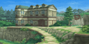  

---

## Armeida

A village in the northern region of Seinegald. Pilgrims of Straylize Temple stop by to rest and relax.

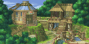  

---

## Straylize Temple

A temple that stands neatly in the depths of the forest. It also operates as a research facility.

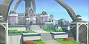  

---

## Cyril

A city in the southern region of Phandaria. Two years ago, the city was a battlefield, but it is now recovering.

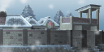  

---

## Frostheim

A port town in the eastern region of Phandaria. Because of its hot springs, tourists come here for hot spring therapy.

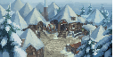  

---

## Shiden

A city in the northern region of Aquaveil. Its territory is ruled by the Shiden family. 

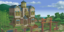  

---

## Terazzi

A city in the southern region of Aquaveil. Its territory is ruled by the Terrazi family. 

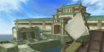  

---

## Moreau

A city in the western region of Aquaveil.
 Its territory is ruled by the Moreau family. 

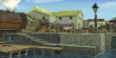  

---

## Neustadt

A developing city in the southern part of Fitzgald. Fierce battles are fought day and night in the arena.

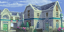  

---

## Tidal Cave (Moreau)

An underwater cave that connects Shiden and Moreau.

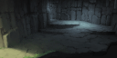  

---

## Tidal Cave (Shiden)

An underwater cave that connects
 Shiden and Moreau.

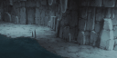  

---

## Tilso Forest

A snowy forest that connects eastern and western Phandaria.

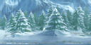  

---

## Straylize Forest

A forest at the top of a mountain.
 As the main path to Straylize Temple, it 
 mainly is used by missionaries and priests.

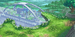  

---

## Swordian R&D Lab

A research facility for the Er'ther forces deep beneath the earth. It was unearth by Belcrant's bombardment.

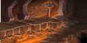  

---

## Traveler's Lodge

A hut where travelers stop to rest. You may have a strange encounter here.

  

---

## Food Sack Master's Haven

A haven for those who have mastered the art of making food sacks. 

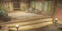  

---

## Lumina Draconis

A transport vehicle made of the biometal Berselium.

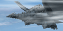  

---

## Phandaria Pass

A snow-covered mountain road that connects Janos with Torn's Cabin.

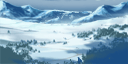  

---

## Radisrol

A ship once known for its heroics. The ship has resurfaced once again to carry out the blitzkrieg strategy used in the Aeth'er War.

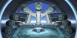  

---

## Ignasea

The nearest aerial city from Radisrol. There is a transporter terminal that connects the cities.

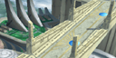  

---

## Josaia

One of the aerial cities connected to Ignasea via a transporter.

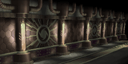  

---

## Mikheil

An Aeth'er Cruiser used to link the aerial cities.

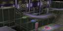  

---

## Rodeon

One of the aerial cities connected to Ignasea via a transporter.

  

---

## Helraios

One of the most important bases of the aerial cities. It is home to the technological research facilities for the Aeth'erian army. 

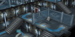  

---

## Deimos

One of the aerial cities connected to Ignasea via a transporter.

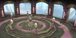  

---

## Cloudius

One of the most important bases of
 the aerial cities. There is a control facility for the guardian dragons.

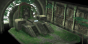  

---

## Dycroft

The most important base of the aerial cities. The functions of all the other cities are controlled by the Eye of Atamoni here.

  

---

## Katz Village

A village formed by Katz who have come to the Outer Shell.

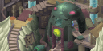  

---

## Hole to the Er'ther Lands

A hole made by the lens cannon where Radisrol was once located. It is the only path connecting the Er'ther Lands and the Outer Shell.

  
