## Armor: Leather Armor

Upper body armor made of leather. Favored by adventurers due to its lightness and fair protection.

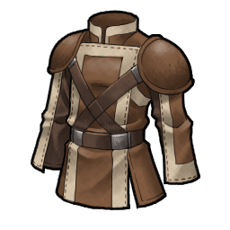  

---

## Armor: Bronze Armor

Upper body armor made of thin bronze. Traditional armor used since the age of the Aeth'er War.

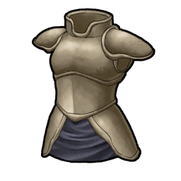  

---

## Armor: Iron Armor

Upper body armor made of iron, the most familiar of metals. Sturdy and tough, but heavy.

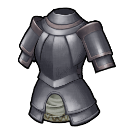  

---

## Armor: Steel Armor

Upper body armor made of several steel plates. Favored by knight apprentices.

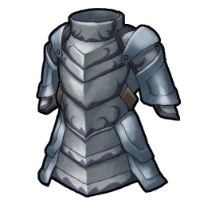  

---

## Armor: Titanium Armor

Upper body armor strengthened with a titanium alloy. Very light and corrosion resistant.

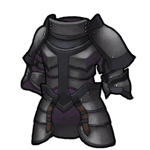  

---

## Armor: Silver Armor

Upper body armor decorated with silverwork. Has a beautiful luster and is imbued with prayers.

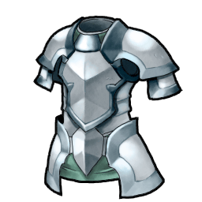  

---

## Armor: Gold Armor

Upper body armor decorated with gold. Also known as the "Opulent Armor".

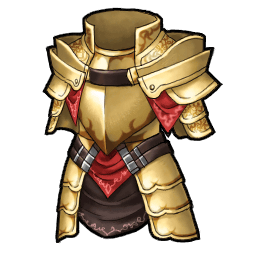  

---

## Armor: Mithril Armor

Upper body armor decorated with Mithril. Considered to be a Dwarven work of art.

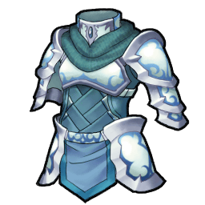  

---

## Armor: Ring Armor

Upper body armor sewn with metal rings. Protects the body from slashing attacks.

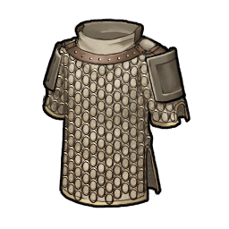  

---

## Armor: Chain Armor

Upper body armor sewn with steel wires. Easy to put on and a favorite of soldiers.

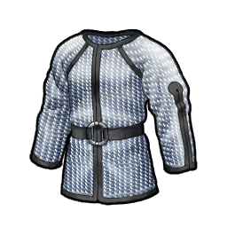  

---

## Armor: White Armor

Beautifully polished upper body armor. Pure white armor used in rituals. Said to hold the divine protection of light.

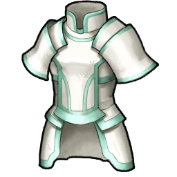  

---

## Armor: Knight Armor

Upper body armor of a Royal Knightly order. Constructed to be sturdy. With this you too can feel like a Knight.

  

---

## Armor: Star Armor

Extremely light upper body armor made with a special process. Allows one to move as fast as a falling star. Or so it is advertised.

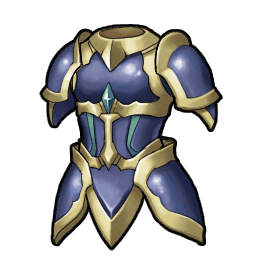  

---

## Armor: Diamond Armor

Upper body armor decorated with diamonds. Bewilders enemies with its brightness.

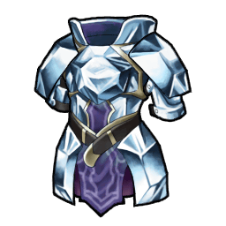  

---

## Armor: Battle Armor

Upper body armor made specially for combat. Since it is made with functionality in mind it doesn't hinder one's movements.

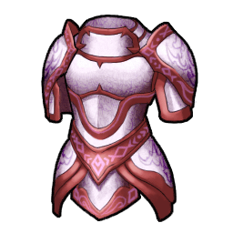  

---

## Armor: Rare Armor

Masterpiece imbued with the soul of Giese. Extremely valuable.

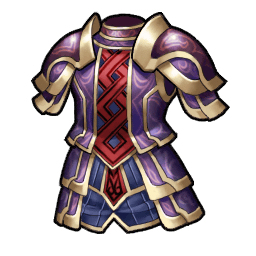  

---

## Armor: Scale Armor

Upper body armor sewn with steel scales. A storied and ancient armor. Its only fault is that it's noisy when moving.

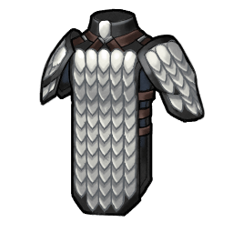  

---

## Armor: Splint Armor

Chain Armor strengthened with steel plates. Tougher than Chain Armor, but also heavier.

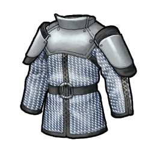  

---

## Armor: Black Armor

A beautiful and shining black armor. Jet black armor used in rituals.

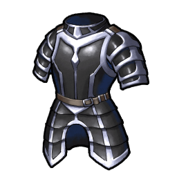  

---

## Armor: Gothic Armor

A simple, but elegant upper body armor. Its beautiful style draws inspiration from a bygone era.

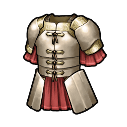  

---

## Armor: Rune Armor

Upper body armor engraved with the Hope rune. Imbues its users with the strength of mind to never be disheartened.

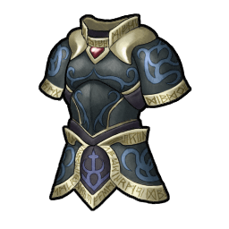  

---

## Armor: Platinum Armor

Upper body armor decorated with platinum. A solid and beautiful armor worn by high-ranking knights.

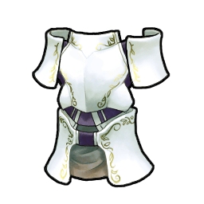  

---

## Armor: Dragon Armor

Upper body armor strengthened with dragon scales. Protects against a dragon's sharp claws and fiery breath.

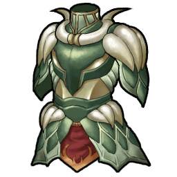  

---

## Armor: Grimm Armor

Armor imbued with the hidden power of fantasies. Named after the brothers who collected oral traditions into a book.

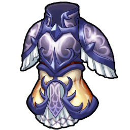  

---

## Armor: Masterpiece

A peerless masterpiece made by an unknown blacksmith. Will never crack no matter the attack.

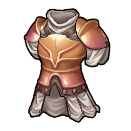  

---

## Armor: Fortress

Upper body armor referred to as a fortress. Feels like an impregnable wall with no openings.

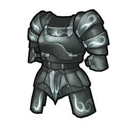  

---

## Armor: Schlachtfeld

Designated after the deity that protects soldiers on the battlefield. Praised as the armor that guarantees their return.

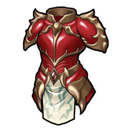  

---

## Armor: Megingjord

Ensorcelled sash that doubles one's might. Said to be the possession of a thunder God.

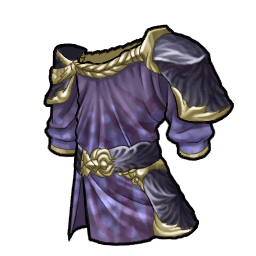  

---

## Armor: Reflex

Upper body armor that is said to reflect attacks. Said to have been invented by a genius scientist during the Aeth'er War.

  

---

## Armor: Mumbane

Upper body armor imbued with the Earth Goddess' protection. Protects the body with a holy aura.

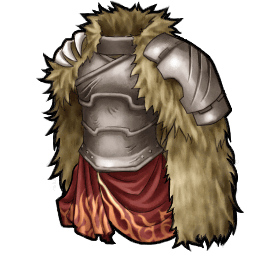  

---

## Armor: Last Crusader

Upper body armor made for knights heading to holy war. Protects its wearers with the power of faith.

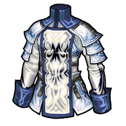  

---

## Armor: Harmonic Armor

Upper body armor that carries the meaning of "Harmony". Turns one into a disciple of balance. Can only be acquired by the chosen ones.

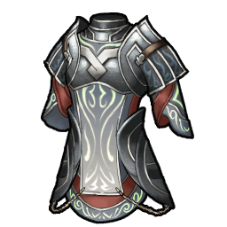  

---

## Armor: Leather Plate

Leathern breastplate. Favored by adventurers due to its lightness and fair protection.

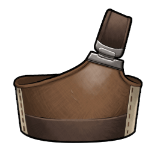  

---

## Armor: Iron Plate

Breastplate strengthened with iron plates. A heavy, but sturdy, traditional breastplate.

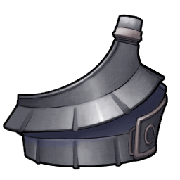  

---

## Armor: Steel Plate

Breastplate strengthened with steel plates. A favorite of soldiers.

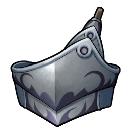  

---

## Armor: Titanium Plate

Breastplate strengthened with a titanium alloy. Very light and corrosion resistant.

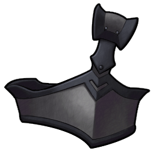  

---

## Armor: Silver Plate

Breastplate decorated with silverwork. Has a beautiful luster and is imbued with prayers.

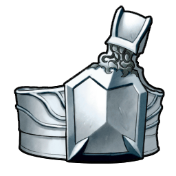  

---

## Armor: Gold Plate

Breastplate decorated with gold. Also known as the "Opulent Breastplate".

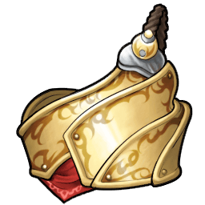  

---

## Armor: Mithril Plate

Breastplate decorated with Mithril. Considered to be a Dwarven work of art.

  

---

## Armor: Star Plate

Extremely light breastplate made using a special process. Allows one to move as fast as a falling star. Or so it is advertised.

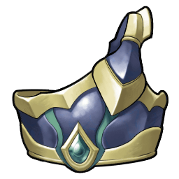  

---

## Armor: Diamond Plate

Breastplate decorated with diamonds. Bewilders enemies with its brightness.

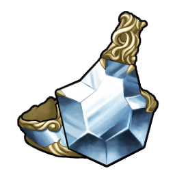  

---

## Armor: Battle Plate

Breastplate made specially for combat. Since it is made with functionality in mind it doesn't hinder one's movements.

  

---

## Armor: Rare Plate

Masterpiece imbued with the soul of Giese. Extremely valuable.

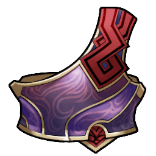  

---

## Armor: Rune Plate

Breastplate engraved with the Courage rune. Imbues its users with the strength of mind to never be disheartened.

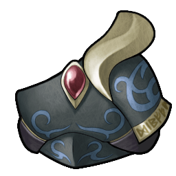  

---

## Armor: Platinum Plate

Breastplate decorated with platinum. Not only expensive and beautiful but also very functional.

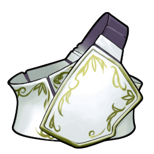  

---

## Armor: Dragon Plate

Breastplate strengthened with dragon scales. Protects against a dragon's sharp claws and fiery breath.

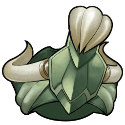  

---

## Armor: Grimm Plate

Breastplate imbued with the hidden power of fantasies. Named after the brothers who collected oral traditions into a book.

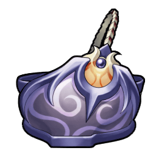  

---

## Armor: Rampart

Breastplate referred to as a rampart. Provides a staunch defense impenetrable by even heavy bows.

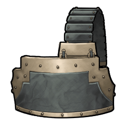  

---

## Armor: Vital Burner

Breastplate that imbues the wearer with vitality. Grants an unbreakable heart even in hard-fought battles.

  

---

## Armor: Vertical

Breastplate named after the Zenith. Light as a feather and blessed by light and wind.

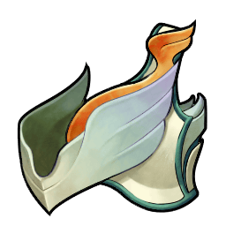  

---

## Armor: Revival Plate

Breastplate that carries the meaning of "Rebirth". Will not allow one to fall. Can only be acquired by the chosen ones.

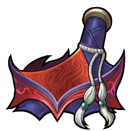  

---

## Armor: Bronze Tunic

A man's garment made of bronze plates stitched together. Favored by travelers due to lightness and fair protection.

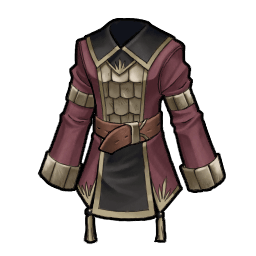  

---

## Armor: Iron Tunic

A man's garment made of iron plates stitched together. Heavy but rigid and made for combat.

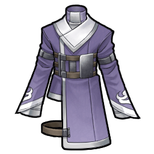  

---

## Armor: Steel Tunic

A man's garment made of steel plates stitched together. Used by guards and local militias.

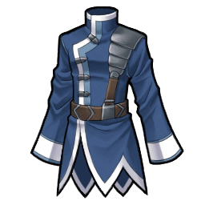  

---

## Armor: Gold Tunic

A man's garment decorated with gold. Also known as the "Opulent Wear." 

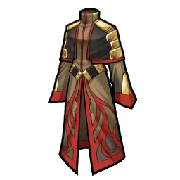  

---

## Armor: Mithril Tunic

A man's garment decorated with Mithril. Considered to be a Dwarven work of art. 

  

---

## Armor: Breast Tunic

A man's garment with enhanced chest protection. Maintains a high defense, but has rather poor balance.

  

---

## Armor: White Tunic

A man's beautiful white garment. Holy clothes used in rituals. Said to hold the divine protection of light.

  

---

## Armor: Knight Tunic

Garment used by Royal Knights. Looks plainly made, but is very sturdy.

  

---

## Armor: Battle Tunic

Garment made specially for combat. Made for functionality. Sturdy and easy to move in.

  

---

## Armor: Rare Tunic

Masterpiece imbued with the soul of Giese. Extremely valuable.

  

---

## Armor: Holy Tunic

Garment blessed by holy powers. Protects the life of its wearers.

  

---

## Armor: Black Tunic

Black garment lined with silver. Holy clothes used in rituals. Said to be imbued with dark powers.

  

---

## Armor: Gothic Tunic

A simple, but elegant garment. Its beautiful style draws inspiration from a bygone era.

  

---

## Armor: Dragon Tunic

Garment strengthened with dragon scales. Protects against a dragon's sharp claws and fiery breath.

  

---

## Armor: Grimm Tunic

Garment imbued with the hidden power of fantasies. Named after the brothers who collected oral traditions into a book.

  

---

## Armor: Duality

Garment with a double structure. Not only does it protect against impacts but also all poisons.

  

---

## Armor: Clownerie

Garment named after clowns. Used by a group of traveling clowns who saved the world with laughter.

  

---

## Armor: Vermillion

Garment sporting a beautiful scarlet crest. Suspicious clothes red as blood.

  

---

## Armor: Executant

Garment named after actors. Does not bother performers as it makes no rustling sounds.

  

---

## Armor: Myth Tunic

Garment that carries the meaning of "Myths". Its wearers are celebrated as heroes. Can only be acquired by the chosen ones.

  

---

## Armor: Leather Cloak

Favored by female adventurers due to its lightness and fair protection.

  

---

## Armor: White Cloak

Cloak decorated with white cloth. Its tidy style is popular with city girls.

  

---

## Armor: Feather Cloak

Cloak sewn with the feathers of a waterfowl. Light as a feather. 

  

---

## Armor: Black Cloak

Cloak decorated with black cloth. Popular with partying city girls.

  

---

## Armor: Silk Cloak

Cloak sewn with silk. It has a pretty luster and feels nice to the touch.

  

---

## Armor: Silver Cloak

Robe decorated with silver. Has a beautiful white brilliance.

  

---

## Armor: Gold Cloak

Cloak decorated with gold. Also known as the "Opulent Cloak."

  

---

## Armor: Mithril Cloak

Cloak decorated with Mithril. Considered to be a Dwarven work of art.

  

---

## Armor: Mesh Cloak

Cloak knit with a mesh pattern. Made to be light and have good permeability.

  

---

## Armor: Mage Cloak

Cloak made for mages. Increases the willpower of its wearers.

  

---

## Armor: Fancy Cloak

Cloak for those pursuing cuteness. Its fluffy skirt is admired by girls everywhere.

  

---

## Armor: Moon Cloak

Cloak designed after a moonlit night. Endowed with the moon's holy power.

  

---

## Armor: Star Cloak

Cloak designed after a star. Allows one to move as fast as a falling star. Or so it is advertised.

  

---

## Armor: Warlock Cloak

Cloak made for skilled mages. Not only does it raise one's  willpower but also their defenses.

  

---

## Armor: Spirit Cloak

Cloak that imbues one with spiritual protection. Gives its wearers mental fortitude.

  

---

## Armor: Rare Cloak

Masterpiece imbued with the soul of Giese. Extremely valuable.

  

---

## Armor: Amber Cloak

Cloak decorated with amber. Imbues the wearer with the divine protection of amber jewels.

  

---

## Armor: Holy Cloak

Cloak blessed by holy powers. Said to prevent enemies from approaching.

  

---

## Armor: Elder Cloak

A cloak named after a grand priest, dyed with the flowers of his beloved elderberries.

  

---

## Armor: Misty Cloak

Cloak made by an unknown process and materials. Its colors  change with viewing angle.

  

---

## Armor: Rune Cloak

Cloak embroidered with the Bless rune. Imbues one with the warmth of light to not fear hardship.

  

---

## Armor: Witch Cloak

Cloak worn by high-ranking mages. Increases one's willpower and protects against enemy attacks.

  

---

## Armor: Prism Cloak

Cloak that breaks light into the colors of the rainbow. Bewilders enemies with its refracted light.

  

---

## Armor: Grimm Cloak

Cloak imbued with the hidden power of fantasies. Named after the brothers who collected oral traditions into a book.

  

---

## Armor: Lovable

Cloak with a lovely design. Its beauty lowers enemies' guards.

  

---

## Armor: Tunic

A Cloak made of fine cloth. Vestment of the Straylize clergy. Blessed by Atamoni.

  

---

## Armor: Middy Blouse

Cloak adapted for sailors. Sought after by enthusiasts.

  

---

## Armor: Body Suit

Full body cloak. Sticks to the skin, easy to move in. Emphasizes the beauty of the female figure.

  

---

## Armor: Wind Breaker

Cloak that protects against cold and wind. Warmth for cold days.

  

---

## Armor: Unstable

Cloak made for ease of movement. Heightens the wearers physical abilities.

  

---

## Armor: Heavenly Garb

Cloak named after the Heavens. Worn by those living in Paradise. Eases all pains.

  

---

## Armor: Nadir Cloak

Cloak that carries the meaning of "Hell". Guides all to its end. Can only be acquired by the chosen ones.

  

---

## Armor: White Robe

Robe decorated with white cloth. Its tidy style is popular with city girls.

  

---

## Armor: Feather Robe

Robe sewn with the feathers of a waterfowl. Light as a feather. 

  

---

## Armor: Black Robe

Robe decorated with black cloth. Popular with partying city girls.

  

---

## Armor: Silk Robe

Robe sewn with silk. It has a pretty luster and feels nice to the touch.

  

---

## Armor: Silver Robe

Robe decorated with silver. Has a beautiful white brilliance. 

  

---

## Armor: Gold Robe

Robe decorated with gold. Also known as the "Opulent Robe". 

  

---

## Armor: Mithril Robe

Robe decorated with Mithril. Considered to be a Dwarven work of art.

  

---

## Armor: Mage Robe

Robe made for mages. Increases the willpower of its wearers.

  

---

## Armor: Fancy Robe

Robe for those pursuing cuteness. Its fluffy skirt is admired by girls everywhere.

  

---

## Armor: Moon Robe

Robe designed after a moonlit night. Endowed with the moon's holy power.

  

---

## Armor: Star Robe

Robe designed after a star. Allows one to move as fast as a falling star. Or so it is advertised.

  

---

## Armor: Warlock Robe

Robe made for skilled mages. Not only does it raise one's  willpower but also their defenses.

  

---

## Armor: Spirit Robe

Robe that imbues one with spiritual protection. Gives its wearers mental fortitude.

  

---

## Armor: Rare Robe

Masterpiece imbued with the soul of Giese. Extremely valuable.

  

---

## Armor: Stray Robe

Robe of the Straylize Temple. Uniform handed out to those who become disciples of God.

  

---

## Armor: Elder Robe

A robe named after a grand
 priest, dyed with the flowers
 of his beloved elderberries.

  

---

## Armor: Misty Robe

Robe made by an unknown process and materials. Its colors change with viewing angle.

  

---

## Armor: Rune Robe

Robe embroidered with the Rest rune. Imbues one with the power to resist any punishment.

  

---

## Armor: Witch Robe

Robe worn by high-ranking mages. Increases one's willpower and protects against enemy attacks.

  

---

## Armor: Prism Robe

Robe that breaks light into the colors of the rainbow. Bewilders enemies with its refracted light.

  

---

## Armor: Grimm Robe

Robe imbued with the hidden power of fantasies. Named after the brothers who collected oral traditions into a book.

  

---

## Armor: Apron Dress

Clothes that became a secret boom in Fitzgald. Item for those who do not ignore cuteness even while doing housework.

  

---

## Armor: Sheath Dress

Risky, thin, and see-through dress. Feels pleasantly refreshing. Requires a little confidence to wear.

  

---

## Armor: Country Dress

Simple country dress. Popular among nostalgic aristocrats. 

  

---

## Armor: China Dress

Dress created in Aquaveil. Emphasizes the beauty of the female figure.

  

---

## Armor: Cocktail Dress

Dress for sophisticated balls. A necessity for parties. Has an open cleavage.

  

---

## Armor: Wedding Dress

Pure white wedding dress. Yearned for by girls and symbol of happiness.

  

---

## Armor: Terminal Robe

Robe that carries the meaning of "End". Protects the body from the power to destroy the world. Can only be acquired by the chosen ones.

  
