## Food Strap: Rice Balls

Strap with some Rice Balls. Carefully molded with love. One's best traveling companion.

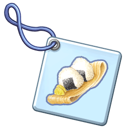  

---

## Food Strap: Sandwich

Strap with a vegetable and ham sandwich. Can be easily eaten anywhere.

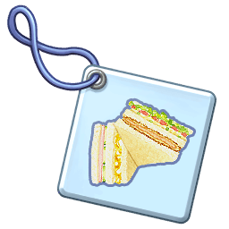  

---

## Food Strap: Hamburger

Strap with a Hamburger. A juicy beef patty between two buns... Very filling!

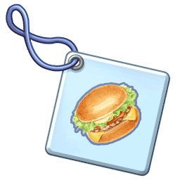  

---

## Food Strap: Hotdog

Strap with a Hotdog. Hot sausage in a lengthwise-cut long bun. 

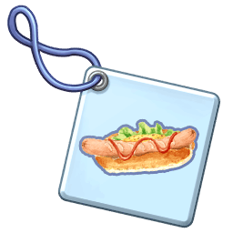  

---

## Food Strap: Burrito

Strap with a Burrito. Rice, meat, beans, and vegetables wrapped in a tortilla.

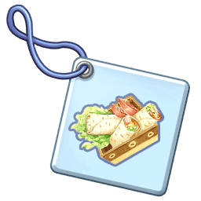  

---

## Food Strap: Kebab

Strap with a Kebab. Slowly and carefully roasted skewered meat.

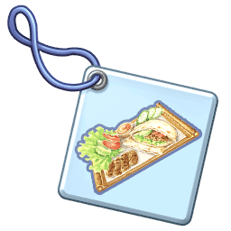  

---

## Food Strap: Inarizushi

Strap with an Inarizushi. Sushi with sweet boiled, deep-fried, vinegared tofu. Popular with children.

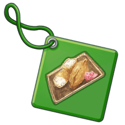  

---

## Food Strap: Pickled Vegetables

Strap with a Pickled Vegetables. Vegetables pickled overnight. Easy to eat.

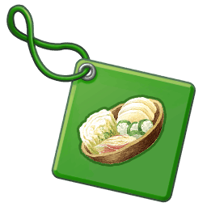  

---

## Food Strap: Ochazuke

Strap with an Ochazuke. Rice with flavored tea-based broth. Gulped down with a slurping sound.

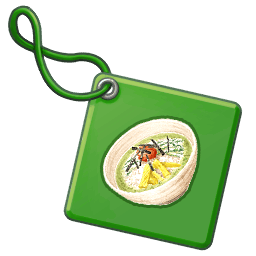  

---

## Food Strap: Fried Rice

Strap with Fried Rice. Rice fried in oil with meat and vegetables. Simple but filling.

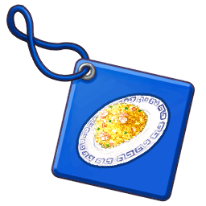  

---

## Food Strap: Omelette Rice

Strap with Omelette Rice. Ketchuppy Rice folded in an Omelette. A favorite of children.

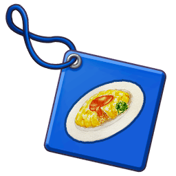  

---

## Food Strap: Curry Rice

Strap with Curry Rice. Made with apple and honey. Sweet but slightly spicy. Tastes like home.

  

---

## Food Strap: Omelette

Strap with Minced Meat Omelette. A fusion between Minced Meat Rice and Omelette Rice. Voluminous and extravagant in taste.

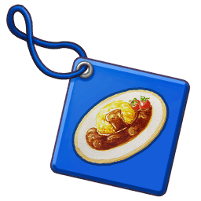  

---

## Food Strap: Paella

Strap with a Paella. Contains rice, meat, and seafood, stewed with olive oil and saffron.

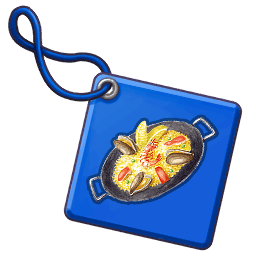  

---

## Food Strap: Oriental Rice

Strap with Oriental Rice. Rice with chives and pork rib. Packed with stamina.

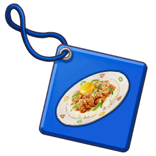  

---

## Food Strap: Muffin

Strap with a Muffin. Small, round, and  puffy sweet pastry. The one stuffed with  fresh cream is recommended.

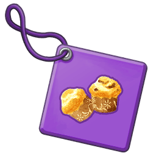  

---

## Food Strap: Kimchi

Strap with Kimchi. Those who can't  handle spicy stuff be cautious. Has a stimulating smell and taste.

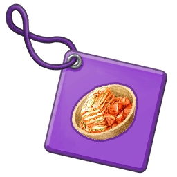  

---

## Food Strap: Meat Bun

Strap with a Meat Bun. Fills the mouth with meat juices when bit into. The sort of stuff one wants to eat on cold days.

  

---

## Food Strap: Loco Moco

Strap with Loco Moco. Rice topped with steak and a sunny-side up egg. Simple, but delicious.

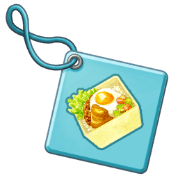  

---

## Food Strap: Beef Bowl

Strap with a Beef Bowl. Rice bowl topped with stewed meat and green onions. Unforgettable taste.

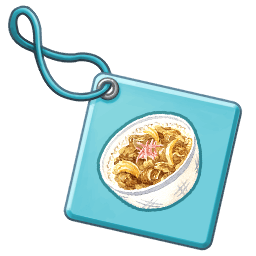  

---

## Food Strap: Oyakodon

Strap with an Oyakodon. Rice topped with stewed chicken and egg in a bowl. Please eat it with rice.

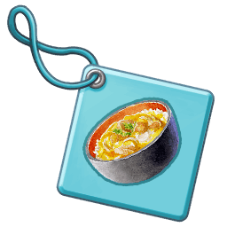  

---

## Food Strap: Seafood Bowl

Strap with a Seafood Bowl. Rice topped with fresh seafood. Its ingredients change with the seasons. A luxurious dish.

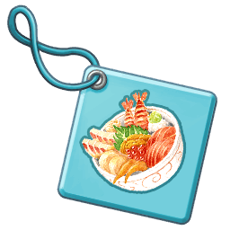  

---

## Food Strap: Clam Chowder

Strap with Clam Chowder. Soup with simmered clams, bacon, and various vegetables. Wonderful on cold days.

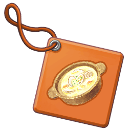  

---

## Food Strap: Risotto

Strap with a Risotto. Rice, meat, fish, and mushrooms stir-fried in oil.

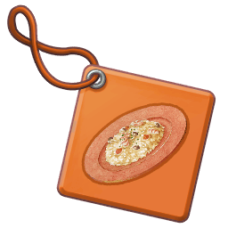  

---

## Food Strap: Beef Stroganoff

Strap with Beef Stroganoff. Beef stewed in sour cream sauce. Has an extravagant and luxurious flavor.

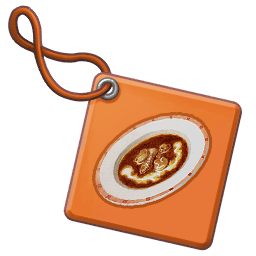  

---

## Food Strap: Meat Sauce

Strap with Meat Sauce. Packed with onion and ground meant. Beware of splashing.

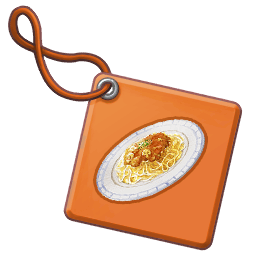  

---

## Food Strap: Gratin

Strap with Gratin. A plethora of ingredients bathed in cheese. The smell of scorched cheese wets one's appetite.

  

---

## Food Strap: Spaghetti Gratin

Strap with Spaghetti Gratin. Allows one to enjoy Spaghetti and Gratin  at the same time. Give it a try.

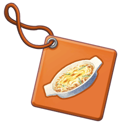  

---

## Food Strap: Hamburger Steak

Strap with a Hamburger Steak. Simmered with carrots. Well kneaded to deliciousness.

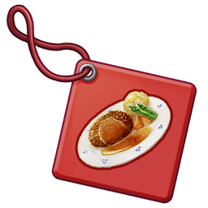  

---

## Food Strap: Steak

Strap with a Steak. Just a grilled slab of meat. One can feel the splendor of meat coming off it.

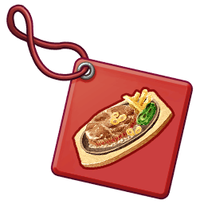  

---

## Food Strap: Okonomiyaki

Strap with an Okonomiyaki. Fried batter garnished to one's preferences. Top it with Nori and and bonito slices.

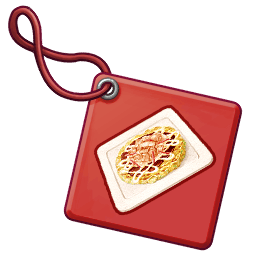  

---

## Food Strap: Sukiyaki

Strap with Sukiyaki.Simmered sweet-salty beef in an iron pot. Also goes well with rice.

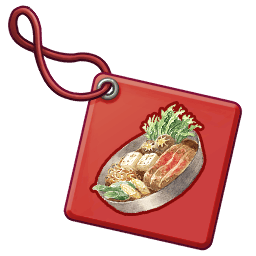  

---

## Food Strap: Sashimi

Strap with Sashimi. Fresh thinly sliced seafood. Irresistibly tender. 

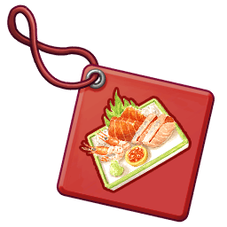  

---

## Food Strap: Sushi Boat

Strap with a Sushi Boat. Traditionally arranged fresh seafood. Still alive.

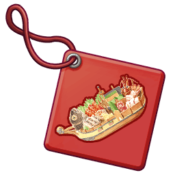  

---

## Food Strap: Fruit Parfait

Strap with a Fruit Parfait. Topped with fruits, cream, and ice cream. Deliciously sweet.

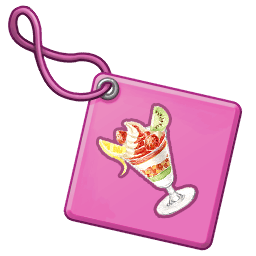  

---

## Food Strap: Fruit Cheese

Strap with Fruit Cheese. Cheese mixed with milk and mashed fruit. Perfect for a snack!

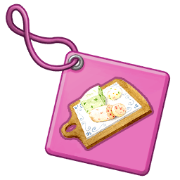  

---

## Food Strap: Fruit Tofu

Strap with Fruit Tofu. A mix of tofu with fruits. Has an  indescribable texture.

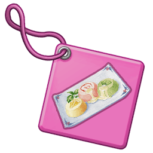  

---

## Food Strap: Hot Pot

Strap with a Hot Pot. Meat hot pot. Filled with meat stock. Leftover soup can be eaten with Udon.

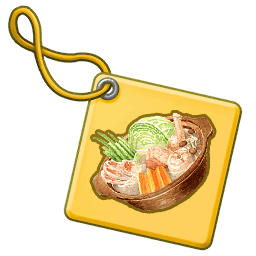  

---

## Food Strap: Fish Hot Pot

Strap with a Fish Hot Pot. Filled with fish stock. Leftover soup can be eaten with Rice.

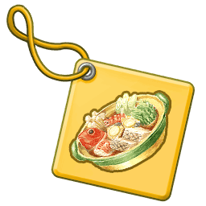  

---

## Food Strap: Sunfish Skewers

Strap with a Sunfish Skewer. Because eating delicious stuff is important.

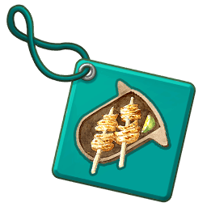  

---

## Food Strap: Miso Oden

Strap with Miso Oden. The sweetness of fine miso sauce spreads in one's mouth. Goes well with sake.

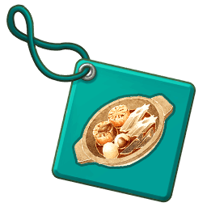  

---

## Food Strap: Mabo Curry

Strap with Mabo Curry. A secret handed down by the military. The utmost harmony between pungent and spicy!

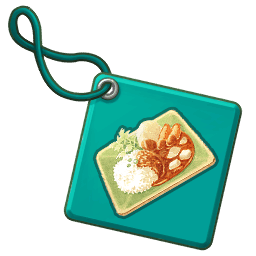  

---

## Food Strap: Crunchy Riceball

Strap with a Crunchy Riceball. People with weak teeth beware. Tempers one's jaw.

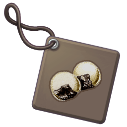  

---

## Food Strap: Dry Sandwich

Strap with a Dry Sandwich. Eat it as quickly as possible. Getting it stuck in your throat is inevitable.

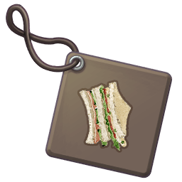  

---

## Food Strap: Squashed Burger

Strap with a Squashed Burger. Not much different from a sat-on burger. Easy to eat.

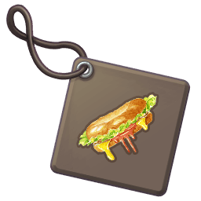  

---

## Food Strap: Burned Dog

Strap with a Burned Dog. Overcooked! A bitter and completely burned sausage.

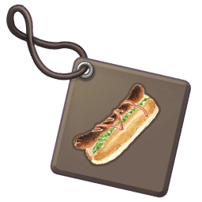  

---

## Food Strap: Soggy Burrito

Strap with a Soggy Burrito. Left out for too long. Sadly, the melted cheese solidified.

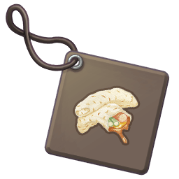  

---

## Food Strap: Half-baked Kebab

Strap with a Half-baked Kebab. Please, cook meat properly. So you won't hurt your stomach....

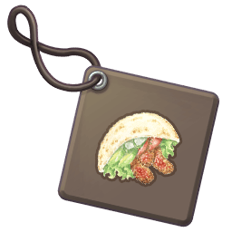  

---

## Food Strap: Dark Bowl

Strap with a Dark Bowl. Dreaded Bowl filled with mystery ingredients. Some days it's good, some days it's bad.

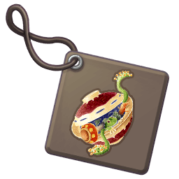  

---

## Food Strap: Dark Pot

Strap with a Dark Pot. No one knows what's inside it. Better eaten in the dark.

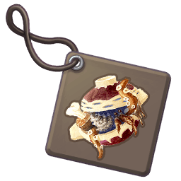  
