## Unique: Leather Gauntlets

Gauntlets strung together with leather.  Light and reasonably strong. Essential for apprentice swordsmen. 

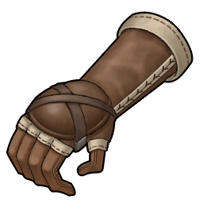  

---

## Unique: Bronze Gauntlet

Gauntlets made of thin bronze. Traditionally used since the age of the Aeth'er War.

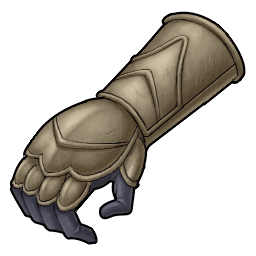  

---

## Unique: Iron Gauntlets

Gauntlets made of iron, the most familiar of metals. Sturdy and tough, but heavy.

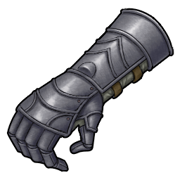  

---

## Unique: Steel Gauntlets

Gauntlets made of several steel plates. A favorite of knight apprentices.

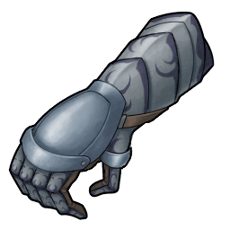  

---

## Unique: Titanium Gauntlets

Gauntlets strengthened with a titanium alloy. Very light and corrosion resistant.

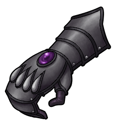  

---

## Unique: Silver Gauntlets

Gauntlets decorated with silverwork. Has a beautiful luster. 

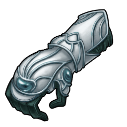  

---

## Unique: Gold Gauntlets

Gauntlets decorated with gold. Also known as the "Opulent Gauntlets."

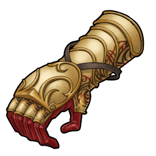  

---

## Unique: Mithril Gauntlet

Gauntlets decorated with Mithril. Considered to be a Dwarven work of art.

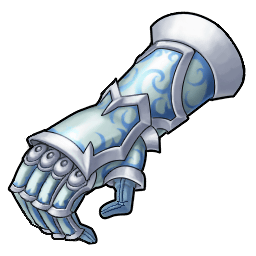  

---

## Unique: Hyper Gauntlets

Gauntlets made with lion teeth and fire rat skin. Imbued with the power of the King of Beasts.

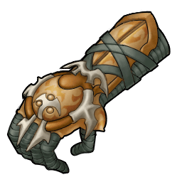  

---

## Unique: Rare Gauntlets

Masterpiece imbued with the soul of Giese. Extremely valuable. 

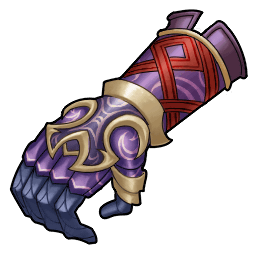  

---

## Unique: Battle Gauntlets

Gauntlets made specially for combat. Not only functional, but also has the power to push past one's limits.

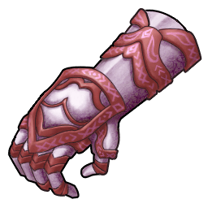  

---

## Unique: Grimm Gauntlets

Gauntlets imbued with the hidden power of fantasies. Named after the brothers who collected oral traditions.

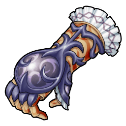  

---

## Unique: Leather Gloves

Bound together by leather. Somewhat stiff, but strong gloves. A regular companion of female travellers.

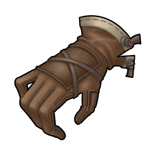  

---

## Unique: Pretty Gloves

Cute mittens made of soft fur. For those who are stylish but feel cold.

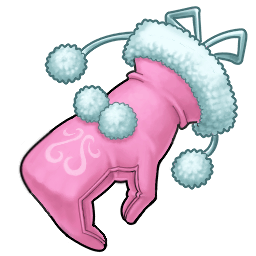  

---

## Unique: White Gloves

Beautiful gloves made of silk. Elegant and soft to the touch. You too can be a lady.

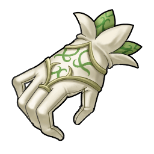  

---

## Unique: Moon Gloves

Gloves designed after a moonlit night. Endowed with the moon's holy power. Goes well with its cloak.

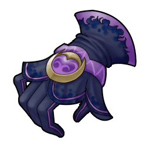  

---

## Unique: Star Gloves

Gloves designed after a star. Its fingertips look like falling stars. Goes well with its cloak.

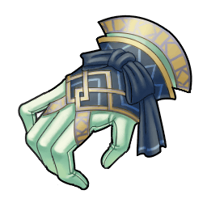  

---

## Unique: Rune Gloves

Gloves embroidered with the Love rune. Imbues one with the power to heal with a touch.

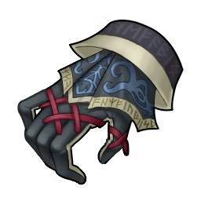  

---

## Unique: Misty Gloves

Gloves made from unknown materials. Its colors change with viewing angle. Goes well with its cloak.

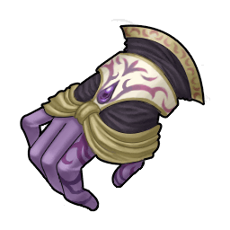  

---

## Unique: Mithril Gloves

Gloves decorated with Mithril. Considered to be a Dwarven work of art.

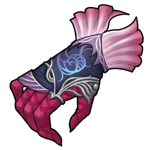  

---

## Unique: Steal Gloves

Gloves said to have been worn by a legendary thief. Allows one to pickpocket even hidden targets.

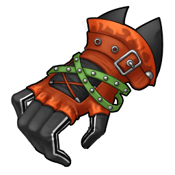  

---

## Unique: Grimm Gloves

Gloves imbued with the hidden power of fantasies. Named after the brothers who collected oral traditions into a book.

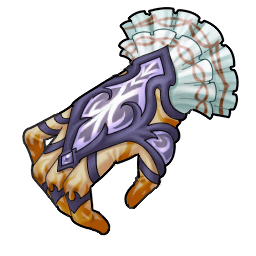  

---

## Unique: Stray Necklace

Necklace given to the priests of the Straylize temple. Increases the wearers concentration.

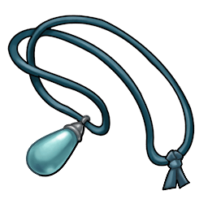  

---

## Unique: Wisdom Necklace

Necklace imbued with the Earth Spirits. Gives one unshakable composure. Increases the damage of  spells.

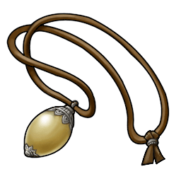  

---

## Unique: Avatar Necklace

Necklace imbued with the Wind Spirits. Gives the drive to make dreams real. Increases the damage of  spells.

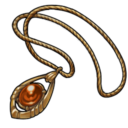  

---

## Unique: Arcane Necklace

Necklace imbued with the Fire Spirits. Makes one hear hidden voices. Increases the damage of  spells.

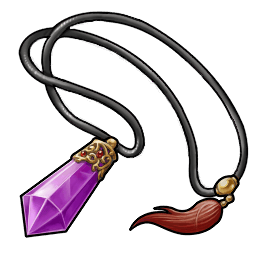  

---

## Unique: Magical Necklace

Necklace imbued with the Water Spirits. Sharpens one's willpower. Increases the damage of  spells.

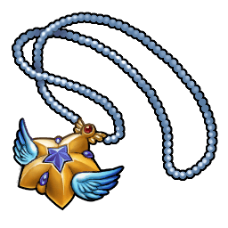  

---

## Unique: Mind Necklace

Necklace imbued with the Light Spirits. Heightens one's power to keep secrets. Increases the damage of  spells.

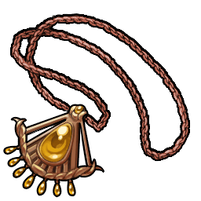  

---

## Unique: Mental Necklace

Necklace imbued with the Earth Spirits and Goddess' blessings and love. Decreases the casting time of  spells.

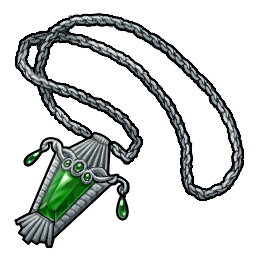  

---

## Unique: Tranquil Necklace

Necklace imbued with the Lord of Winds' blessing and warped heart. Decreases the casting time of  spells.

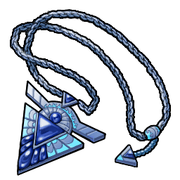  

---

## Unique: Muse Necklace

Necklace imbued with the Fire Goddess' blessing and impenetrable will. Decreases  the casting time of  spells.

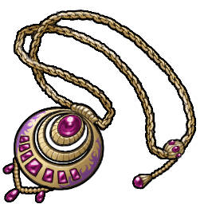  

---

## Unique: Fairy Necklace

Necklace imbued with the Ocean God's blessing and unwavering heart.  Decreases the casting time of  spells.

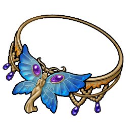  

---

## Unique: Ritual Necklace

Necklace imbued with the God of Light's blessing and eternal integrity. Decreases the casting time of  spells.

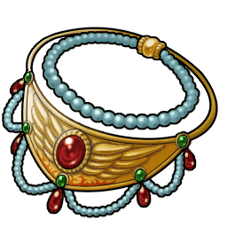  

---

## Unique: Otto Bow

Longbow made from a single piece of lumber. To master the art of archery, one must craft a bow of their own.

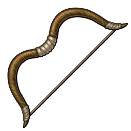  

---

## Unique: Composite Bow

Longbow made of several materials. Moderately flexible. For hunters familiar with the use of bows.

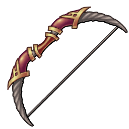  

---

## Unique: Wrapped Bow

Faster than the wind, it can reach fleeing prey. Traditionally made with a part of a hunted animal.

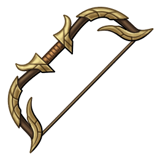  

---

## Unique: Custom Bow

Longbow made from a special alchemically created metal. Said to feel a prey's presence by its heat.

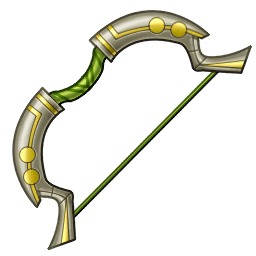  

---

## Unique: Rapid Bow

Faster than an animal running through the fields. Faster than the birds flying through the skies. Made for experienced hunters.

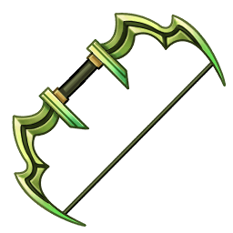  

---

## Unique: Killer Bow

One hit, one kill. Longbow used in assassinations. Shoots death silently.

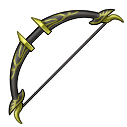  

---

## Unique: Battle Bow

Longbow made for use on the battlefield. Strong enough to pierce the enemy's armor.

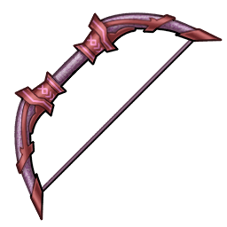  

---

## Unique: Grimm Bow

Longbow imbued with the hidden power of fantasies. Named after the brothers who collected oral traditions into a book.

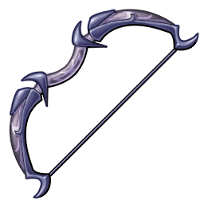  

---

## Unique: Leek

Used as a medicinal plant since ancient times, it warms the body and relieves fatigue.

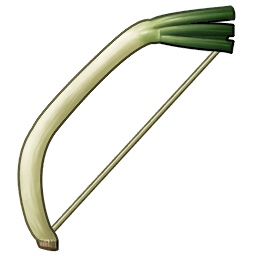  

---

## Unique: Ring Dagger

A dagger with a ring-shaped pommel. Attach a wire and you can throw and reel it in.

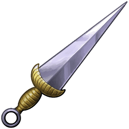  

---

## Unique: Kidney Dagger

A sharp dagger carried by the knights. It is more often used for ceremonial purposes than for actual combat.

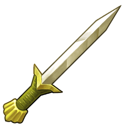  

---

## Unique: Ear Dagger

A dagger with an ear-shaped pommel. It's easy to grip and has great piercing power.

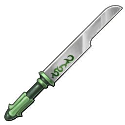  

---

## Unique: Parrying Dagger

Left-hand held dagger, a necessity for ambidextrous swordsmen. Has a sharp blade and can block enemy attacks.

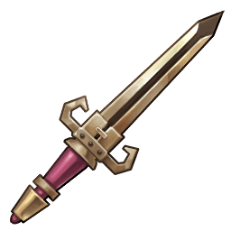  

---

## Unique: Poignard Dagger

A dagger made for thrusting. When used in a duel it can inflict severe bloodshed.

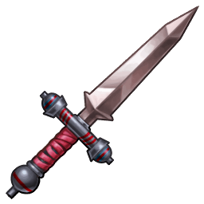  

---

## Unique: Kris Dagger

The world's most refined weapon. Its double-edged blade undulates. Protects the user and expels evil.

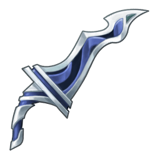  

---

## Unique: Mushroom

The utterly expensive king of mushrooms. Acquires a powerful taste and smell when its cap opens.

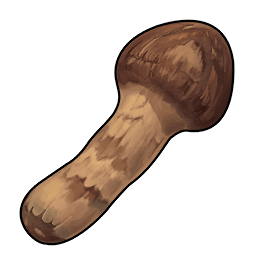  

---

## Unique: Triumph Bandana

A "Certain Victory" bandana. Increases attack when worn. 

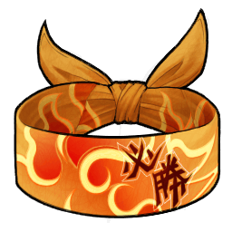  

---

## Unique: Fury Bandana

A "Fury" bandana. Protects wearer against poison and increases attack when worn.

  

---

## Unique: Stout Bandana

A "Stout" bandana. Protects wearer against petrification and increases defense.

  

---

## Unique: Sky Bandana

A "Sky" bandana. Protects wearer against paralysis and increases endurance.

  

---

## Unique: Awakening Bandana

An "Awakening" bandana. Protects wearer against sleep and increases concentration.

  

---

## Unique: Gale Bandana

A "Gale" bandana. Protects wearer against weakness and increases evasion.

  

---

## Unique: Annihilation Bandana

An "Annihilation" bandana. Protects wearer against seal and increases accuracy.

  

---

## Unique: Hero Bandana

A "Hero" bandana. Greatly increases wearer's attack. 

  

---

## Unique: Revolution Bandana

A "Revolution" bandana. Protects against all ailments. "Nothing will  shake me!"

  

---

## Unique: Red Ribbon

A simple red ribbon. A necessity for girls. Increases fire resistance. 

  

---

## Unique: Blue Ribbon

A light blue pleated ribbon. Made for precocious girls. Increases water resistance.

  

---

## Unique: Orange Ribbon

An orange satin ribbon. For girls who look up to ladies. Increases earth resistance.

  

---

## Unique: Green Ribbon

A tropical green ribbon. For girls who want to become different. Increases wind resistance.

  

---

## Unique: White Ribbon

Ribbon decorated with angel feathers. Wearing it makes a girl look classy! Increases light resistance.

  

---

## Unique: Black Ribbon

A mysterious black ribbon. For those who want to surpass adult women. Increases dark resistance.

  

---

## Unique: Weird Ribbon

A ribbon for children. Filled with love, hopes, and dreams. Allows one to move excitedly.

  

---

## Unique: Feather Hat

A hat with a large feather for decoration. decoration. Aiming to be classy with a stylish hat. That's 's style.

  

---

## Unique: Acclaim Hat

Only the strong are allowed to wear it. With it, you're sure to be admired. Imbues attacks with fire.

  

---

## Unique: Exile Hat

This hat is said to be worn by adventurers traveling the world. It gives you wanderlust. Imbues attacks with earth.

  

---

## Unique: Happy Hat

A sorcerer made this hat so it won't be blown away by the wind. That's happiness. Imbues attacks with wind.

  

---

## Unique: Streaked Hat

A hat for a seeker of mysteries. A sign pops up above your head when you find the answer. Imbues attacks with water.

  

---

## Unique: Singer Hat

A historic hat once worn by the choir known as "Angel's Choir". Imbues attacks with light.

  

---

## Unique: Sheikh Hat

The hat of a legendary poet. His voice enchants even the sleeping kings. Imbues attacks with dark.

  

---

## Unique: Replica Belt

A replica of the Champion's belt. He turned the original in when he left the city. We can get it back again!

  

---

## Unique: Fly Belt

Proof one has conquered the arena's flyweight division. Normal attacks have a low chance of downing foes.

  

---

## Unique: Bantam Belt

Proof of having conquered the arena's heavyweight division. Normal attacks have a slight chance of downing foes.

  

---

## Unique: Light Belt

Proof of conquering the arena's lightweight division. Normal attacks have a increased chance of downing foes.

  

---

## Unique: Middle Belt

Proof of conquering the arena's middleweight division. Normal attacks have a high chance of downing foes.

  

---

## Unique: Heavy Belt

Proof of conquering the arena's heavyweight division. Normal attacks have a significant chance of downing foes.

  

---

## Unique: Champion Belt

The greatest proof for those who have conquered the arena! Rebound back when in a pinch with your spirit!

  

---

## Unique: Seinegald Belt

Proof you conquered all monsters in the Seinegald region! 

  

---

## Unique: Fitzgald Belt

Proof you conquered all monsters in the Fitzgald region! 

  

---

## Unique: Calvalese Belt

Proof you conquered all monsters in the Calvalese region! 

  

---

## Unique: Aquaveil Belt

Proof you conquered all monsters in the Aquaveil region! 

  

---

## Unique: Phandaria Belt

Proof you conquered all monsters in the Phandaria region! 

  

---

## Unique: World Champion Belt

The sign of a champion who has conquered every monster! You will never yield to any challenge.

  

---

## Unique: Watermelon

It is another source of water in the desert. In the past, its seeds were considered edible.

  

---

## Unique: Iron Frypan

A frying pan made of iron. The more you use it, the better the flavor.

  

---

## Unique: Copper Frypan

A frying pan made of copper. It has great heat conduction and reduces cooking time.

  

---

## Unique: Silver Frypan

A frying pan made of silver. Has a beautiful white shine. It's a pity it will be burned.

  

---

## Unique: Gold Frypan

A frying pan made of gold. Also known as the "Gorgeous Frying Pan". Now you too can be the royal family's personal chef.

  

---

## Unique: Turnip

A vegetable that has been cultivated for a very long time. Commonly eaten pickled as a side dish.

  
