## Weapon: Dymlos

Swordian of Fire. Leader of an army. His full name is Dymlos Timber.

  

---

## Weapon: Atwight

Swordian of Water. A fierce and intelligent woman. Her full name name is Atwight Ecks.

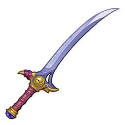  

---

## Weapon: Clemente

Swordian of Light. A wise old man. His full name is Laville Clemente.

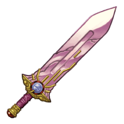  

---

## Weapon: Igtenos

Swordian of Wind. A rational and intelligent man. His full  name is Igtenos Mindarde.

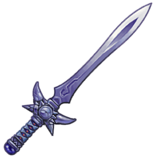  

---

## Weapon: Chaltier

Swordian of Earth. A gifted young man, his full name is Pierre de Chaltier.

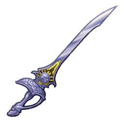  

---

## Weapon: Knight Blade

A sword adopted by the armed forces of many countries. Easy to use.

  

---

## Weapon: Royal Blade

A famous sword handed down from the Royal Family of Phandaria. Looks sharp.

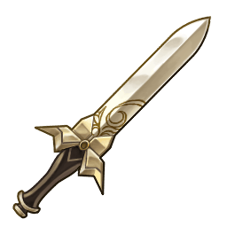  

---

## Weapon: Artifact

An oddly shaped sword and comfy in the hand. It was kept on the Draconis. A powerful aura can be felt

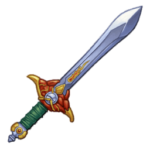  

---

## Weapon: Stone Axe

A knapped stone axe. Although obsolete, it's still a human milestone.

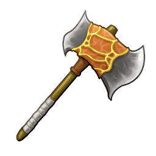  

---

## Weapon: Bronze Axe

An axe made of copper with excellent erosion resistance. Metal that has been used since the age of the Aeth'er War.

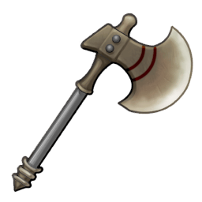  

---

## Weapon: Iron Axe

An axe made of iron. Metal that is used in a variety of structures. The most common metal.

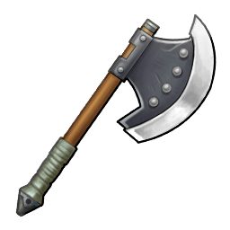  

---

## Weapon: Steel Axe

An axe made of steel. Steel is an alloy formed by mixing iron with carbon.

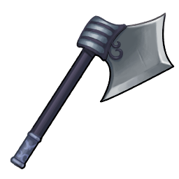  

---

## Weapon: Titanium Axe

This axe is used for a variety of tasks. It is very light, with incredible corrosion resistance.

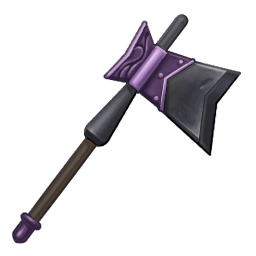  

---

## Weapon: Silver Axe

An axe adorned with silverwork. It has a beautiful white shine. 

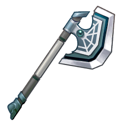  

---

## Weapon: Gold Axe

An axe made by using a rich mixture of gold. Known as the "Luxurious Axe".

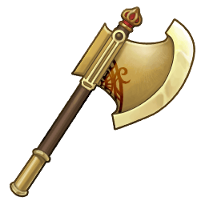  

---

## Weapon: Mithril Axe

An axe forged out of mithril. It is said to be a product of the Dwarves.

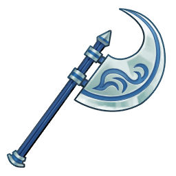  

---

## Weapon: Hand Axe

A small, very easy-to-use small axe. You don't need to be very strong to wield it in one hand.

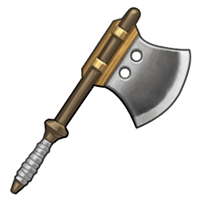  

---

## Weapon: Battle Axe

A thick-tapered axe with a sharp edge. As its name suggests, it is optimized for battle.

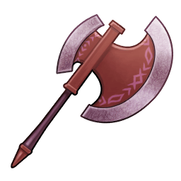  

---

## Weapon: Great Axe

A famous lumberjack once praised this axe with the words: "Wow! It's great!", which was how it received its name.

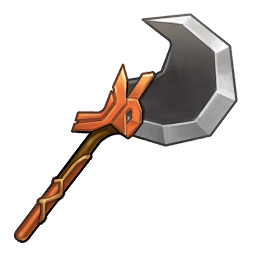  

---

## Weapon: Crescent Axe

An axe shaped like a crescent moon. This milky-white blade more resembles a moon when wielded in the dark.

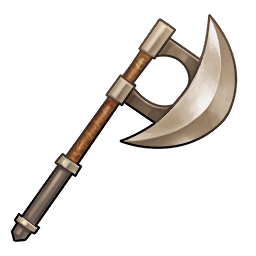  

---

## Weapon: Head Axe

An axe with an edge that extends to the other side of the blade. Used for thrusting into the ground.

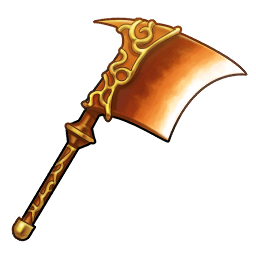  

---

## Weapon: Strike Axe

An axe designed to fight swordsmen. Hook and break swords by using the gap in its edge.

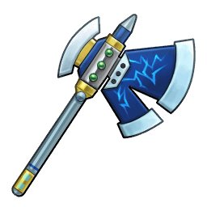  

---

## Weapon: Driving Axe

An axe characterized by its thin, round edge. Easily cuts through flesh, even with little strength.

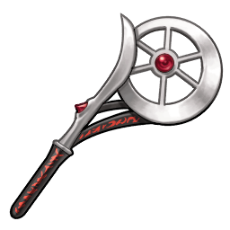  

---

## Weapon: Rare Axe

A masterpiece filled with the soul of master craftsman Giese. It's  valuable. A warrior's dream axe.

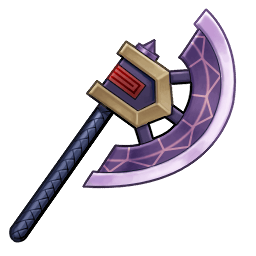  

---

## Weapon: Tomahawk Axe

An axe whose name means "A tool for cutting."If you're skillful, you can throw it.

  

---

## Weapon: Poleaxe

A heavy axe with a sharp cutting edge. Shatters even the heaviest of armors.

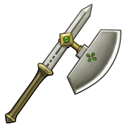  

---

## Weapon: Jedburgh Axe

An axe with a spear-shaped tip. Not only can it cut, but it can also stab.

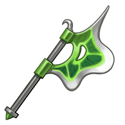  

---

## Weapon: Lochaber Axe

An axe with an edge and a hooked claw. Used to drag down foes on horseback.

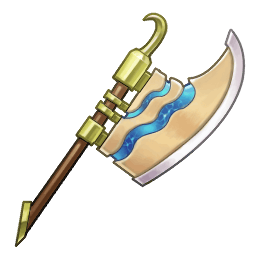  

---

## Weapon: Eye Axe

An axe whose name is taken from its eye-shaped axe head. 

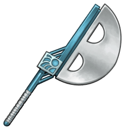  

---

## Weapon: Epsilon Axe

An improved Eye Axe that is easier to handle. The attack power has increased and it weighs less.

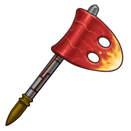  

---

## Weapon: Gaia Axe

An axe named after the Earth itself. Its slender shape belies its power. 

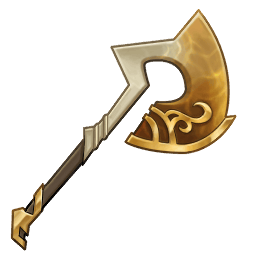  

---

## Weapon: Grimm Axe

An axe with legendary powers that appears in folklore. It bears the name of the brothers who recorded oral traditions.

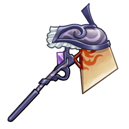  

---

## Weapon: Gano

An axe with a crescent-shaped head. It can be made with a small amount of metal.

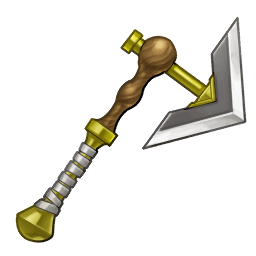  

---

## Weapon: Shoka

An axe reinforced with metal for extra strength. Can be used as an everyday tool.

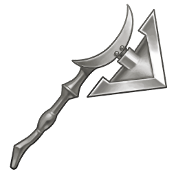  

---

## Weapon: Celtis

An axe with a chisel-shaped head. Contrary to its graceful appearance, it's actually quite sharp.

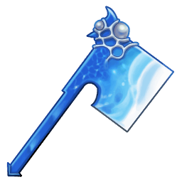  

---

## Weapon: Tabar

A half-moon shaped axe with a tough lens embedded. It's luxurious, but sharp.

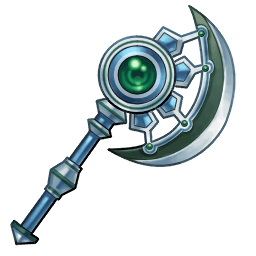  

---

## Weapon: Tabangil

A battle axe decorated to look like a plant. It's light, but is an excellent tool for  bludgeoning.

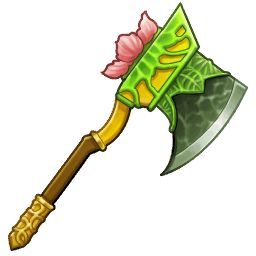  

---

## Weapon: Tangi

An axe with an upturned blade. Its beautiful, clear blade is a remnant from its use in rituals.

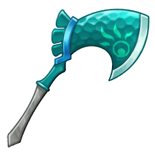  

---

## Weapon: Bullova

A battle axe with a broad, crescent shaped head. Specializes in cutting down foes.

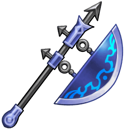  

---

## Weapon: Reverie Axe

An axe that signifies a fantasy. It transforms the user's thoughts into power. Only the chosen may wield it.

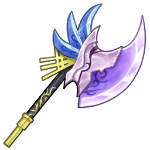  

---

## Weapon: Potato

Sweet potatoes are rich in fiber. Cook it at low temperatures to increase its sweetness.

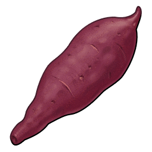  

---

## Weapon: Wood Bow

A small wooden bow. A beginner's best friend. 

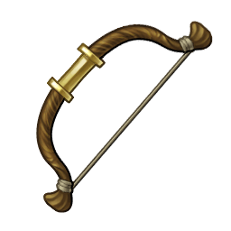  

---

## Weapon: Steel Bow

A small bow made of steel.  

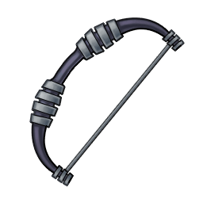  

---

## Weapon: Titanium Bow

A small bow made of titanium. It is very versatile. 

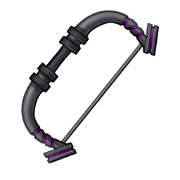  

---

## Weapon: Silver Bow

A small bow decorated with silver. It shines beautifully.  

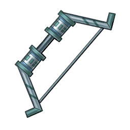  

---

## Weapon: Gold Bow

A small bow made of 80 percent gold. Also known as "The Beautiful Bow." 

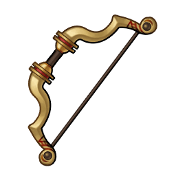  

---

## Weapon: Mithril Bow

Weaved out of the finest mithril, this small bow is a work of art created by dwarven craftsmen.

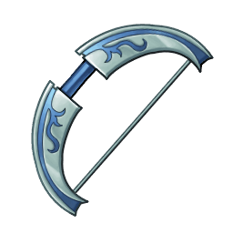  

---

## Weapon: Hunter Bow

A smaller version of a hunter's bow. Good performance at an affordable price!

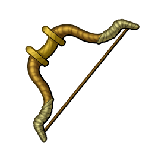  

---

## Weapon: Battle Bow

A combat oriented bow. Holds together even when struck by enemy attacks.

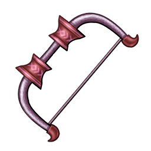  

---

## Weapon: Killer Bow

It only takes one shot. A small bow made for assassins. 

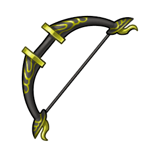  

---

## Weapon: Griffin Bow

A small bow with an arch that resembles a griffin's claw. It is said to be able to shoot birds flying high in the sky.

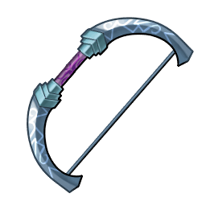  

---

## Weapon: Rare Bow

An unparalleled masterpiece that contains the soul of Giese, a master craftsman. An irreplaceable treasure to any archer.

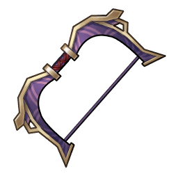  

---

## Weapon: Crane Bow

A small meshwork bow made  from a variety of woods. 

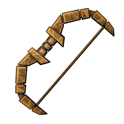  

---

## Weapon: Elven Bow

A small bow said to be used by elves. It is as light as a feather. 

  

---

## Weapon: Crescent Bow

A small bow in the shape of a crescent moon. It is said that even the mightiest beasts are paralyzed by its beauty.

  

---

## Weapon: Berserk Bow

A smaller version of "The Madman's Bow." The originals were owned by archers who claimied to be invincible.

  

---

## Weapon: Grimm Bow

An small bow named after two Brothers. Its power of illusion may make you feel like you are the huntsman himself.

  

---

## Weapon: Scarlet Needle

A smaller bow used by passionate and beautiful female warriors. Its precision could thread a needle.

  

---

## Weapon: Strike Eagle

What a deadly shot! This small bow  fires arrows at lightning speed! 

  

---

## Weapon: Soulsteal

A diabolical weapon that turns the souls of those it slays into power for its wielder. 

  

---

## Weapon: Celestial Star

A small bow made from an ancient meteorite. Its unique craftsmanship baffles tradesmen to this day.

  

---

## Weapon: Fortune Bow

A small bow that symbolizes destiny. Those who use it can bend fate to their will. Only those who are worthy may wield it.

  

---

## Weapon: Cucumber

The more prickly the warts, the more fresh they are. The key is to harvest them while they are still immature.

  

---

## Weapon: Iron Knuckle

Knuckles made of iron.  

  

---

## Weapon: Titanium Knuckle

Knuckles made of titanium. They are very versatile. 

  

---

## Weapon: Silver Knuckle

Knuckles decorated with silver. Reminiscent of a pure white glove. 

  

---

## Weapon: Gold Knuckle

Knuckles made with a large portion of gold. They are also known as "The Fabulous Fists." 

  

---

## Weapon: Mithril Knuckle

Weaved out of the finest mithril, these knuckles are works of art created by dwarven craftsmen.

  

---

## Weapon: Power Knuckle

These reinforced knuckles are 30% more durable than your bare fists! 

  

---

## Weapon: Needle Knuckle

Knuckles focused on stabbing rather than punching. The length of the needles makes it better for people with large swings.

  

---

## Weapon: Diamond Knuckle

Beautiful knuckles with diamond polished blades. Sharp, hard, and hurts like hell! 

  

---

## Weapon: Rare Knuckle

An unparalleled masterpiece that contains the soul of Giese, a master craftsman. An irreplaceable treasure to any warrior.

  

---

## Weapon: Bear Knuckle

Ready to fight bear handed? The fur is from an actual bear! It's a bit smelly...

  

---

## Weapon: Dragon Knuckle

Knuckles made in the image of a dragon from Aquaveil legends. It will bite into and tear apart your opponents.

  

---

## Weapon: Kaiser Knuckle

Venerable knuckles that were said to have been used by the first champion. 

  

---

## Weapon: Grimm Knuckle

Knuckles with the power of illusions. It bears the name of two brothers who transcribed many legends.

  

---

## Weapon: Venom

Knuckles of pure malice. This weapon tears flesh with its horns, then pours in a paralyzing poison.

  

---

## Weapon: Ivory Fang

Terrifying knuckles that will deal a lethal blow no matter where they hit. It's name means "A Powerful Organization."

  

---

## Weapon: God Weapon

Knuckles that are akin to God's wrath. These shining fists crush all evil. 

  

---

## Weapon: Volt Knuckle

These knuckles represent the world. With their power, you could conquer all. Only the mightiest of men can wield them.

  

---

## Weapon: Mandolin

An offshoot of the lute. Its stings are plucked with a pick made of a tortoiseshell.

  

---

## Weapon: Biwa

An instrument popularized in Aquaveil. It is usually plucked with a bachi instead of fingers and is often used when storytelling.

  

---

## Weapon: Lute

The instrument of a Bard. It has many strings that are strung in pairs.

  

---

## Weapon: Guitar

The instruments of stars. You press down the strings and pluck them with a pick.

  

---

## Weapon: Shamisen

A string instrument originally from Aquaveil. Its three strings are plucked with a plectrum. Peng! Peng!

  

---

## Weapon: Infinity Guitar

A guitar of infinite potential. Its tone reaches the depths of space. It can only be wielded by the chosen one.

  

---

## Weapon: Corn

Corn with high sugar content in the kernels. The fresher it is, the sweeter it is. 

  

---

## Weapon: Iron Ladle

A common ladle found in every home. A standard for corporal punishment. 

  

---

## Weapon: Copper Ladle

A rather expensive copper ladle. Wait, doesn't copper conduct a lot of heat? 

  

---

## Weapon: Silver Ladle

A rare Silver Ladle. Make sure to take care of your silverware! 

  

---

## Weapon: Gold Ladle

A ladle made of gold, to flex your Gald. Disclaimer: Not for cooking. 

  

---

## Weapon: Fanatic Ladle

An unrivaled ladle for cooking enthusiasts! I'm not certain it will make your food taste any better...

  

---

## Weapon: Carrot

Carrots are rich in carotene. Absorbtion is improved if you cook it in butter or oil.

  
