# Stahn's Side - Side-Quest Guide

## Side-Quest #001 - Lost Passport!

   

| | Janos   |
| :--------------------------------------------------------------------------------------- | :------------------ |
|  | No.04 Arriving in Janos ~ No.15 Before arriving in Cherik    |
|    | None    |

This event occurs when you talk to the man in front of the inn in Janos. He tells you that he has been staying in Janos for several years without being able to return to Phandaria since he lost his passport. He begs you to sell him your passport, but of course you can't. This man also appears in "The Bird in the Cage" [Side-Quest #077](projects/destiny-dc/stahn-guide?id=Side-Quest-077-bird-in-a-cage). 

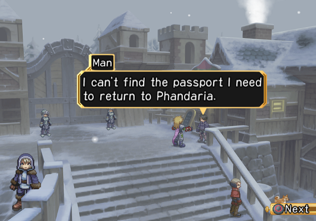  
▲ Unfortunately you can't help him yet.

---

## Side-Quest #002 - Small Family 1

   

| | Harmentz   |
| :--------------------------------------------------------------------------------------- | :------------------ |
|  | No.08 Arriving in Harmentz ~ No.15 Before arriving in Cherik    |
|    | None    |

This is a five part event and where each one is mandatory for the next one. The first one occurs when you examine the nest on the roof of the item shop. The shopkeeper will tell you that a family of birds that live on the roof and build a nest every year. The last part of this series of event will reward you with a [Magical Aroma], make sure to not miss any.

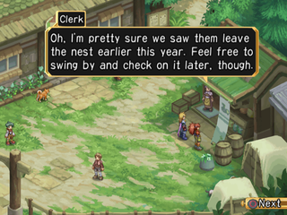  
▲ You can even witness the moment when the young birds leave their nests.

---

## Side-Quest #003 - Soldier's Advance 1

   

| | Darilsheid   |
| :--------------------------------------------------------------------------------------- | :------------------ |
|  | No.09 Leon joins ~ No.15 Before arriving in Cherik    |
|    | None    |

Like the "Small Family" event mentioned above, this event also has multiple parts to enjoy. The first part occurs upon entering the Darilsheid bar through the front door. A rowdy Seingaldian soldier will try to put the moves on Rutee, but an uninterested Rutee immediately rejects him. The rest of the parts of this event have a limited duration for when you can see them, so be sure to check their availability so you don't miss any of them. 

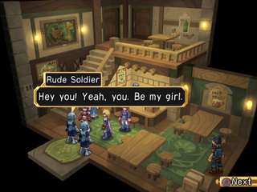  
▲ He's not the man Rutee needs, of course, so he got easily rejected.

---

## Side-Quest #004 - Country Boy

  

| | Darilsheid   |
| :--------------------------------------------------------------------------------------- | :------------------ |
|  | No.09 Taking Hugo’s Request ~    |
|    | Stahn's title [Country Boy]    |

This event occurs when you encounter a man who seems to know Stahn in from of the Darilsheid Item shop. He is friendly and will ask Stahn if he knows him. You should answer honestly that you do not know him. Only the first answer will work, pretending to know the man will force you to Buy [Apple Gel](projects/destiny-dc/items/item?id=item-apple-gel) for 100 gald.

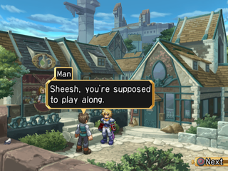  
▲ Try saying the wrong answer while not having enough money to buy his apple gel.

---

## Side-Quest #005 - The Rumoured Seven Generals

   

| | Darilsheid   |
| :--------------------------------------------------------------------------------------- | :------------------ |
|  | No.09 Taking Hugo’s Request ~ No.58 Fight against Hugo    |
|    | None    |

The Heroes of Seinegald are known as the "Seven Generals." You will encounter rumors about them in various places. Once you have heard them all, head to the audience chamber within Seinegald Castle to witness an assembly of the Seven Generals. The locations where the rumors can be encountered are listed below.

||||
|-----|-----|-----|
|Janos|Innkeeper's bar|Waitress|
|Harmentz|The house below the armorer's shop|Young Mother|
|Harmentz|Riverbank at the lower right of the armorer's shop|Young Man|
|Darilshield|Front of the item shop|Man|
|Darilshield|Residential district|Oberon Employee|
|Darilshield|Harbor|Meat Merchant|
|Armeida|The islet at the lower right of the village|Kid|

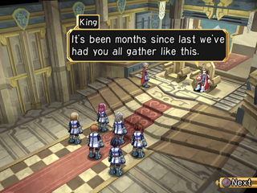  
▲ That's Darilsheid tax money at work.

---

## Side-Quest #006 - Capsule Toy

  

| | Darilsheid   |
| :--------------------------------------------------------------------------------------- | :------------------ |
|  | No.09 Taking Hugo’s Request ~    |
|    | See table below    |

There is a vending machine on the second floor of the Darilsheid Inn that offers capsule items for 200 Gald. Some of the available items are rare, so if you have a few Gald to spare, you should try your luck! The following table shows the items that are available and the probability of obtaining them. 

|||
|----------------|-----------|
|Apple Gel       |30%        |
|Oberol C        |20%        |
|Holy Bottle     |9%         |
|Dark Bottle     |9%         |
|Gamble Gel      |5%         |
|Liqueur Bottle  |5%         |
|Life bottle     |4%         |
|Peach Gel       |3%         |

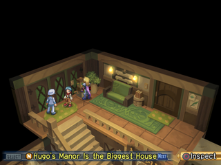  
▲ It's not technically a Side-Quest but since it's hidden in plain sight we felt the need to include it.

---

## Side-Quest #007 - Greedy Witch

  

| | Darilsheid   |
| :--------------------------------------------------------------------------------------- | :------------------ |
|  | No.09 Taking Hugo’s Request ~    |
|    | Rutee's title [Greedy Witch]    |

In the plaza just after passing under Seingald Castle's gate, talk to the soldier and select "How about some manners!" to see this event. The soldier will try to recall Rutee's nickname in a comical scene featuring many overlapping messages. The soldier says many incorrect names, seemingly on purpose, and Rutee will question each one. After Rutee gets exhausted and dizzy, the soldier says her real nickname and abruptly walks away.

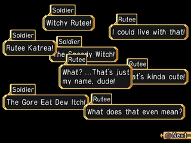  
▲ The [Greedy Witch] title is necessary to trigger Marian's Event [Side-Quest #097](projects/destiny-dc/stahn-guide?id=Side-Quest-097-Marian). 

---

## Side-Quest #008 - Doug Brothers

   

| | Darilsheid   |
| :--------------------------------------------------------------------------------------- | :------------------ |
|  | No.09 Taking Hugo’s Request ~ No.12 Straylize Temple cleared    |
|    | None    |

Between the period listed above, a Side-Quest will occur if you head to Reynold's Laboratory. There you will encounter Ashley of the Seven-Generals. He expresses frustration after learning of Stahn's mission and rushes off to the castle.This Side-Quest is mandatory to trigger the "Seinegald's King" [Side-Quest #073](projects/destiny-dc/stahn-guide?id=side-quest-073-seinegald39s-king-succession)

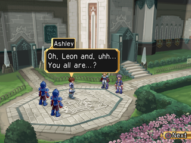  
▲ Triggering this Side-Quest is counterintuitive since it requires you to go back to the castle when you have no business there anymore the same is true for the "Alleged Mother"  [Side-Quest #010](projects/destiny-dc/stahn-guide?id=side-quest-010-alleged-mother).

---

## Side-Quest #009 - Bad Pun Man

  

| | Darilsheid   |
| :--------------------------------------------------------------------------------------- | :------------------ |
|  | No.09 Taking Hugo’s Request ~    |
|    | Mary's title [Breaker]    |

This event occurs after you visit Hugo's mansion in Darilsheid and receive the swordians. Speak with the old man in the house to the left in the residencial district. The old man, named "Bad Pun Man," shares that he loves puns, as long as they are of good caliber. Stahn impresses him, but Mary gives Stahn a hard time about his terrible jokes. Completing the event gives your the [Breaker] title for Mary.

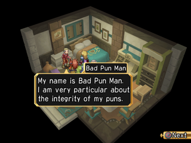  
▲ You will need the [Breaker] title for the "Fayte" event [Side-Quest #081](projects/destiny-dc/stahn-guide?id=Side-Quest-081-Fayte).

---

## Side-Quest #010 - Alleged Mother?

   

| | Darilsheid   |
| :--------------------------------------------------------------------------------------- | :------------------ |
|  | No.09 Taking Hugo’s Request ~ No.12 Straylize Temple cleared    |
|    | Mary's title [Home Cook]    |

This event only appears for a short time, so it's best to complete it PRIOR TO heading to Staylize Temple. Visit the dining room in Seinegald Castle, which is located at the end of the corridor on the left side of the first floor. A child will shout "mother," leading Stahn and the party to wonder for a moment if this child is Mary's. In the end, it all turns out to be a misunderstanding. 

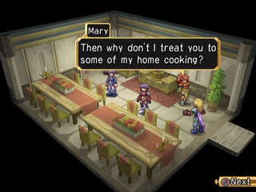  
▲ The title for this Side-Quest is super important and you really need to get out of your way to get it since there's no reason to visit this room in the castle at this point.

---

## Side-Quest #011 - Draconis Crewman's Family 1

   

| | Darilsheid   |
| :--------------------------------------------------------------------------------------- | :------------------ |
|  | No.09 Taking Hugo’s Request ~ No.37 End of part 1    |
|    | None    |

This event is available during the above period and occurs when you enter the two-story home behind the Darilsheid inn. Stahn and the party will encounter a mother scolding her child as he pretends to be a member of the Draconis' crew. The woman shares with the party that her husband, who serves upon the Draconis, has yet to return. When Rutee attempts to tell the woman the fate of the Draconis, Leon intervenes. Leon expresses concern for her husband's safety, but leaves without telling her about the crash. 

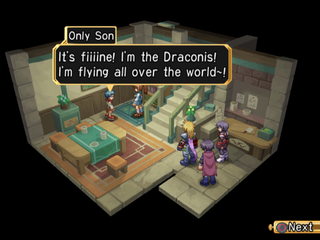  
▲ You can get the conclusion to this event in "Draconis Crewman's Family 2" [Side-Quest #124](projects/destiny-dc/stahn-guide?id=side-quest-124-draconis-crewman39s-family-2). 

---

## Side-Quest #012 - Dark Wings 1

   

| | Armeida   |
| :--------------------------------------------------------------------------------------- | :------------------ |
|  | No.10 Arriving in Armeida ~ No.12 Straylize Temple Cleared    |
|    | None    |

The Dark Wings, whom you met in Janos, appear before Stahn and others once again in this Side-Quest. You trigger this event by visiting the plaza at the far side of Armeida. While this is the first of eight Side-Quests, there is no specific order in which to view the events staring these three "lens hunters." No items or titles are obtained either, but their antics are worth seeing through to the very end. 

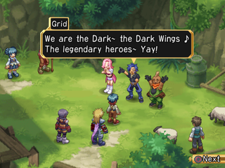  
▲ This time they're pretending to be legendary heroes.

---

## Side-Quest #013 - Lovers' Quarrels

   

| | Armeida   |
| :--------------------------------------------------------------------------------------- | :------------------ |
|  | No.10 Arriving in Armeida ~ No.44 Oberon Secret Factory clear    |
|    | Food strap [Fried Rice](projects/destiny-dc/items/food-strap?id=food-strap-fried-rice)    |

Upon entering the grocery store in Armeida, Mary is informed that due to the laziness of the store owner's husband, the available ingredients leave much to be desired. Mary tries to offer advice to help them get the situation under control, but only time will tell if this will assist in replenishing the grocers shelves.

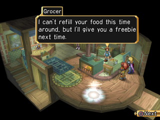  
▲ After the first conversation, go out of the shop and re enter to trigger the second part.

---

## Side-Quest #014 - Life Saver

   

| | Armeida   |
| :--------------------------------------------------------------------------------------- | :------------------ |
|  | No.12 Arrival at Straylize Temple ~ No.14 Before arriving in Cherik    |
|    | Item [Life Bottle](projects/destiny-dc/items/item?id=item-life-bottle) x2    |

Visiting the plaza in Armedia during this you will encounter one the Seven Generals, General Lewein. Speaking to him will trigger an event where you learn about an unexpected connection between Stahn's grandfather, Thomas Aileron, and the General Lewein. 

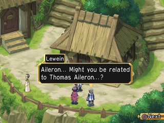  
▲ The period to do this sidequest is really short so make sure to stop after clearing the Straylize Temple

---

## Side-Quest #015 - Philia's First Time in Junkland

   

| | Junkland   |
| :--------------------------------------------------------------------------------------- | :------------------ |
|  | No.15 Arrival at Baruk's Office ~ No.54 Fight against Ilene    |
|    | None    |

Junkland doesn't need to be visited until towards the end of the story in case you just want to advance the main plot. However, to view this Side-Quest, you need to visit Junkland very early in the story. Near the armorer in Junkland, Philia is unable to handle the powerful stench in the air and falls ill. Do not fret - this event has no bearing on her actual status in game.

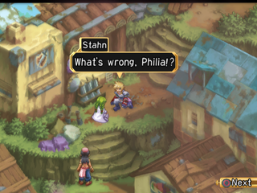  
▲ The best time to trigger this event is to go directly after leaving Cherik and before entering Calviola.

---

## Side-Quest #016 - Yearning to Join the Dark Wings 1

   

| | Calviola   |
| :--------------------------------------------------------------------------------------- | :------------------ |
|  | No.16 Arriving in Calviola ~ No.19 Before arriving at Neustadt    |
|    | None    |

To trigger this event, speak with a young boy with green hair near a large pool of water to the right of the entrance of Calviola. You will start the story of a boy named Toshu who has run away from home in order to join the Black Wings. The continuation of this story does not occur until this event is cleared. 

  
▲ Toshu doesn't suspect the Dark Wings real identity. The second event will reveal what happened after that [Side-Quest #075](projects/destiny-dc/stahn-guide?id=Side-Quest-075-Yearning-to-join-the-Dark-Wings-2).

---

## Side-Quest #017 - Calviola's Elena 1

   

| | Calviola   |
| :--------------------------------------------------------------------------------------- | :------------------ |
|  | No.16 Arriving in Calviola ~ No.19 Before arriving at Neustadt    |
|    | None    |

This event occurs when speaking with Elena, who is in a house to the left of the Oberon Corporation building in Calviola. She asks the party to assist her in finding her father, who is half Calviolan and half Seinegaldian. If you do not complete (trigger?) this Side-Quest, the second part, [Calviola's Elena 2](projects/destiny-dc/stahn-guide?id=side-quest-076-calviola39s-elena-2), will NOT occur. 

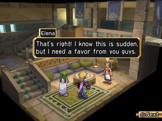  
▲ Completing this event is nessesary to trigger the "Bird in a Cage?" [Side-Quest #077](projects/destiny-dc/stahn-guide?id=Side-Quest-077-Bird-in-a-Cage?).

---

## Side-Quest #018 - The Pickpocket Incident

   

| | Calviola   |
| :--------------------------------------------------------------------------------------- | :------------------ |
|  | No.18 Calviola Temple Cleared ~ No.19 Before arriving at Neustadt    |
|    | None    |

This event occurs if you try to leave Calviola through the northern exit with some lens on you. A boy bumps into Stahn and the others. Rutee immediately recognizes him as a lens pickpocket and presses him for answers. After a heated exchange, the boy eventually runs off with your some of your lens.(Quantity wasnt checked for how much he steals but it's not a lot probably)

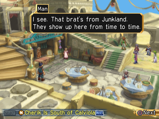  
▲ The party learns from a bystander that the kid is from Junkland

---

## Side-Quest #019 - Dark Wings 2

   

| | Cherik   |
| :--------------------------------------------------------------------------------------- | :------------------ |
|  | No.18 Calviola Temple Cleared ~ No.19 Before arriving at Neustadt    |
|    | None    |

Visit the square close to where the Baruk Foundation is located in Cherik to encounter the Black Wings. Approaching them causes an event to occur where they claim they are heros to the people of the city. However, they are ignored and are offered no fanfare. No matter what they try, they cannot grab the attention of anyone and are not taken seriously. 

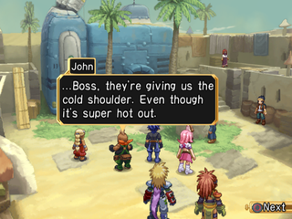  
▲ IMPORTANT this event won't appear if you trigger the cherik port scene before going there, it's really easy to miss!

---

## Side-Quest #020 - Sibling 1

   

| | Neustadt   |
| :--------------------------------------------------------------------------------------- | :------------------ |
|  | No.20 Arriving in Neustadt ~ No.20 Before entering Ilene's house    |
|    | None    |

Talking to the girl on the bridge connected to the Oberon Lens shop in Neustadt. She is worried about how she treated her step brother. Rutee shares her opinion that they are still siblings, even if they aren't related by blood.  The girl doesn't understand what Rutee says and leaves. You must complete this even before the next event, [Sibling 2], can occur. You have a very short window to complete these, so you should do both of them when you first visit Neustadt. 

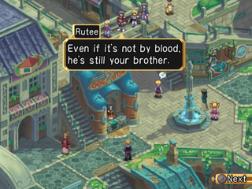  
▲ Rutee asks the troubled girl for her honest thoughts and feelings.

---

## Side-Quest #021 - Gaze of Resolve

  

| | Neustadt   |
| :--------------------------------------------------------------------------------------- | :------------------ |
|  | No.20 Arriving in Neustadt    |
|    | Philia's title [Gaze of Resolve]    |

This event occurs when you speak with the woman who is standing in front of the Neustadt item shop. When presented with a choice, select "Is this about...me?".  From here a conversation with this woman ensues, where Philia is recognized as a Straylize Priestess. The woman comments on Philia's gaze. The title you receive here is necessary for the next part of this event series [Maiden's Gaze].

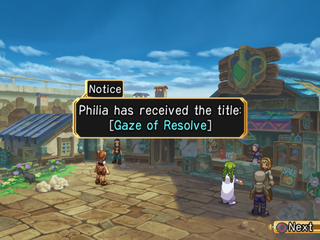  
▲ The title you receive here is necessary for the next part of this event series "Maiden's Gaze [Side-Quest #046](projects/destiny-dc/stahn-guide?id=side-quest-046-maidens-gaze)" 

---

## Side-Quest #022 - Sweet Boy

   

| | Neustadt   |
| :--------------------------------------------------------------------------------------- | :------------------ |
|  | No.20 Arriving in Neustadt ~ No.22 Arriving in Shiden Territory    |
|    | Leon's title [Sweet Boy]    |

This event occurs when you speak with a young boy sitting on a bench in front of the Softy Kreem stand in Neustadt. During the conversation, select "I have no business with children." Leon will provide an answer to the child's question about food he doesn't like. In order for this event to occur, you must have Leon in your party. 

  
▲ The boy discovers Leon's hidden taste for sweets.

---

## Side-Quest #023 - Lost Child

   

| | Neustadt   |
| :--------------------------------------------------------------------------------------- | :------------------ |
|  | No.20 Arriving in Neustadt ~ No.20 Before entering Ilene's house    |
|    | None    |

You can trigger this event by speaking to the lost child near Ilene's house in Neustadt. Due to the child's appearance, Rutee assumes the child is rich and helps to child in hopes of getting a reward. It turns out the child is only borrowing these clothes and is actually quite poor. The window for you to trigger this event is quite short, so make sure to view it before going into Ilene's house. 

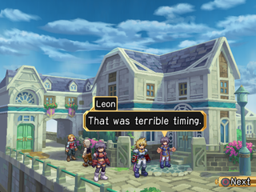  
▲ Unfortunately Rutee's scheme didn't pay out and the mother left without even saying thanks.

---

## Side-Quest #024 - "Swatian" User?

  

| | Neustadt   |
| :--------------------------------------------------------------------------------------- | :------------------ |
|  | No.20 Arriving in Neustadt    |
|    | Stahn title ["Swatian" User?]    |

Trigger this even by talking to the boy near the fountain in Neustadt. Upon selecting the choice "You know about the Swordians?," Dymlos scolds Stahn for blurting out such sensitive information. Stahn attempts to use his wits to cover up his mistake, sharing instead about the mystic Swatian, used to swat flies.  

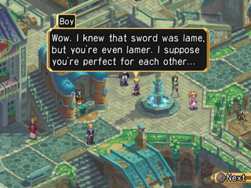  
▲ The title obtained is a required for "Fake Swordian" [Side-Quest #138](projects/destiny-dc/stahn-guide?id=side-quest-138-fake-swordians)

---

## Side-Quest #025 - Monster Book Appraisal

  

| | Neustadt   |
| :--------------------------------------------------------------------------------------- | :------------------ |
|  | No.20 Arriving in Neustadt    |
|    | See Below    |

Make sure to be checking the maximum number of hits displayed when you review the Monster Book as it will be related to other Side-Quests. After you have fought your way to a number over 30, talk to a monster researcher in the Neustadt arena, next to a weapon shop in any city, or next to an armorer in any city. You will receive a Definite Strike Record. Afterward, each time you perform a Definite Strike, a ★ mark will appear to the right of the monster's name in the Monster Book. When you reach 100% for a region, you are awarded one of the items outlined in the table below by a Monster Researcher. 

|        Condition        |        Reward        |
|        -----       |        -----        |
|        Seinegald area complete        |        Item [Zexceed Material]        |
|        Seinegald area  complete        |        Unique [Seinegald Belt]        |
|        Fitzgald area  complete        |        Item [Variable Material]        |
|        Fitzgald area  complete        |        Unique [Fitzgald Belt]        |
|        Calvalese area  complete        |        Unique [Grimm Bow]        |
|        Calvalese area  complete        |        Unique [Calvalese Belt]        |
|        Aquaveil area  complete        |        Unique [Aquaveil Belt]        |
|        Aquaveil area  complete        |        Food Strap [Fish Hot Pot]        |
|        Phandaria area  complete        |        Unique [Revolution Bandana]        |
|        Phandaria area  complete        |        Unique [Phandaria Belt]        |
|        All areas complete        |        Unique [Grimm Gauntlets]        |
|        All areas complete        |        Unique [World Champion Belt]|

  

---

## Side-Quest #026 - Pirate Ship Reward

   

| | Neustadt   |
| :--------------------------------------------------------------------------------------- | :------------------ |
|  | No.22 Pirate Ship Cleared ~ No.22 Arriving in Shiden Territory    |
|    | See Below    |

After you have cleared the pirate ship, speak with the sailor north of Irene's house. He will give you a reward based on the amount of time you spent clearing the pirate ship.  

|Rank|Time|Reward|
|-----|-----|-----|
|1| Less than 3 minutes|[Blast Material](projects/destiny-dc/items/item?id=item-blast-material)|
|2| Less than 5 minutes|[Clear Lens](projects/destiny-dc/items/key?id=key-clear-lens) x50|
|3| More than 5 minutes|[Rough Lens](projects/destiny-dc/items/key?id=key-rough-lens) x 100|

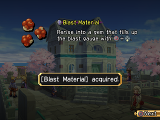  
▲ The requirements for obtaining the rewards are listed below.

---

## Side-Quest #027 - Dark Wings 3

   

| | Neustadt   |
| :--------------------------------------------------------------------------------------- | :------------------ |
|  | No.22 Pirate Ship Cleared ~ No.22 Arriving in Shiden Territory    |
|    | None    |

This event takes place when you enter the nursing room on the left side of the arena. Here you will encounter the Dark Wings yet again. Taking advantage of Kongman's absence, they claim to be the champions of the arena. While there is no reward for this event, seeing them panic when Kongman arrives with Stahn and the others is quite amusing. 

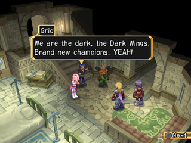  
▲ This event is only accessible after the pirate ship and before Kongman leave the party at the port. 

---

## Side-Quest #028 - Sibling 2

   

| | Neustadt   |
| :--------------------------------------------------------------------------------------- | :------------------ |
|  | No.22 Pirate Ship Cleared ~ No.22 Arriving in Shiden Territory    |
|    | None    |

This event is triggered by speaking with the same girl on the bridge for [Siblings 1], assuming you completed the first event in the series. After the monster attack, she learns the truth behind Rutee's words.  

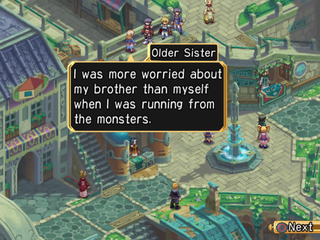  
▲ Even though she had been struggling with the fact that they were not her true siblings, the unprecedented incident seems to have opened her eyes.

---

## Side-Quest #029 - Young Master 1

   

| | Shiden   |
| :--------------------------------------------------------------------------------------- | :------------------ |
|  | No.23 Arriving in Shiden Territory ~ No.28 Before Arriving in Terrazi Territory    |
|    | None    |

This event occurs when you speak with a child crying on a bridge in Shiden. This child is starved for attention and has an obnoxiously selfish attitude. Leon cannot stand seeing such a display, especially from such a spoiled brat.

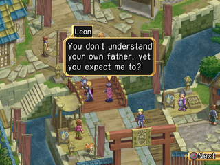  
▲ The kid's attitude is unbearable for Leon since he had a tough upbringing 

---

## Side-Quest #030 - Neat Sister

  

| | Shiden   |
| :--------------------------------------------------------------------------------------- | :------------------ |
|  | No.25 Undersea Cave cleared~    |
|    | Rutee's title [Neat Sister]    |

Speak with the girl in front of the Shiden Family mansion and she will compliment Rutee on her beauty. Choose the dialogue option of "Do I have something on my face?" to receive the title of Neat Sister. 

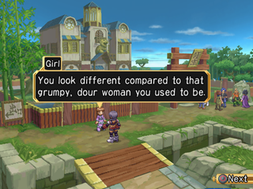  
▲ The title [Neat Sister] is mandatory to trigger the event "Sealed Man" [Side-Quest #108](projects/destiny-dc/stahn-guide?id=Side-Quest-108-Sealed-Man) 

---

## Side-Quest #031 - Dark Wings 4

   

| | Shiden   |
| :--------------------------------------------------------------------------------------- | :------------------ |
|  | No.25 Arriving in Moreau ~ No.28 Before arriving in Terazzi    |
|    | None    |

The Dark Wings are back again. This time, they appear in front of the Shiden family mansion. They claim to be the ones hired to assist. It doesn't take long before the ruse is discovered and the Dark Wings are foiled once again.

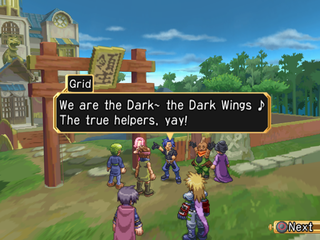  
▲ Lot of people haven't seen this event since it requires you to backtrack all the way to Shiden after arriving in Moreau. If you clear Moreau castle you'll miss it. The same is true for the next Side-Quest.

---

## Side-Quest #032 - Michel Shiden

   

| | Shiden   |
| :--------------------------------------------------------------------------------------- | :------------------ |
|  | No.25 Arriving in Moreau ~ No.28 Before arriving in Terazzi    |
|    | None    |

This event occurs when you go to the bridge at Shiden Port. Johnny is defending a boy who is being questioned by the residents. He will tell you a story about Michel Shiden, the founder of Aquaveil. In order to see this event, you must return to Shiden from Moreau through the underwater caves BEFORE you clear Moreau's Castle.

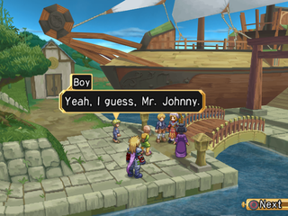  
▲ When Johnny told them about his ancestors, it made them realize how futile their quarrel his.

---

## Side-Quest #033 - Eleanor 1

   

| | Moreau   |
| :--------------------------------------------------------------------------------------- | :------------------ |
|  | No.27 Clear Moreau's Castle ~ No.28 Before arriving in Terazzi    |
|    | Item [Meteorite](projects/destiny-dc/items/item?id=item-meteorite)    |

After clearing Moreau Castle, take a small boat to Johnny's hideout. You will see a scene where Johnny reminisces about his childhood friends, Fate and Eleanor. 

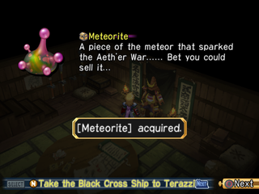  
▲ After seeing this event, you can get a [Meteorite](projects/destiny-dc/items/item?id=item-meteorite) by examining the samurai armor on the wall.

---

## Side-Quest #034 - Shiden's Youngest

   

| | Moreau   |
| :--------------------------------------------------------------------------------------- | :------------------ |
|  | No.27 Clear Moreau's Castle ~ No.28 Before arriving in Terazzi    |
|    | Johnny's title [Shiden's Youngest]    |

This event is triggered when you speak with the man on the roof of the underground warehouse in Moreau. Choose the dialogue option of "I'm just the clown know as..." to witness a scene where the man shares his disdain for Johnny's lifestyle. Stahn and the others are impressed with how he handles the matter, earning him this title. You will not be able to get to this building using the gondola, so you'll need to go on foot. 

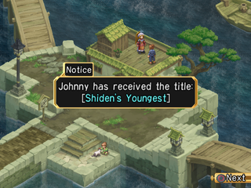  
▲ If you choose the option above during the conversation, you can get Johnny's title [Shiden's Youngest]

---

## Side-Quest #035 - Arthur Shiden

   

| | Shiden   |
| :--------------------------------------------------------------------------------------- | :------------------ |
|  | No.27 Clear Moreau's Castle ~ No.28 Before arriving in Terazzi    |
|    | None    |

Speak with Arthur Shiden while Johnny has the [Shiden's Youngest] title to trigger this event. You will find Arthur Shiden in the Shiden Family Mansion. He is despondent as he is no longer a lord. He hopes that Johnny will become the next great king. However, Johnny refuses to listen.

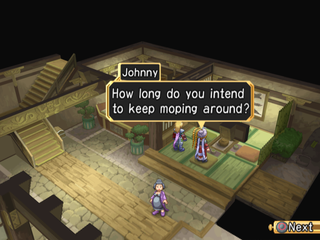  
▲ He was ousted from his position as lord after the theft of the treasured sword.

---

## Side-Quest #036 - Dark Wings 5

   

| | Frostheim   |
| :--------------------------------------------------------------------------------------- | :------------------ |
|  | No.31 Woodrow & Chelsea joins ~ No.36 Before Greybum's Battle    |
|    | None    |

Approach the Dark Wings in Frostheim to see additional antics. They claim to be "legendary mercenaries," and indulge in food and drink without intending to pay. They are no match for Master Alba, who cons them into clearing snow from his roof. 

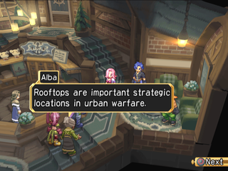  
▲ The three of them are completely enticed by Alba's story and head for the roof to remove the snow with renewed enthusiasm.

---

## Side-Quest #037 - Rose of Seinegald

  

| | Frostheim   |
| :--------------------------------------------------------------------------------------- | :------------------ |
|  | No.31 Woodrow & Chelsea joins ~    |
|    | Leon's title [Rose of Seinegald]    |

Speaking to a woman near the entrance of Frostheim triggers this event. If you ignore her, she professes her adoration for Leon, which started as soon as she saw them in Seinegald. She seems to be mistaken that Leon is a girl, not realizing the beautiful man before her is the man of her dreams.  

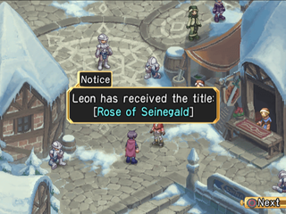  
▲ The event end without Leon being able to clear the "misunderstanding."

---

## Side-Quest #038 - Cursed Beauty

  

| | Frostheim   |
| :--------------------------------------------------------------------------------------- | :------------------ |
|  | No.31 Woodrow & Chelsea joins ~    |
|    | Chelsea's title [Cursed Beauty]    |

This event takes place in the house to the left of the ??? shop found in Frostheim. When offered a choice, choose "Hey, he's kinda cute!" A misunderstanding with the young man leads to quite the conversation between him and Chelsea. 

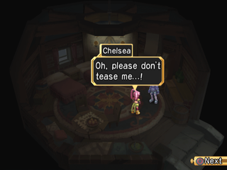  
▲ The title obtained here is necessary to trigger "Princess Rhianna" [Side-Quest #082](projects/destiny-dc/stahn-guide?id=Side-Quest-082-Princess-Rhianna) 

---

## Side-Quest #039 - Isaac's Son

  

| | Cyril   |
| :--------------------------------------------------------------------------------------- | :------------------ |
|  | No.33 Mary's memories returned    |
|    | Woodrow's title [Isaac's Son]    |

Talk to the boy near the food store in Cyril to trigger this event. When presented with a choice, choose "Is something wrong, boy?" The boy recognizes Woodrow as the King Isaac's son. Surprised by Woodrows honesty about who he is, the boy realizes just how cool Woodrow really is.

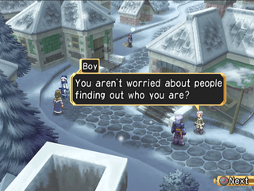  
▲ The title obtained here is necessary to trigger "Popularity Battle" [Side-Quest #065](projects/destiny-dc/stahn-guide?id=Side-Quest-065-Popularity-Battle) 

---

## Side-Quest #040 - Former Soldier

  

| | Cyril   |
| :--------------------------------------------------------------------------------------- | :------------------ |
|  | No.33 Mary's memories returned    |
|    | Mary's title [Former Soldier]    |

After Mary's memory is restored, talk to the man shoveling snow in Cyril. When presented with a choice, choose "You seem familiar..." The man will share he knew Mary when he was a simple mercenary. 

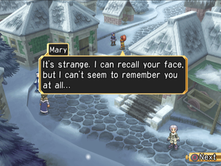  
▲ He tells a few stories about Mary when they were in the army.

---

## Side-Quest #041 - Chris' Old Acquaintance

   

| | Janos   |
| :--------------------------------------------------------------------------------------- | :------------------ |
|  | No.33 Mary's memories returned No.36 Before Greybum's Battle    |
|    | Leon's blast caliber [Infernal Suffering]    |

This sub event is triggered by speaking with the Janos gate guard during the period mentioed above while Leon is a member of your party. He knew Leon's mother, Chris, and recalls stories of her childhood. This will grant you the blast caliber Infernal Suffering. If you already know this blast caliber, you receive nothing. 

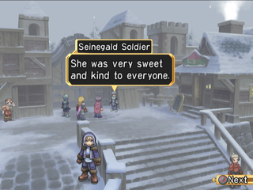  
▲ This event is short lived so it's better to do it before Mary's memory has returned.

---

## Side-Quest #042 - Meeting the Wonder Baker

  

| | Lienea   |
| :--------------------------------------------------------------------------------------- | :------------------ |
|  | No.38 Start of part 2 ~    |
|    | None    |

When Stahn approaches the Grocer in Lienea he encounters the mythical Wonder Baker. This individual loves their bread puns. Even Stahn can't help but join in with his own special way of speaking. 

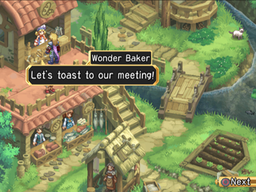  
▲ This food shop as a huge selection of different bread-type food like sandwiches.

---

## Side-Quest #043 - Lienean Man

  

| | Lienea   |
| :--------------------------------------------------------------------------------------- | :------------------ |
|  | No.38 Philia joins ~    |
|    | Stahn title [Lienean Man]    |

You will be presented with a choice when Stahn speaks to the Chief's Daughter in Lienea. Choose "Nowhere special..." and she'll notice Philia with Stahn. This makes her see Stahn has grown into a young man. 

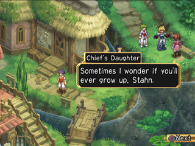  
▲ If she recognizes Stahn as "a man," he'll earn the title [Lienean Man]

---

## Side-Quest #044 - Community Old Man

  

| | Traveler's Lodge   |
| :--------------------------------------------------------------------------------------- | :------------------ |
|  | No.38 Departure from the village of Lieane    |
|    | Portrait Option    |

Heading west of Linea you can find a remote small building with an old man inside, this old man used to be linked to a defunct website where you could enter passwords to unlock in-game rewards. However, much like any other site from the early 2000’s, it was dead by the time the Director’s Cut version of the game was released. He now unlocks the alternate portrait option in the Customize menu.

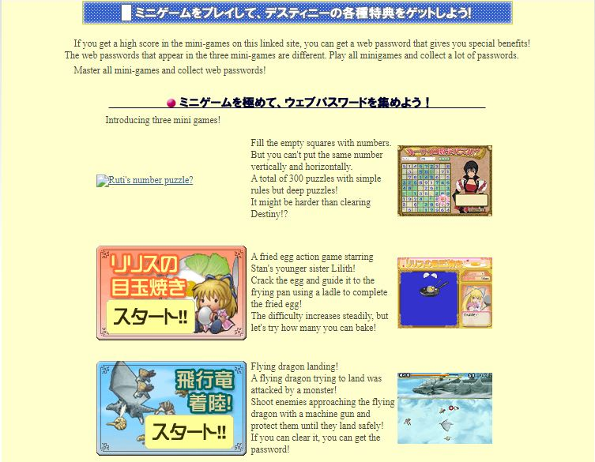  
▲ That's how the website use to look and here's the internet archive link https://web.archive.org/web/20070114131308/http://namco-ch.net:80/to-destiny/pc_game.html

---

## Side-Quest #045 - Dalis' Nightmare

  

| | Cyril   |
| :--------------------------------------------------------------------------------------- | :------------------ |
|  | After Side-Quest [Young Master 2]    |
|    | None    |

NOTE: References the defunked website and a password obtained from a mini game played on hard difficulty. Once you use the password with the Community Old Man, talk to Dalis in Cyril to experience this event. 

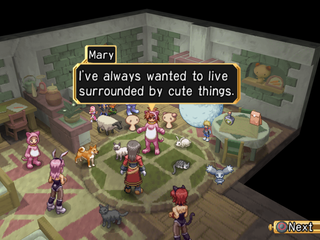  
▲ This is what moé hell would look like, poor Dalis.

---

## Side-Quest #046 - Maiden’s Gaze

  

| | Neustadt   |
| :--------------------------------------------------------------------------------------- | :------------------ |
|  | No.39 Arriving in Neustadt    |
|    | Philia's title [Maiden’s Gaze]    |

This event will occur when you speak to the woman standing in front of the lower quarter item shop after completing the [Gaze of Resolve] Side-Quest. Select the choice "You're the woman from before!" She will notice a change in Philia granting her the title. If you haven't completed [Gaze of Resolve], you can leave the screen to reset the NPC.

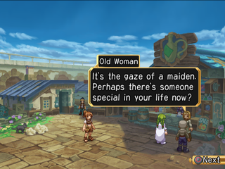  
▲ The title obtained here is necessary to trigger "Chief's Daughter" [Side-Quest #057](projects/destiny-dc/stahn-guide?id=side-quest-057-chief39s-daughter) 

---

## Side-Quest #047 - Dalis' Wife

  

| | Frostheim   |
| :--------------------------------------------------------------------------------------- | :------------------ |
|  | No.40 Mary joins  ~    |
|    | Mary's title [Dalis' Wife]    |

After Mary rejoins the party in the second part of the game, speak to the woman near the Armor shop in Frostheim. Select the dialogue choice "Who are you...?" and the woman will speak to Mary about Dalis. During the conversation, Mary remembers that this woman was a neighbor who helped care for Dalis.

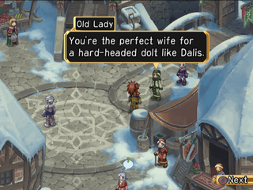  

---

## Side-Quest #048 - Topless Man

  

| | Frostheim   |
| :--------------------------------------------------------------------------------------- | :------------------ |
|  | No.40 Mary joins  ~    |
|    | Kongman's title [Topless Man]    |

This event occurs when you speak to the woman near the entrance of Frostheim from the [Rose of Seinegald] event. Select the dialogue choice "Sorry, no autographs on my down time." Watch as she receives an unconventional answer about his choice of attire.

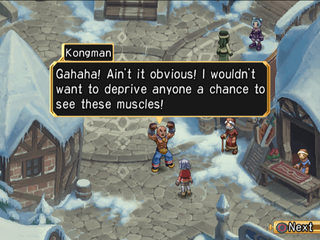  
▲ The title obtained here is necessary to trigger "Kong Theatre" [Side-Quest #104](projects/destiny-dc/stahn-guide?id=Side-Quest-104-Kong-Theatre) 

---

## Side-Quest #049 - Kidult

  

| | Heidelberg   |
| :--------------------------------------------------------------------------------------- | :------------------ |
|  | No.41 Woodrow & Chelsea joins ~    |
|    | Chelsea's title [Kidult]    |

Speak to the boy at the entrance of Heidleberg to trigger this event. When presented with a choice, choose the dialogue option "Ohohoh, what a rowdy little boy!" Chelsea is in control of the situation until the boy makes fun of her outfit. 

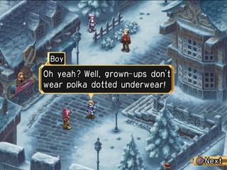  
▲ The title obtained here is necessary to trigger "Homesickness" [Side-Quest #100](projects/destiny-dc/stahn-guide?id=Side-Quest-100-Homesickness) 

---

## Side-Quest #050 - Phandaria's King

  

| | Heidelberg   |
| :--------------------------------------------------------------------------------------- | :------------------ |
|  | No.41 Woodrow & Chelsea joins ~    |
|    | Woodrow's title [Phandaria's King]    |

Speak to the young woman on the second floor of the Heidelberg inn to trigger this event. When presented with dialogue choices, choose "How can I be of assistance?" She shares he desire to seek an audience with the King.  She shares with Woodrow her plight as a result of the recent riots. 

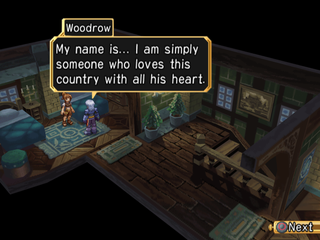  
▲ The title obtained here is necessary to trigger "Dalis and Mary" [Side-Quest #115](projects/destiny-dc/stahn-guide?id=Side-Quest-115-Dalis-and-Mary) 

---

## Side-Quest #051 - Accidental Resemblance

  

| | Janos   |
| :--------------------------------------------------------------------------------------- | :------------------ |
|  | No.41 Woodrow & Chelsea joins ~    |
|    | Woodrow's title [Doppelganger], Items see below    |

In this multi-part sub quest, Woodrow is mistaken for someone else by people all over the world. You can trigger this event by speaking with a traveler at the tavern in Janos. There are people scattered all over the world as shown in the table below. Speaking to them will get you more information. The three most important locations are in Janos, Darilsheid, and Neustadt. After speaking with these three, a portait of "Woodrow" will appear in the halls of Heidelberg Castle.  It may help reveal who he is being mistaken for. You can receive the title of "Doppelganger" when you speak to everyone listed in the table.

||||
|-----|-----|-----|
| Harmentz | Second screen facing the river |Boy with white bandana|
| Harmentz | Inside green roof house at the second area | Woman |
| Darilsheid | Inside house at far left screen (where two shops are) | Man |
| Darilsheid | Second area going up | Blue haired female Oberon employee |
| Armeida | Front of equipment shop | Pink dressed little girl |
| Armeida | Left house on the second area | Pink dressed girl |
| Neustadt | At the arena entrance | Black haired man with sunglasses |
| Neustadt | In front of the inn | Blonde ponytail girl |
| Cresta | Front entrance | Brown haired girl |
| Cresta | Left of equipment shop | Guy |

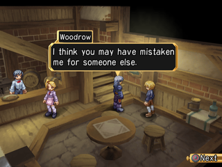  
▲ Woodrow need to be the onscreen character to trigger each scenes.

---

## Side-Quest #052 - Small Family 2

  

| | Harmentz   |
| :--------------------------------------------------------------------------------------- | :------------------ |
|  | No.41 Woodrow & Chelsea joins ~ No.45 Before arrival at Radisrol    |
|    | None    |

This is the second part of the "Small Family" series. If you have completed [Small Family 1], simply examine the banner at the Harmentz item shop to start. The time window is short, so make sure you start the event during the available time.

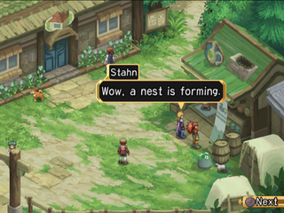  
▲ This Side-Quest is easy to miss so make sure to go back as soon as you can.

---

## Side-Quest #053 - Dark Wings 6

   

| | Armeida   |
| :--------------------------------------------------------------------------------------- | :------------------ |
|  | No.41 Woodrow & Chelsea joins ~ No.44 Before arrival at Undersea Caves    |
|    | None    |

Head to the central area of Armedia and approach the Dark Wings during the period listed above. They haven't been very successful and are basically screw-ups. They resign themselves to the fact that they can only be themselves in Armedia and decide to settle down.

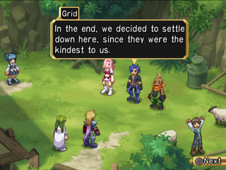  
▲ They've come a long way since their cons days.

---

## Side-Quest #054 - Ayles' Lament

  

| | Straylize Temple   |
| :--------------------------------------------------------------------------------------- | :------------------ |
|  | No.41 Woodrow & Chelsea joins ~ No.41 Woodrow & Chelsea joins    |
|    | Philia's title [Secret Agent], Philia's blast caliber [Divine Power]    |

This event is available after Woodrow and Chelsea rejoin the party. Have Philia speak with Ayles in Stralize Temple with the title Gaze of Resolve set.  Philia asks to know more of the origins of the temple, and is shocked by what Ayles tells her.

  
▲ That event is pretty important since it not only gives a new title it also gives a new Blast Calibur

---

## Side-Quest #055 - Philia's Husband

  

| | Straylize Temple   |
| :--------------------------------------------------------------------------------------- | :------------------ |
|  | No.41 Woodrow & Chelsea joins ~ No.41 Woodrow & Chelsea joins    |
|    | Philia's title [Divine Wife], Kongman's title [Goddess Challenger]    |

After Woodrow joins the others, they talk to Ayles within Stralize Temple. Kongman, who is in love with Philia, asks about making Philia his lover. Unfortunately, he is in for a surprise when he learns that she is married - to the Goddess, of course.

  
▲ The title obtained here is necessary to trigger "Greybum's Memory" [Side-Quest #117](projects/destiny-dc/stahn-guide?id=Side-Quest-117-Greybum39s-Memory) 

---

## Side-Quest #056 - Man of Fists

  

| | Neustadt   |
| :--------------------------------------------------------------------------------------- | :------------------ |
|  | No.41 Woodrow & Chelsea joins ~    |
|    | Kongman's title [Tekken King]    |

Speaking to a child standing in front of the item shop in Neustadt triggers this event. Some children ask why Kongam only fights with his fists and doesn't use any wepons. He shares with the children a few memories of the champion he idolized as a child.

  
▲ It seems that the champion who inspired Kongman was also a bare-knuckle fighter.

---

## Side-Quest #057 - Chief's Daughter

  

| | Neustadt   |
| :--------------------------------------------------------------------------------------- | :------------------ |
|  | No.41 Woodrow & Chelsea joins ~    |
|    | Philia's title [Jealous Girl]    |

This event will trigger when you speak to a young man in Neustadt's Fountain Square while Philia has the [Maiden's Gaze] title set. He is waiting for a woman who turns out to be Stahn's childhood friend, the daughter of the village chief of Lienea. She has matured and we are witnesses to her journey in finding love. 

  
▲ She used to be madly in love with Stahn but unfortunately she discovered DestinyTinder™ and found another man.

---

## Side-Quest #058 - Karma the Adopted Kid

  

| | Neustadt   |
| :--------------------------------------------------------------------------------------- | :------------------ |
|  | No.41 Woodrow & Chelsea joins ~    |
|    | None    |

This event is triggered when you go north from Ilene's house in Neustadt. Two brothers are tormenting a young kid, Karma. Kongman is there to assist in only the way a champion of the arena can. 

  
▲ By becoming a bully himself, Kongman encourages Karma to have a strong heart.

---

## Side-Quest #059 - Peeping Tom

   

| | Lienea   |
| :--------------------------------------------------------------------------------------- | :------------------ |
|  | No.41 Woodrow & Chelsea joins ~ No.58 Fight against Hugo    |
|    | Stahn title [Young Detective]    |

Stahn must have the [Lienean Man] title set when talking to Thomas in Stahn's house in Lienea. Thomas suggests that Stahn rest at home for a while. While doing so, Stahn hears the screams of his sister, Lilith. She claims there was someone watching her bathing through the window. Stahn, using briliant deductive thinking, is able to gather a group of suspicious characters and find out the creep who has been spying on his sister.

  
▲ If you walk behind Thomas' house you can talk to a NPC there.

---

## Side-Quest #060 - Ex-Lens Hunter

  

| | Cresta   |
| :--------------------------------------------------------------------------------------- | :------------------ |
|  | No.42 Rutee joins ~    |
|    | Rutee's title [Ex-Lens Hunter]    |

An event will be triggered when you speak with one of the nuns at the back of the Cresta orphanage. Select the dialogue choice "(...I didn't say goodbye to the sister...)" and Rutee will have a heart to heart with her.

  
▲ The sisters tell Rutee, who is concerned about the orphanage, to put her health first.

---

## Side-Quest #061 - Free Man

  

| | Darilsheid   |
| :--------------------------------------------------------------------------------------- | :------------------ |
|  | No.43 Arriving in Darilsheid ~    |
|    | Various Titles    |

Speaking to the prisoner in the right cell in Seinegald castle will trigger this event. He will explain titles and give you a free title of [XX Representative]. Speak with him again to change the title whenever you want. 

Excel Table

  
▲ These titles are mandatory to be able to get the discovery hints from the Retired old man NPC.

---

## Side-Quest #062 - Patriotism 1

   

| | Darilsheid   |
| :--------------------------------------------------------------------------------------- | :------------------ |
|  | No.43 Audience with the king ~ No.58 Fight against Hugo    |
|    | None    |

This event is triggered when you speak to Isard at the Darilsheid port. He tells Stahn and his party of his Aquavalian roots and his concern for that country. This is a missable event. Be sure to do it during the period listed above. 

  

---

## Side-Quest #063 - The General's Date

   

| | Darilsheid   |
| :--------------------------------------------------------------------------------------- | :------------------ |
|  | No.43 Audience with the king ~ No.58 Fight against Hugo    |
|    | None    |

Speaking to the man behind the inn in Darilsheid while Philia has the title [Jealous Girl] set will trigger this event. The man tells you that Vims of the Seven Generals and Melina like each other and Llewyn, another of the Seven Generals, has grown impatient with them not acting on their feelings and has set them up on a date.   

  
▲ This random NPC seems to know a whole lot about the inner lives of the seven generals.

---

## Side-Quest #064 - Popular General Dryden

   

| | Darilsheid   |
| :--------------------------------------------------------------------------------------- | :------------------ |
|  | No.43 Audience with the king ~ No.64 Berselium Acquired    |
|    | Mary's title [Wife Networker]    |

This event will trigger when Mary has the title of [Dalis' Wife] set while speaking to ladies meeting near Darilsheid's Inn. Dryden, the leader of the Seven Generals, may speak harshly to Stahn and the others but the party learns that he is well loved by the people.

  
▲ Visiting Dryden at the castle entrance after getting the title will reward you with a special event.

---

## Side-Quest #065 - Popularity Battle

  

| | Darilsheid   |
| :--------------------------------------------------------------------------------------- | :------------------ |
|  | No.43 Audience with the king ~    |
|    | Woodrow's title [Royal Aura]    |

Speak to the thirsty cat girl near the weapon shop in Darilsheid while Woodrow has the [Son of Isaac] title set. Leen, one of the Seven Generals, and Kongman will have a special competition. Woodrow, who did not participate, ends up being the one who wins. 

  
▲ Leen must have some serious HR complains to his name.

---

## Side-Quest #066 - Kidnapping

   

| | Darilsheid   |
| :--------------------------------------------------------------------------------------- | :------------------ |
|  | No.43 Audience with the king ~ No.43 Before Oberon Hidden Factory    |
|    | Item [Magical Aroma](projects/destiny-dc/items/item?id=item-magical-aroma)    |

Having Mary with the [Former Soldier] title set while visiting the room on the left side of the second floor of Seinegald Castle will trigger this event. Stahn's party will assist in the investigation surrounding the Queen's kidnapping. To complete the event, journey to Straylize Forest and defeat the bandits there. The party learns that Hugo used the bandits as a tactic to delay a response to the theft of the Eye of Atamoni.

Boss Info Table

  
▲ There's a fight with the list below bandits, prepare yourself before entering Straylize Forest.

---

## Side-Quest #067 - Triva

  

| | Harmentz   |
| :--------------------------------------------------------------------------------------- | :------------------ |
|  | No.43 Audience with the king ~    |
|    | Philia's title [Trivia Queen], Woodrow's title [Original King of Trivia]    |

This event is triggered when speaking with a young boy near the Northern entrance of Harmentz. He will quiz both Philia and Woodrow on their knowledge of the Phandarian King, leading to them earning their titles. They are quite impressed with the child's knowledge.

  
▲ Make sure to check ou the Rare Skit after this Side-Quest.

---

## Side-Quest #068 - Old Friend

  

| | Harmentz   |
| :--------------------------------------------------------------------------------------- | :------------------ |
|  | No.43 Audience with the king ~    |
|    | Rutee's blast caliber [Life Discharge], 5000 Gald    |

Speak to the green-haired man at Waltz' Mansion in Harmentz while Rutee has the title [Former Lens Hunter] set. He will receive a message from a lens hunter that he is in the temple near Janos. You will see a scene in which Rutee, who was once a wanted criminal, is about to be sold out to Seinegal soldiers.

  
▲ In the end, Rutee was cooperating with the Seinegard autorities and got him arrested.

---

## Side-Quest #069 - Darzen's Soliloquy

   

| | Heidelberg   |
| :--------------------------------------------------------------------------------------- | :------------------ |
|  | No.43 Audience with the king ~ No.58 Fight against Hugo    |
|    | None    |

Speaking to the five people listed below while visiting Heidelberg Castle prior to entering the throne room will trigger a request from Woodrow. He will remain here while Stahn and the others speak with Darzen and learn more of Woodrow's parents.

Excel Table

  
▲ If you don't talk to enough of the listed NPC you won't be able to trigger the real ending to this Side-Quest.

---

## Side-Quest #070 - Miawster

  

| | Cresta   |
| :--------------------------------------------------------------------------------------- | :------------------ |
|  | No.44 Arriving in Oberon's Secret Factory ~    |
|    | Philia's title [Bomb Alchemist]    |

Speak with the woman at the fountain in Cresta to trigger this event. This woman shares that her pet isn't doing well. Philia offers her some special medicine. However, each time she administers the medicine, the pet's appearance changes!

  

---

## Side-Quest #071 - Lady Chelsea

   

| | Radisrol   |
| :--------------------------------------------------------------------------------------- | :------------------ |
|  | No.46 Ritora's return ~ No.58 Fight against Hugo    |
|    | Chelsea's title [Little Lady]    |

This event will play when you enter the room just below the entrance to Radisrol. Being fed up with people thinking of her as a child, she takes the advise of each party member, acheiving the ultimate fashion in the process.

  
▲ You'll acquire the title required for the next Side-Quest listed bellow

---

## Side-Quest #072 - Chelsea Meets Woodrow

   

| | Torn's Cabin   |
| :--------------------------------------------------------------------------------------- | :------------------ |
|  | No.46 Ritora's return ~ No.72 Lens collecting completed    |
|    | See Below    |

Set Chelsea's [Little Lady] title and speak to Alba in his cabin to trigger this event. You will hear the story of when Woodrow and Chelsea met. 

excel table for reward

  
▲ There's quite a few rewards from this Side-Quest so make sure to check it out.

---

## Side-Quest #073 - Seinegald's King Succession

   

| | Darilsheid   |
| :--------------------------------------------------------------------------------------- | :------------------ |
|  | No.46 Ritora's return ~ No.58 Fight against Hugo    |
|    | None    |

This event occurs when you talk to the King within the audience chamber of Seinegald Castle after you have completed the "Doug Brothers" [Side-Quest #008](projects/destiny-dc/stahn-guide?id=side-quest-008-doug-brothers) event. You will need to ensure Woodrow has the [Older Brother Figure] title set. The King has finally chosen a successor in Ashley of the Seven Generals. However, Ahsley refuses.

  

---

## Side-Quest #074 - Soldier's Advance 2

   

| | Darilsheid   |
| :--------------------------------------------------------------------------------------- | :------------------ |
|  | No.46 Ritora's return ~ No.58 Fight against Hugo    |
|    | None    |

After completing the "Soldier's Advance 1" [Side-Quest #003](projects/destiny-dc/stahn-guide?id=side-quest-003-soldier39s-advance-1) enter the Darilsheid Tavern through the main entrance. Rutee must once again fend off the moves of a clueless soldier.

  
▲ Rutee finally snaps and threaten the man with her sword.

---

## Side-Quest #075 - Yearning to join the Dark Wings 2

  

| | Calviola   |
| :--------------------------------------------------------------------------------------- | :------------------ |
|  | No.46 Ritora's return ~    |
|    | None    |

After completing "Yearning to join the Dark Wings 1" [Side-Quest #016](projects/destiny-dc/stahn-guide?id=side-quest-016-yearning-to-join-the-dark-wings-1), head back to the large pool of water to the right of the entrance of Calviola. Speak to Toshu to learn what happened with the hopeful apprentance.

  
▲ Toshu dream finally came true! Never give up, never surrender, JUST DO IT.

---

## Side-Quest #076 - Calviola's Elena 2

  

| | Calviola   |
| :--------------------------------------------------------------------------------------- | :------------------ |
|  | No.46 Ritora's return ~    |
|    | Philia's title [Bomb Alchemist]    |

After completing "Calviola's Elena 1"[Side-Quest #17](https://lifebottle.github.io/#/./projects/destiny-dc/stahn-guide?id=side-quest-017-calviola39s-elena-1), visit the Baruk Foundtain in Cherik and you'll meet Elena's father, Nash. After this encounter, visit the house to the left of Oberon Corp in Calviola. This will trigger an event, revealing true intentions and restoring familial bonds. 

  
▲ "Bird in a Cage?" [Side-Quest #077](projects/destiny-dc/stahn-guide?id=side-quest-077-bird-in-a-cage) requires a title obtain here.

---

## Side-Quest #077 - Bird in a Cage?

  

| | Janos   |
| :--------------------------------------------------------------------------------------- | :------------------ |
|  | No.46 Ritora's return ~    |
|    | Item [Gain Material](projects/destiny-dc/items/item?id=item-gain-material)    |

This event triggers if you have Philia's  when and you talk one more time to the man in front of Janos' inn from "Lost Passport!" [Side-Quest #001](projects/destiny-dc/stahn-guide?id=side-quest-001-lost-passport). She'll encourage him to not give up on his dream of returning to Seinegald.

  
▲ Even if you haven't triggered the first part "Lost Passport!" [Side-Quest #001](projects/destiny-dc/stahn-guide?id=side-quest-079-mother39s-face-leon) you can still see this part.

---

## Side-Quest #078 - I Like Sweet Things

   

| | Neustadt   |
| :--------------------------------------------------------------------------------------- | :------------------ |
|  | No.46 Ritora's return ~ No.58 Fight against Hugo    |
|    | None    |

Visiting the Softy Kreem stand in Neustadt will trigger this event. Stahn will think aloud about him and Lion not being able to have Softy Kreem. The shop owner will muse about a particular pretty boy and the perceived femininity of eating Softy Kreem.

  
▲ Leon was only pretending to no like sweet things, unfortunatly he never got to try them.

---

## Side-Quest #079 - Mother's Face: Leon

  

| | Darilsheid   |
| :--------------------------------------------------------------------------------------- | :------------------ |
|  | No.46 Ritora's return ~    |
|    | None    |

This event will only occur if Mary has the title "Home Cook" and you have viewed the "I Like Sweet Things" [Side-Quest #78](https://lifebottle.github.io/#/./projects/destiny-dc/stahn-guide?id=side-quest-078-i-like-sweet-things)event. Speaking with the maid in Hugo's mansion reveals she is having difficulty in deciding a menu. Mary will suggest a recipe, prompting the maid to find a old note from Lion's mother, Chris. 

  
▲ This quest "Mother's Face: Leon" [Side-Quest #079](projects/destiny-dc/stahn-guide?id=side-quest-079-mother39s-face-leon) lead to the next part "Mother's Face: Rutee" [Side-Quest #094](projects/destiny-dc/stahn-guide?id=side-quest-079-mother39s-face-leon)

---

## Side-Quest #080 - City Hero

  

| | Neustadt   |
| :--------------------------------------------------------------------------------------- | :------------------ |
|  | No.46 Ritora's return ~    |
|    | Kongman's title [City Hero]    |

Speaking to the old man standing on the lower road near the fountain in Neustadt will trigger this event. When prompted with a choice, select "You bet I am!" The old man will reveal just how huge of a fan he is, and wishes to be punched by the one and only Kongman at least one time before he dies. 

  
▲ "I want you to hit me as hard as you can" the man says, but Kongman fists are there to protects.

---

## Side-Quest #081 - Fayte

   

| | Moreau   |
| :--------------------------------------------------------------------------------------- | :------------------ |
|  | No.46 Ritora's return ~ No.58 Fight against Hugo    |
|    | None    |

Speaking with Rihanna while Mary has the "Breaker" title set will trigger this event. The party speaks with her about what it means to rule and the conversation eventually turns to Johnny. Stahn and the others learn of Johnn'ys past, leading to insight about why Johnny behaves the way he does.

  
▲ The reason for Johnny's clowning around seems to be related to his past with Fayte.

---

## Side-Quest #082 - Princess Rhianna

   

| | Moreau   |
| :--------------------------------------------------------------------------------------- | :------------------ |
|  | No.46 Ritora's return ~ No.58 Fight against Hugo    |
|    | Item [Rapid Material](projects/destiny-dc/items/item?id=item-rapid-material)    |

This event will trigger if you speak with Rihanna while Chelsea has the title "Cursed Beauty" set. Chelsea will ask about what it is like to be queen, and is given multiple tales of hardship in return. 

  
▲ Seems that beign a devoted queen is much harder than it seems.

---

## Side-Quest #083 - Lilith's Promise

  

| | Lienea   |
| :--------------------------------------------------------------------------------------- | :------------------ |
|  | No.46 Ritora's return ~    |
|    | Stahn's title [Arena Champion], Lilith joins    |

This is an important event which ultimate ends with Lilith joining the party. First, after Lilith appears, head to Stahn's house in the Villiage of Lienea. This will trigger an scene between Lilith and Stahn. After viewing this event, head to the Arean in Neustadt and clear rank 4 in the Arena with Stahn. An unlikely opponent will enter to fight Stahn, his sister Lilith! Defeat her and she will join your party permanently.

  
▲ This might seem complicated but having Lilith as a new party member for the rest of the game is definitly worth it.

---

## Side-Quest #085 - New General

   

| | Darilsheid   |
| :--------------------------------------------------------------------------------------- | :------------------ |
|  | No.46 Ritora's return ~ No.58 Fight against Hugo    |
|    | None    |

Speaking with Dryden while Lilith has the title of "Flame Girl" set will trigger this event. We learn about Dryden's saddness regarding Lion, and the expectations he had for him. 

  
▲ Dryden hoped that Leon would become the next general...

---

## Side-Quest #086 - PokeDragon 1

   

| | Lienea   |
| :--------------------------------------------------------------------------------------- | :------------------ |
|  | No.46 Ritora's return ~ No.73 Before entering Dycroft    |
|    | Lilith's title [Dragon Nurturer]    |

Speakin with Thomas at Stahn's house in Lienea village while Chelsea has the title "White Ape" set and with Lilith in the party will trigger this event during the period specified above. Thomas will mention that there is something stuck in the tree outside of his house and Chelsea will use her skill as an archer to force it free. To everyone's suprise, it was an egg that hatches to reveal a baby dragon. Lilith is mistaken by the dragon as it's mother, leading her keeping him. 

  
▲ This Side-Quest has a second part with a valuable armor as a reward make sure to do it. Also there's pretty unique dialogue whe you talk to the villager with the dragon in tow.

---

## Side-Quest #087 - Hide and Seek

   

| | Cresta   |
| :--------------------------------------------------------------------------------------- | :------------------ |
|  | No.46 Ritora's return ~ No.58 Fight against Hugo    |
|    | Rutee's title [Eldest Orphan]    |

Speaking with the Sister standing in front of the house next to the general store in Cresta while Philia has the title "Secret Agent" set will trigger this event. The sister asks you to investigate the mayor's wife fearing that she may be scheming something. With the "Secret Agent" title still set, interact with the window of the mayor's house to trigger the next scene. Eventually, the children of the orphanage will go missing! You will need to find all four children in order to complete the event. 

Multiple Graphics

  

---

## Side-Quest #088 - My name is...

   

| | Cresta   |
| :--------------------------------------------------------------------------------------- | :------------------ |
|  | No.46 Ritora's return ~ No.58 Fight against Hugo    |
|    | None    |

To trigger this event, you must first view the skit "A Premonition?". Once viewed, have the "Tekken King" title set on Kongman and speak with the girl standing in front of the vaccant house in Cresta. She will ask the party for advice on how to handle a bully. 

  
▲ If you didn't get it yet this is actually an easteregg about Tales of Destiny 2.

---

## Side-Quest #089 - Jonathan the Sheep 1

  

| | Lienea   |
| :--------------------------------------------------------------------------------------- | :------------------ |
|  | No.47 Hidden Temple cleared ~    |
|    | None    |

This series of events will not trigger uness you have seen the skit "The Pursuit of Friendship." After viewing this skit, talk to Thomas in Stahns house in the village of Lienea. Thomas asks for Stahn's assitance taking care of some sheep.

  
▲ There's four part to this Side-Quest but if you miss the first one you'll be locked out of the other three, so make sure to do this one.

---

## Side-Quest #090 - Jonathan the Sheep 2

  

| | Lienea  |
| :--------------------------------------------------------------------------------------- | :------------------ |
|  | No.47 Zero-gravity elevator on Radistrol active |
|    | None    |

This event is only viewable after completing the first in the series [**Jonathan the Sheep 1**](https://lifebottle.github.io/#/./projects/destiny-dc/stahn-guide?id=side-quest-089-jonathan-the-sheep-1). Speak with Thomas in Lienea to trigger the next event in the series where you will witness Stahn happily chasing sheep. This will unlock the third  event in the series. 

  
▲ Take Radisrol zero-gravity elevator and make sure to do this one too.

---

## Side-Quest #091 - Small Family 3

   

| | Harmentz   |
| :--------------------------------------------------------------------------------------- | :------------------ |
|  | No.51 Fight Against Baruk ~ No.58 Fight against Hugo    |
|    | None    |

This event is only viewable after completing the second in the series [**Jonathan the Sheep 2**](https://lifebottle.github.io/#/./projects/destiny-dc/stahn-guide?id=side-quest-090-jonathan-the-sheep-2). This event triggers in the same area as last time near the tool shop in Harmentz. In this event, you will find an egg in the now completed birds nest. There are only two other times you'll be able to obverse the nest in this state. 

  
▲ This Side-Quest window is short so stop in Harmentz before going to Darilsheid

---

## Side-Quest #092 - Dark Wings 7

   

| | Armeida   |
| :--------------------------------------------------------------------------------------- | :------------------ |
|  | No.59 Arriving in Darilsheid ~ No.61 Reynolds returns ~    |
|    | None    |

The Dark Wings never quit and you can find them in the village square of Armeida. When we last saw them, they had decided to settle in Armeida but now the impending monster attack has them worried. While plotting to secretly leave the village, a cild fan asks for their help, unaware of their shelfishness. 

  
▲ The Dark Wings realize that they are respected by the villagers and are finally enlightened.

---

## Side-Quest #093 - Jonathan the Sheep 3

  

| | Lienea   |
| :--------------------------------------------------------------------------------------- | :------------------ |
|  | No.61 Resting at an Inn ~    |
|    | None    |

This event is available when you talk to Thomas at Stahn's house in Lienea after completing [**Johnathan the Sheep 2**](https://lifebottle.github.io/#/./projects/destiny-dc/stahn-guide?id=side-quest-090-jonathan-the-sheep-2). Stahn continues to happily herd sheep like a true country bumpkin would. Perhaps helping one final time will lead to the ultimate reward.

  
▲ Stahn chases the sheep around, just as he did in the first and second related part.

---

## Side-Quest #094 - Mother's Face: Rutee

  

| | Cresta   |
| :--------------------------------------------------------------------------------------- | :------------------ |
|  | No.61 Resting at an Inn ~    |
|    | Rutee's title [Gald Maiden]    |

This event occurs when Rutee has the title **Neat Sister** set  whiles peaking to the Sister in the Crestan orphenage. She gives Rutee her childhood diary, filled with memories that embarrass her. This event is one of the conditions for the {**Sub Quest #95**](https://lifebottle.github.io/#/./projects/destiny-dc/stahn-guide?id=side-quest-095-mother39s-face-chris).

  
▲ The diary reveals that Rutee has been a money-grubber since she was a child.

---

## Side-Quest #095 - Mother's Face: Chris

  

| | Darilsheid   |
| :--------------------------------------------------------------------------------------- | :------------------ |
|  | No.61 Resting at an Inn ~    |
|    | Rutee's title [Mother-like]    |

This event occurs when you talk to the maid at Hugo's mansion in Darilsheid after you have completed "Mother's Face: Leon" (sub 79) and "Rutee" (sub 94). The maid will give you a diary written in her youth by Chris, the mother of Leon and Rutee, and you will be able to look at the contents of the diary, which are a little embarrassing.

  
▲ The title [Mother-like] is mandatory to unlock the "Hugo's Memory" [Side-Quest #098](projects/destiny-dc/stahn-guide?id=side-quest-098-hugo39s-memory)

---

## Side-Quest #096 - Lens Diviner

  

| | Traveler's Lodge   |
| :--------------------------------------------------------------------------------------- | :------------------ |
|  | No.61 Resting at an Inn ~    |
|    | None    |

This event occurs when Stahn has the title **Country Boy** set while speaking with the Lens Reader in the Traveler's hut. Stahn will learn about the secret of the lens.

  
▲ You wont see this NPC anymore but after chatting with her you'll unlock a series of rare skits that are really worth seeing.

---

## Side-Quest #097 - Marian

  

| | Darilsheid   |
| :--------------------------------------------------------------------------------------- | :------------------ |
|  | No.61 Reynolds returns ~    |
|    | None    |

This even occurs when Rutee has the title **Greedy Witch** set while speaking with Marian at Hugo's mansion. Rutee has a heart to heart with Marian in an attempt to have her move on with her life.

  
▲ Rutee tells her to leave the mansion and stop suffering over Leon death and move on.

---

## Side-Quest #098 - Hugo's Memory

  

| | Darilsheid   |
| :--------------------------------------------------------------------------------------- | :------------------ |
|  | No.61 Reynolds returns ~    |
|    | None    |

If you have seen the [**Lens Diviner - Side Quest 96**](https://lifebottle.github.io/#/./projects/destiny-dc/stahn-guide?id=side-quest-096-lens-diviner), set Rutee's title to *Mother-like* and examine the picture found in Hugo's mansion just left of the entrance. This will trigger an event where Rutee will find a special lens, revealing Hugo's past.

  
▲ The lens reflected the actions of a sad human being who had been deprived of his humanity by Miktran.

---

## Side-Quest #099 - Poker Face

  

| | Torn's Cabin   |
| :--------------------------------------------------------------------------------------- | :------------------ |
|  | No.61 Reynolds returns ~    |
|    | Chelsea's title [Actress Guise]    |

This Side-Quest takes place when you visit the Zelkova tree behinds Torn's Cabin. A scene will take place between Chelsea and Stahn we're he still believes she can talk to trees. Highly recommend checking this hilarious quest.

  
▲ If you talk the talk you gotta walk the walk, she's too far gone to tell him the truth now.

---

## Side-Quest #100 - Homesickness

  

| | Janos   |
| :--------------------------------------------------------------------------------------- | :------------------ |
|  | No.61 Reynolds returns ~    |
|    | None    |

After viewing [**Chelsea Meets Woodrow**](https://lifebottle.github.io/#/./projects/destiny-dc/stahn-guide?id=side-quest-072-chelsea-meets-woodrow), speak to a traveler at the inn in Janos while Chelsea has the title of **Kidult** set to trigger this event. We witness Chelsea become overcome with homesickness, wishing to return to Torn's cabin. 

  
▲ After this Side-Quest, you will automatically go back to Torn's Cabin.

---

## Side-Quest #101 - Be Yourself

   

| | Armeida   |
| :--------------------------------------------------------------------------------------- | :------------------ |
|  | No.61 Reynolds returns ~ No.64 Berselium acquired    |
|    | None    |

You must have completed [**Side Quest #073**](https://lifebottle.github.io/#/./projects/destiny-dc/stahn-guide?id=side-quest-073-seinegald39s-king-succession) iin order for this sub quest to trigger. Set Chelsea's title to **Actress Guise** and speak with Ashley near the stairs to Armeida's tool shop. You will witness the bravey of Ashley and the admiration of the citizenry.

  
▲ Ashley has been struggling with his Royal heritage, but this one experience has put his mind at ease.

---

## Side-Quest #102 - Batista's Memory

  

| | Calviola   |
| :--------------------------------------------------------------------------------------- | :------------------ |
|  | No.61 Reynolds returns ~    |
|    | None    |

This side-quest is available only if you have completed the [**Lens Diviner Side Quest**](https://lifebottle.github.io/#/./projects/destiny-dc/stahn-guide?id=side-quest-096-lens-diviner). Set Philia's title to **Bomb Alchemist** and exmine the southeastern bookshelf in the library at the Caviolan Temple. She will find lens that provide her insight into Batista's childhood.

  
▲ As a child, Batista was the complete opposite of the image he portrayed.

---

## Side-Quest #103 - Irene's Memory

  

| | Neustadt   |
| :--------------------------------------------------------------------------------------- | :------------------ |
|  | No.61 Reynolds returns ~    |
|    | None    |

After completing the [**Lens Diviner Side Quest**](https://lifebottle.github.io/#/./projects/destiny-dc/stahn-guide?id=side-quest-096-lens-diviner), set Kongman's title to **Goddess Challenger** and have him examine Ilene's desk at her mansion in Neustadt. This will trigger an event where he finds some lens that illuminate her past.

  
▲ In Irene's past, we see her struggling between ideals and reality. She was working hard every day to make her ideals true.

---

## Side-Quest #104 - Kong Theatre

  

| | Neustadt   |
| :--------------------------------------------------------------------------------------- | :------------------ |
|  | No.61 Reynolds returns ~    |
|    | Kongman's title [☆Star☆]    |

Have Kongman speak with the new stage director near the Softy Kreem shop in Neustadt with the title **Topless Man** to trigger this event. You will end up participating in a mini-game while Kongman becomes the new leading man while following the directions of the director. For a flawless performance, you should press buttons in the following order:  ▲→ 〇 → ▲ → X → ▢

Excel Table

  
▲ The director will give you five instructions. Concentrate and try not to make any mistakes, that's a good moment to abuse savestates if you want.

---

## Side-Quest #105 - Neustadt

  

| | Neustadt   |
| :--------------------------------------------------------------------------------------- | :------------------ |
|  | No.61 Reynolds returns ~    |
|    | None    |

This event occurs when Kongman is set the title [City Hero] and speaks to a woman who is shopping at Neustadt's harbor. The woman tells Kongman that a dispute has been going on, and Kongman intervenes to resolve it.

  
▲ Everybody stops arguing when they realized that the kids are the resonable ones.

---

## Side-Quest #106 - Rembrandt's Memory

  

| | Neustadt   |
| :--------------------------------------------------------------------------------------- | :------------------ |
|  | No.61 Reynolds returns ~    |
|    | None    |

After completing the [**Lens Diviner Side Quest**](https://lifebottle.github.io/#/./projects/destiny-dc/stahn-guide?id=side-quest-096-lens-diviner), set Lilith's title to **Dragon Nurturer** and examine a bookshelf in Ilene's house on the second floor. Nestled in a the pages of a diary she will find a lens which reflects the paste of Rembrandt.

  

---

## Side-Quest #107 - Meeting with Sakuraba

  

| | Shiden   |
| :--------------------------------------------------------------------------------------- | :------------------ |
|  | No.61 Reynolds returns ~    |
|    | Johnny's title [Live Musician], Weapon [Guitar](projects/destiny-dc/items/weapon?id=weapon-guitar)    |

This event takes place when examining the piano on the second floor of the Shiden residence. This begin's Johnny's journey in search of an old guitar. Follow the chart below to locate the sentimental instrument. 

Excel Table

  
▲ Sakuraba will do a mad jam and you'll be forced to listen, enjoy.

---

## Side-Quest #108 - Sealed Man

  

| | Shiden   |
| :--------------------------------------------------------------------------------------- | :------------------ |
|  | No.61 Reynolds returns ~    |
|    | Johnny's title [Sealed Man]    |

You will need to complete [**Sub-Quest 30 - Neat Sister**](https://lifebottle.github.io/#/./projects/destiny-dc/stahn-guide?id=side-quest-030-neat-sister) to trigger this event. She will comment on how Johnny has changed from before. If you have not completed [**Sub-Quest 30 - Neat Sister**](https://lifebottle.github.io/#/./projects/destiny-dc/stahn-guide?id=side-quest-030-neat-sister), complete that event first then reenter.

  
▲ The girl is still sharp as she was with Rutee and can see behind Johnny's mask. 

---

## Side-Quest #109 - Young Master 2

  

| | Shiden   |
| :--------------------------------------------------------------------------------------- | :------------------ |
|  | No.61 Reynolds returns ~    |
|    | Item [Absorb Material]    |

You must have completed [**Side Quest #029 - Young Master 1**](https://lifebottle.github.io/#/./projects/destiny-dc/stahn-guide?id=side-quest-029-young-master-1) in order to trigger this event. In the continuation of this event, he will ask where Lion is, noticing his absence. 

  
▲ Watching the second event will reward you with the [Absorb Material](), also this Side Quest is mendatory to unlock "Dalis' Nightmare" [Side Quest #045](projects/destiny-dc/stahn-guide?id=side-quest-045-dalis39-nightmare).

---

## Side-Quest #110 - Tiberius's Memory

  

| | Moreau   |
| :--------------------------------------------------------------------------------------- | :------------------ |
|  | No.61 Reynolds returns ~    |
|    | None    |

After completing the [**Lens Diviner Side Quest**](https://lifebottle.github.io/#/./projects/destiny-dc/stahn-guide?id=side-quest-096-lens-diviner), set Johnny's title to **Live Musician** before examining a drum in the underground warehouse in Moreau. Johnny will find a lens and be granted visions of Tiberius' past.

  
▲ If you are interested in Tiberius' lore check this out.

---

## Side-Quest #111 - SISTER?

  

| | Frostheim   |
| :--------------------------------------------------------------------------------------- | :------------------ |
|  | No.61 Reynolds returns ~    |
|    | Chelsea's title [Innocent]    |

Woodrow arrives at the reception desk of the Frostheim hot springs and is approached by three female tourists.  When they invite him to join them, Chelsea becomes angry at their behavior. She is further baffled when attempting to shoo them away, they claim to be Woodrow's sisters.

  
▲ The title acquired here is necessary to trigger the next Side-Quest "The Perfect Couple" [Side-Quest #112](projects/destiny-dc/stahn-guide?id=side-quest-112-the-perfect-couple).

---

## Side-Quest #112 - The Perfect Couple

   

| | Harmentz   |
| :--------------------------------------------------------------------------------------- | :------------------ |
|  | No.61 Reynolds returns ~ No.64 Berselium acquired    |
|    | None    |

You must have viewed [**Side-Quest #063 - The General's Date**](https://lifebottle.github.io/#/./projects/destiny-dc/stahn-guide?id=side-quest-063-the-general39s-date) in order to trigger this event. Set Cheslea's title to *Innocent* and speak with Melina in Harmentz. Still unable to share her true feelings, Melina is caught off gaurd by Chelsea's innocence. Thanks to Chelsea, Melina's feelings can finally be shared. 

  
▲ She's tough on him when others are around but when they're alone you can see her true side, it's what you would call a "Tsundere".

---

## Side-Quest #113 - Hot Springs Event 1

  

| | Frostheim   |
| :--------------------------------------------------------------------------------------- | :------------------ |
|  | No.61 Reynolds returns ~    |
|    | None    |

The first event shows the men's bath, where Kongman is interested in the "sexy conversation" the women must be having in their bath. Wanting to take a quick peek, he tries to sucker Stahn in to "climbing the mountain." 

  
▲ Kongman's plan to entice Stahn to "climb the mountain" is revealed because of his loud mouth.

---

## Side-Quest #114 - Hot Springs Event 2

  

| | Frostheim   |
| :--------------------------------------------------------------------------------------- | :------------------ |
|  | No.61 Reynolds returns ~    |
|    | Various Titles    |

You can view this event immediately after the preceeding event. This time, the perspective is that of the women's bath. Rutee and the other women react to the conversation occuring from the men's bath. Unable to hear the entire conversation, they make a mistake leading to their perspective of Woodrow to be forever changed. 

Excel Table

  
▲ The epic conclusion to the hotspring saga.

---

## Side-Quest #115 - Dalis and Mary

  

| | Cyril   |
| :--------------------------------------------------------------------------------------- | :------------------ |
|  | No.61 Reynolds returns ~    |
|    | None    |

This even occurs when Woodrow has the title **Phandaria's King** set and speaking with a woman near Mary's house in Cyril. After hearing her talk about the King, the party heads to Mary's house to see Dalis. Dalis isn't home, so the party leaves Woodrow behind and goes searching for him. Dalis returns soon after they leave, allowing Woodrow and him to have a meaningful conversation.

  
▲ Dalis tells all to Woodrow and shows him how deeply he loves Mary.

---

## Side-Quest #116 - Gambler Rutee

  

| | Heidelberg   |
| :--------------------------------------------------------------------------------------- | :------------------ |
|  | No.61 Reynolds returns ~    |
|    | Rutee's title [Gambler Rutee]    |

This event will only occur if the last digit of the number of Gald you have is 1 when you stay at the Inn in Heidelberg. The party is informed that the Inn isn't properly stocked for food and decide to have dinner at the bar. Stahn is enticed to play a game of dice with a traveling gambler, using only a single gald. 

  
▲ Stahn wins a bet and wins big. However, his joy is short-lived, as he then loses it all.

---

## Side-Quest #117 - Greybum's Memory

  

| | Heidelberg   |
| :--------------------------------------------------------------------------------------- | :------------------ |
|  | No.61 Reynolds returns ~    |
|    | None    |

After completing the [**Lens Diviner Side Quest**](https://lifebottle.github.io/#/./projects/destiny-dc/stahn-guide?id=side-quest-096-lens-diviner), set Philia's title to **Divine Wife** and examine a bookshelf in the same room as a portait of the Queen in Heidelberg Castle. There, Philia will find a lens that allows her insight into Greybum's true feelings.

  
▲ The lens reveal to use that Greybum was just Hugo's patetic puppet

---

## Side-Quest #118 - Queen Chelsea

  

| | Heidelberg   |
| :--------------------------------------------------------------------------------------- | :------------------ |
|  | No.61 Reynolds returns ~    |
|    | None    |

Set Mary's title to **Wife Networker** and stay at the Heidelberg Inn. That night, Chelsea will be missing. Search for her in Heidelberg Castle and you will find Chelsea in the throne room doing her best queen impression.

  
▲ Sneaking up at night to roleplay as the Queen, she truly is drunk on throne fever.

---

## Side-Quest #119 - Blizzard Bowl

  

| | Heidelberg   |
| :--------------------------------------------------------------------------------------- | :------------------ |
|  | No.61 Reynolds returns ~    |
|    | Unique [Fairy Necklace](projects/destiny-dc/items/unique?id=unique-fairy-necklace)    |

Set Kongman's title to ☆Star☆ before speaking to the man in red in the hall of Heidelberg Castle.  Kongman will be asked to participate in a contest being held in the  city.

  
▲ If you're the only participant can you still claim you're number one?!

---

## Side-Quest #120 - Missing Uncle Bob

  

| | Lienea   |
| :--------------------------------------------------------------------------------------- | :------------------ |
|  | No.61 Reynolds returns ~    |
|    | None    |

Set Stahn's title to **Young Detective** and speak with Aunt Mggie in Lienea. You will learn from her that Uncle Bob is missing. Once you complete the Outer Shell areas, you will be able to find Uncle Bob in the Katz Village.

  
▲ Finding Uncle Bob will require you to progress much further in the game.

---

## Side-Quest #121 - Rutee's Birthday

  

| | Cresta   |
| :--------------------------------------------------------------------------------------- | :------------------ |
|  | No.61 Reynolds returns ~    |
|    | Rutee's title [Forever Young]    |

Set Rutee's title to **Eldest Orphan** and speak with the Sister in the kitchen of the Cresta orphanage. We learn that Rutee shares the birthday with three of the orphans, and conversations ensue trying to determine just how old Rutee really is.

  
▲ "Baruk's Memory" [SideQuest #122](projects/destiny-dc/stahn-guide?id=side-quest-122-baruk39s-memory) requires the title acquired here to trigger.

---

## Side-Quest #122 - Baruk's Memory

  

| | Cherik   |
| :--------------------------------------------------------------------------------------- | :------------------ |
|  | No.61 Reynolds returns ~    |
|    | None    |

After completing the [**Lens Diviner Side Quest**](https://lifebottle.github.io/#/./projects/destiny-dc/stahn-guide?id=side-quest-096-lens-diviner),set Rutee's title to **Forever Young** and inspect a shelf inbetween a safe and a chair in the Baruk Foundation headquarters in Cherik. Rutee and Stahn will find a lense containing Baruk's memories, providing the two of them a chance to reflect on what they saw together.

  
▲ Stahn is suprisingly objective about Baruk's past.

---

## Side-Quest #123 - Patriotism 2

  

| | Darilsheid   |
| :--------------------------------------------------------------------------------------- | :------------------ |
|  | No.61 Avitus Draconis acquired ~    |
|    | Johnny's title [Royal Clown]    |

After witnessing the event  [**Patriotism 1**](https://lifebottle.github.io/#/./projects/destiny-dc/stahn-guide?id=side-quest-062-patriotism-1), head to the Darilsheid port with Johnny in your party. Isard will share his feelings over past deeds after hearing Johnny's thoughts.

  
▲ This Side-Quest gives us some pretty good lore about the Shiden family.

---

## Side-Quest #124 - Draconis Crewman's Family 2

  

| | Darilsheid   |
| :--------------------------------------------------------------------------------------- | :------------------ |
|  | No.61 Avitus Draconis acquired ~    |
|    | Stahn title [Gentle Liar], Rutee's title [Realist]    |

Enter the left house behind the Darilsheid Inn to trigger this event. A lost soldier who was thought to have died when the Draconis died will be reunited with his family.

  
▲ Spot the difference from the conversation in the first part.

---

## Side-Quest #125 - Soldier's Advance 3

  

| | Darilsheid   |
| :--------------------------------------------------------------------------------------- | :------------------ |
|  | No.61 Avitus Draconis acquired ~    |
|    | Rutee's title [Honest Girl], Unique [Steal Gloves](projects/destiny-dc/items/unique?id=unique-steal-gloves)    |

After completing [**Soldier's Advance 2**](https://lifebottle.github.io/#/./projects/destiny-dc/stahn-guide?id=side-quest-074-soldier39s-advance-2), set Rutee's title to **Realist** prior to returning to the Darilsheid bar.  Rutee wards off the advances of the soldier from Seinegald with her own confession of love.

  
▲ This conclude one of the very first multipart quest of the game congrats.

---

## Side-Quest #126 - Lens Panic

  

| | Darilsheid   |
| :--------------------------------------------------------------------------------------- | :------------------ |
|  | No.61 Avitus Draconis acquired ~    |
|    | Rutee's title [Invisible Hand]    |

Set Stahn's title to **Gentle Liar** prior to speaking with the clerk at the Darilsheid branch of the Oberon Corp. Depending on which dialogue option you choose, the lens exchange rate will change. If you select the option "The rumors are true, but please calm down." the exchange rate will not change. However, if you select the option referencing the delay in the arrival of the Oberon transport, the exchange rate for lens will increase.

  
▲ No matter which choice you pick you'll still get the title and be able to redeem lens again.

---

## Side-Quest #127 - Small Family 4

   

| | Harmentz   |
| :--------------------------------------------------------------------------------------- | :------------------ |
|  | No.61 Avitus Draconis acquired ~ No.72 Lens collecting completed    |
|    | None    |

This is the fourth sub-event where you check in on the nest above the Harmentz tool shop. In order to activate this event, you must have already seen [**Small Family 3**](https://lifebottle.github.io/#/./projects/destiny-dc/stahn-guide?id=side-quest-091-small-family-3). There is only one more time you'll be able to check in on the nest.

  
▲ Remember to stop by and check the progress of this quest.

---

## Side-Quest #128 - Switcheroo

  

| | Neustadt   |
| :--------------------------------------------------------------------------------------- | :------------------ |
|  | No.61 Avitus Draconis acquired ~    |
|    | Kongman's title [Man in Love]    |

Set Johnny's title to **"Royal Clown** prior to speaking with the nurse in the Neustadt arena. She is a huge fan of Kongman and looks just like Philia. The party decides to play a trick on Kongman by having the nurse and Philia swap places.

  
▲ Kongman can never catch a break.

---

## Side-Quest #129 - Kongman's Origin Story

  

| | Neustadt   |
| :--------------------------------------------------------------------------------------- | :------------------ |
|  | No.61 Avitus Draconis acquired ~    |
|    | None    |

This event has three requirements to trigger. First, you must have completed the event [**Man of Fists**](https://lifebottle.github.io/#/./projects/destiny-dc/stahn-guide?id=side-quest-056-man-of-fists). Second, you have completed the event [**Karma the Adopted Kid**](https://lifebottle.github.io/#/./projects/destiny-dc/stahn-guide?id=side-quest-058-karma-the-adopted-kid). Finally, you must set Rutee's title to **Invisible Hand** before entering the spectator area of the Neustadt Arena. You will meet a man near the doorway, which will trigger the event.

  
▲ Kongman tells his backstory to a man who still visits the arena. 

---

## Side-Quest #130 - Eleanor 2

  

| | Moreau   |
| :--------------------------------------------------------------------------------------- | :------------------ |
|  | No.61 Avitus Draconis acquired ~    |
|    | Johnny's title [Sorrowful Musician]    |

After witnessing the event [**Eleanor 1**](https://lifebottle.github.io/#/./projects/destiny-dc/stahn-guide?id=side-quest-033-eleanor-1), set Rutee's title to **Honest Girl** and enter the basement of the house where the underground warehouse is located. You will see memories of Johnny and his childhood friend. 

  
▲ Johnny makes a shocking discovery.

---

## Side-Quest #131 - Oath to Leon

  

| | Darilsheid   |
| :--------------------------------------------------------------------------------------- | :------------------ |
|  | No.61 Avitus Draconis acquired ~    |
|    | Armor [Battle Tunic]    |

The event occurs when Johnny has the title "Sorrowful Musician" equipped and talks to a fish vendor at the Darilsheid's port. The fish vendor tells Stahn and his friends that he lost his friend at sea and urges them to go back to the place where they lost their friend. They follow his words to the shore of the island where Oberon's hidden factory is located and find Leon's cape washed up on the beach.

  
▲ Stahn renewed his resolve to save the world rather than wallow in his sorrow.

---

## Side-Quest #132 - Great Detective Stahn

  

| | Moreau   |
| :--------------------------------------------------------------------------------------- | :------------------ |
|  | No.61 Avitus Draconis acquired ~    |
|    | Stahn title [Great Detective!]    |

This event will trigger when you speak with a woman near Johnny's Hideout in Moreau. Stahn will be tasked to find the truth behind an incident of the soldier who was attacked. Stahn must speak with the people outlined before to gather information on the incident. Once he gathers enough information, speak with the soldier in the square to identify the culprit. In order to reveal who the true culprit is, you must select the three correct reponses from a list of choices.   The first correct choice is "This girl talks to cats in a loud voice." The second choice is "The people who're attacked always
have two injuries on them." The final choice is "...was you, little girl!" Once Stahn successfully identifies the culprit, he will receive the title **Great Detective!** Receiving this title is one of the conditions for the sub-event [**The Four Secrets of the World**](https://lifebottle.github.io/#/./projects/destiny-dc/stahn-guide?id=side-quest-157-four-secrets-of-the-world).

  
▲ There is only one correct answer for each question, but if you make a mistake, you can redo it as many times as you like.

---

## Side-Quest #133 - Life-threatening Situation

  

| | Lienea   |
| :--------------------------------------------------------------------------------------- | :------------------ |
|  | No.61 Avitus Draconis acquired ~    |
|    | Stahn title [Destiny's Child]    |

This Side-Quest occurs when the title "Man in Love" is set on Kongman and he talks to Bacchus, who is standing in front his house. They begin to talk passionately about what love is. They are visited by General Lewein of the Seven Generals. After listening to their conversation, he tells Bacchus that he was in love with Thomas' wife, and that he regrets that he never told her how he felt.

  
▲ The title obtained is a condition for the "Parents" [Side-Quest #134](projects/destiny-dc/stahn-guide?id=Side-Quest-134-Parents) 

---

## Side-Quest #134 - Parents

  

| | Shiden   |
| :--------------------------------------------------------------------------------------- | :------------------ |
|  | No.61 Avitus Draconis acquired ~    |
|    | 100 Gald    |

This event occurs if Lilith is in the party. After Stahn acquires the "Destiny's Child" titles he can trigger a scene in Johnny's Mansion. The scene shows an exchange between Johnny's mother, who treats him like a child when he returns to his hometown after a long absence, and Johnny, who treats his mother ill out of embarrassment. After Stahn and his friends see this and chastise Johnny for not understanding the importance of parents, his mother gives him 100 Gald as pocket money for his remorse.

  

---

## Side-Quest #135 - Food Book Appraisal

  

| | Food Sack Master's Haven   |
| :--------------------------------------------------------------------------------------- | :------------------ |
|  | No.61 Avitus Draconis acquired ~    |
|    | See Below    |

You must find the Food Sack Master on a small island in the south easetern area of Moreau. Realizing his great passion for food, the party will ask him to evaluate your food book. Speaking with give grants the party the food strap "Oriental Rice." In addition, you can get the Lilith exclusive equipment "the frying pan" if you meet the conditions outlined in the table below. 

Excel Table

  

---

## Side-Quest #136 - Hidden Calvalisians

  

| | Junkland   |
| :--------------------------------------------------------------------------------------- | :------------------ |
|  | No.66 Lumina Draconis acquired ~    |
|    | Various items    |

Speak with the young man in Junkland who helped you retrieve the bio-metal Bersilum required to repair the Draconis. He tells you that there are many Calvalisians hiding their true identity all over the world. Visiting all of them around the world **in a specific order** will net Stahn and his friends specific rewards, as outlined on the table below. 

Excel Table

  
▲ The sequence is predetermined. If you skip a NPC and talk to another one, the rest of the event won't occur.

---

## Side-Quest #137 - Dark Wings 8

   

| | Armeida   |
| :--------------------------------------------------------------------------------------- | :------------------ |
|  | No.68 Lens collecting starts ~ No.72 Lens collecting completed    |
|    | None    |

You must have viewed [**Dark Wings 7**](https://lifebottle.github.io/#/./projects/destiny-dc/stahn-guide?id=side-quest-092-dark-wings-7) and have collected the necessary amount of lens for the integrated lens cannon in order to trigger this event. Enter the square of Armeidia village to witness the Dark Wings finally come to their senses. Though they swindled and lied in the past, they have decided to stay put and protect Armedia. Receiving no fame or fortune, we are able to witness the story of their growth.

  
▲ The three decided to live in the village of Armeida.

---

## Side-Quest #138 - Fake Swordians

  

| | Straylize Temple   |
| :--------------------------------------------------------------------------------------- | :------------------ |
|  | No.68 Lens collecting starts ~    |
|    | Stahn title [Genuine Master], Item [Chaser Material](projects/destiny-dc/items/item?id=item-chaser-material)    |

This even will trigger when Stahn enters Straylize Temple and speaks with Ayles with the title of **Swatian User?** set.  He iforms the party that his lens was taken by some one claiming to be a Swordian Master. The imposters return and the party confront them, teaching them a lesson. 

  
▲ Stahn and his team easily defeat the thieves and show that they are true Master Swordians.

---

## Side-Quest #139 - Former Lovers

  

| | Swordian R&D Lab   |
| :--------------------------------------------------------------------------------------- | :------------------ |
|  | No.68 Lens collecting starts ~    |
|    | Item [Advance Material](projects/destiny-dc/items/item?id=item-advance-material)    |

After collecting lens from each location, enter the R&D Laboratory while Stahn has the title **Genuine Master** set. We will be treated with an event where Stahn leans of Dymlos' and Atwights deep connection from 1000 years ago.

  
▲ Embarrassed, Dymlos try to interrupt the video.

---

## Side-Quest #140 - Small Family 5

  

| | Harmentz   |
| :--------------------------------------------------------------------------------------- | :------------------ |
|  | No.73 Arriving in Dycroft    |
|    | Item [Magical Aroma](projects/destiny-dc/items/item?id=item-magical-aroma)    |

This is the final opportunity to check in on the nest on the roof of the Harmentz tool shop and requires that [**Small Family 4**](https://lifebottle.github.io/#/./projects/destiny-dc/stahn-guide?id=side-quest-127-small-family-4) has been viewed. Watch in awe as the family of birds you have taken such good care of finally find their wings and leave the nest. A fitting, heartwarming end to a long series of events.

  
▲ The reward of the event is a pretty rare item [Magical Aroma](projects/destiny-dc/items/item?id=item-magical-aroma).

---

## Side-Quest #141 - Clown

  

| | Shiden   |
| :--------------------------------------------------------------------------------------- | :------------------ |
|  | No.73 Arriving in Dycroft    |
|    | Johnny's Blast Caliber [Layer Sphere]    |

Speak with an old woman at the Shiden Port while Johnny has the title **Sealed Man** set. The old woman shares her wisdom on life, as if she can see how much of a free spirit Johnny is. After the conclusion of this event, Johnny learns the Blast Caliber "Layer Sphere," even if he doesn't meet the necessary requirements to learn it naturally. 

  
▲ If you have already acquired [Layer Sphere] on a previous playthrough, you will not be rewarded after the event.

---

## Side-Quest #142 - Jonathan the Sheep 4

  

| | Lienea   |
| :--------------------------------------------------------------------------------------- | :------------------ |
|  | No.73 Arriving in Dycroft    |
|    | Item [Apple](projects/destiny-dc/items/item?id=item-apple)    |

If you have seen the [**Jonathan the Sheep 3 event**](https://lifebottle.github.io/#/./projects/destiny-dc/stahn-guide?id=side-quest-093-jonathan-the-sheep-3), you can speak to Thomas at Stahns house in Lienea to trigger the next and final part. After witnessing this event, you will be rewarded for you hard work and dedication with a most coveted of rewards, an apple. 

  
▲ This unfortunately is the end of this Side-Quest, I hope you liked seeing Stahn and his friend Jonathan interact.

---

## Side-Quest #143 - PokeDragon 2

  

| | Lienea   |
| :--------------------------------------------------------------------------------------- | :------------------ |
|  | No.73 Arriving in Dycroft    |
|    | Armor [Dragon Armor](projects/destiny-dc/items/armor?id=armor-dragon-armor)    |

The second part of this Side-Quest is triggered when you enter Thomas' house after arriving at Dycroft. Lilith will ask where's her little Dragon and learn that he left.

  
▲ With the exception of Rerise, The [Dragon Armor](projects/destiny-dc/items/armor?id=armor-dragon-armor) can only be obtained with this Side-Quest.

---

## Side-Quest #144 - Lovely Katz

  

| | Katz Village   |
| :--------------------------------------------------------------------------------------- | :------------------ |
|  | No.73 Arriving in Dycroft    |
|    | Mary's title [Cat-Lover]    |

This Side-Quest triggers automaticaly when you enter the Katz Base. Mary will go crazy for the cute Katz and Bunnyz and they will give her a costume to calm her down. She'll earn a title that is mandatory for the "Lost Pet" [Side-Quest #145](projects/destiny-dc/stahn-guide?id=side-quest-145-lost-pet).

Multiple Graphics

  
▲ [Cat-Lover] will be added to Mary's title after watching this Side-Quest

---

## Side-Quest #145 - Lost Pet

  

| | Frostheim   |
| :--------------------------------------------------------------------------------------- | :------------------ |
|  | No.73 Arriving in Dycroft    |
|    | 3000 Gald    |

Set Mary's [Cat-Lover] title and examine the sign in front of the Frostheim's inn. Next talk to the innkeeper and choose "no," this will trigger a mini game where you need to catch ten cats. Good luck, this game can get pretty frustrating and the reward is meager. 

  

---

## Side-Quest #146 - Movie Viewer

  

| | Katz Village   |
| :--------------------------------------------------------------------------------------- | :------------------ |
|  | New Game Plus    |
|    | None    |

This is a new game+ Side-Quest. It occurs when you load the clear data and talk to the blue-costumed bunny standing near "Noko" at the Katz Base. You can watch all the movies in the game, including the opening and ending.

  

---

## Side-Quest #147 - He's Me, I'm Him, so He's...

  

| | Katz Village   |
| :--------------------------------------------------------------------------------------- | :------------------ |
|  | New Game Plus    |
|    | None    |

This is also a Side-Quest that can only be viewed on a new game+. The event occurs when you talk to the sleeping cat in the rocket at the Katz Base after you have obtained all the titles. Suddenly Stahn and his friends are struck by lightning and everyone is freaky fridays.

Excel Table

  

---

## Side-Quest #148 - Skit Viewer

  

| | Katz Village   |
| :--------------------------------------------------------------------------------------- | :------------------ |
|  | No.73 Arriving in Dycroft    |
|    | None    |

The NPC named "Noko" on the right side of the entrance to the Katz Base is a mysterious creature that will show you all the skits again. Rare skits can be viewed if they have already occurred. The conditions under which all of them occur are as listed below.

|        Rare Skit Names        |        Trigger        |
|        -----------------------        |        ----------------------------------        |
|        Ode to Leviathan        |        After No.58 Fight against Hugo & Ride the Leviathan with Johnny        |
|        Harsh Reality        |        First time you fight Lilith in the arena and lose        |
|        I'm a Bit Nervous        |        When Lilith joins        |
|        Burning Glare        |        After watching the skit "I'm a Bit Nervous"        |
|        EX Burning Glare        |        After watching the skit "Burning Glare"        |
|        You're the Future Champion!?        |        After watching the skit "EX Burning Glare"        |
|        War of the Women?        |        After watching the skit "You're the Future Champion!?"        |
|        The Key to Strength        |        After watching the skit "War of the Women?"        |
|        Legendary Champion        |        After watching the skit "The Key to Strength"        |
|        Female Friendship?        |        After watching the skit "Legendary Champion"        |
|        Ghosts of the Past        |        Defeat Barbatos        |
|        Enthralling Brilliance        |        After No.58 Fight against Hugo & possessed Gald is over 1,000,000        |
|        The Life of a Lens Hunter        |        Have 990 of all Lens types        |
|        I Hate This!        |        After No.58 Fight against Hugo & possessed Gald is 0        |
|        I'm Stuffed!        |        Number of time the Foodsack used is over 110        |
|        You Need to Recover        |        After No.58 Fight against Hugo & battle end with Stahn KO        |
|        Don't Get Confused!        |        After No.58 Fight against Hugo & battle end with Rutee KO        |
|        Common Sense        |        Leon is in the party & battle end with Philia KO        |
|        A Token of Apology        |        After No.58 Fight against Hugo & battle end with Woodrow KO        |
|        Potential Substitute?        |        Battle end with Leon KO        |
|        Personal Responsibility        |        After No.58 Fight against Hugo & battle end with Chelsea KO        |
|        Positive and Negative Words        |        Leon is in the party & battle end with Mary KO        |
|        Are We Forgetting Something?        |        After No.58 Fight against Hugo & battle end with Kongman KO        |
|        I Know How You're Feeling        |        After No.58 Fight against Hugo & battle end with Johnny KO        |
|        Older Brother's Feelings        |        Battle end with Lilith KO        |
|        Thank You, Everyone!        |        Complete the [Battle Record] and talk to the Monster Researcher in the arena        |
|        Mary's Dream        |        Complete the [Food Book]        |
|        Did They Lose Their Name?        |        After No.58 Fight against Hugo & Philia used [Philia Bomb] more than 100 times        |
|        I Love Sleeping        |        180 seconds after Stahn is set as Support        |
|        Searching for Gald        |        180 seconds after Rutee is set as Support        |
|        I've Got Your Back        |        180 seconds after Philia is set as Support        |
|        Intuition on the Field?        |        180 seconds after Woodrow is set as Support        |
|        Surprisingly Suited for Command        |        180 seconds after Leon is set as Support        |
|        I'm Enjoying This        |        180 seconds after Mary is set as Support        |
|        Growing Seeds Is Fun        |        180 seconds after Chelsea  is set as Support        |
|        Merits and Demerits        |        180 seconds after Johnny is set as Support        |
|        Tireless Effort Is the Secret to Victory        |        180 seconds after Kongman is set as Support        |
|        The Fun After Battle        |        180 seconds after Lilith is set as Support        |
|        Big Sis' Secret!        |        After completing the "Hide and Seek" [Side-Quest #087](projects/destiny-dc/stahn-guide?id=Side-Quest-087-Hide-and-Seek)         |
|        Race - 1        |        No.20 Arriving in Neustadt & completing the "Race Game" [Side-Quest #150](projects/destiny-dc/stahn-guide?id=Side-Quest-150-Race-Game)         |
|        Race - 2        |        After No.61 Reynolds returns & completing "Race Game" [Side-Quest #150](projects/destiny-dc/stahn-guide?id=Side-Quest-150-Race-Game)         |
|        Question!        |        After completing the "Triva" [Side-Quest #067](projects/destiny-dc/stahn-guide?id=Side-Quest-067-Triva)         |
|        Ready!        |        After watching the skit "Question!"        |
|        Absolutely Correct!        |        After completing the "ToD Quiz" [Side-Quest #155](projects/destiny-dc/stahn-guide?id=Side-Quest-155-ToD-Quiz)         |
|        Still Practicing        |        After watching the skit "Absolutely Correct!"        |
|        Expedition Stahn        |        Complete the [Discovery Book]        |
|        Fortune - 1        |        After completing the "Lens Diviner"  [Side-Quest #096](projects/destiny-dc/stahn-guide?id=Side-Quest-096-Lens-Diviner)         |
|        Fortune - 2        |        After watching the skit "Fortune - 1"        |
|        Fortune - 3        |        After watching the skit "Fortune - 2"        |
|        Fortune - 4        |        After watching the skit "Fortune - 3"        |
|        Fortune - 5        |        After watching the skit "Fortune - 4"        |
|        Fortune - 6        |        After watching the skit "Fortune - 5"        |
|        Fortune - 7        |        After watching the skit "Fortune - 6"        |
|        "Batista Bomb"        |        After completing the "Batista's Memory" [Side-Quest #102](projects/destiny-dc/stahn-guide?id=Side-Quest-102-Batista's-Memory)         |
|        Philia's True Feelings        |        After completing the "Batista's Memory" [Side-Quest #102](projects/destiny-dc/stahn-guide?id=Side-Quest-102-Batista's-Memory)         |
|        A Time for Dreaming        |        After completing the "Queen Chelsea" [Side-Quest #118](projects/destiny-dc/stahn-guide?id=Side-Quest-118-Queen-Chelsea)         |
|        He's Me, I'm Him, so He's...        |        After completing the "He's Me, I'm Him, so He's..." [Side-Quest #147](projects/destiny-dc/stahn-guide?id=Side-Quest-147-He's-Me,-I'm-Him,-so-He's..)         |
|        Rembrandt's Talent        |        No.58 Entering Belcrant        |

  

---

## Side-Quest #149 - Procurement Quest

  

| | Around the world   |
| :--------------------------------------------------------------------------------------- | :------------------ |
|  | No.04 Arriving in Janos ~    |
|    | See Below    |

In this errand event, you will receive a grade based on delivering a predetermined number of items to various traders around the world. Half of the reward is paid as a start-up fee when the work is undertaken with the first merchant, and the remaining amount is paid by the merchant to whom you are making a delivery to. After the second part of the game begins, if you cmoplete this question at least once, you will receiving one of the following titles. 

Multiple Tables

  
▲ If you abandon a job you have accepted, you will have to pay a Gald penalty.

---

## Side-Quest #150 - Race Game

  

| | Neustadt   |
| :--------------------------------------------------------------------------------------- | :------------------ |
|  | No.20 Arriving in Neustadt ~    |
|    | See Below    |

You can race the young boy in the fountain square of Nuestadt by speaking to him. The first race (from the arrival at No.20 arrival at Neustadt) is a piece of cake as long as you don't deviate from the race course. However, the second race (available after No.61 Reynolds' return) is much harder as getting caught by any of the obsticals will have the boy easily overtake you. Itis important to run with a good grasp on both the racecourse and the behavior /  movements of people who may pass by. The rewards will be different on subsequent victories, as shown below. 

Multiple Tables + Graphics

  

---

## Side-Quest #151 - Rock Rally

  

| | Around the world   |
| :--------------------------------------------------------------------------------------- | :------------------ |
|  | After arriving in each locations ~    |
|    | See Below    |

This mini-game consists of kicking stones on the overworld to a predetermined location. The game can be played in all regions except Phadaria. Completing this mini-game increases the lens exchange rate for that region of the world. Converting your lens **after** successfully winning the mini-game in a region will increase your gald returns significantly. An overview of Rock Rally play in eah region is below. While you can begin kicking the rock in Seinegald, it provides no reward until you can kick it to Armeida Villiage.

Multiple Graphics

  

---

## Side-Quest #152 - Arena

  

| | Neustadt   |
| :--------------------------------------------------------------------------------------- | :------------------ |
|  | No.39 Arriving in Neustadt ~    |
|    | See each page    |

The arena is the largest facility in Neustadt. The first part of this scenario, Stahn and Kongman will face off in the area. The second part of the scenario will require you to select a party member to fight in the arena at the reception desk and defeat all the enemy waves with that particular party member. Once you clear the arena with each party member, Rank 4 will unlock as part of the side event [**Lilith's Promise**](https://lifebottle.github.io/#/./projects/destiny-dc/stahn-guide?id=side-quest-083-lilith39s-promise). If you prove victorious in battle against Lilith, she will join your party.

Multiple Graphics

  
▲ There are five ranks. You must clear each rank in order to advance to the next one.

---

## Side-Quest #153 - Wild Shot

  

| | Neustadt   |
| :--------------------------------------------------------------------------------------- | :------------------ |
|  | No.41 Woodrow & Chelsea joins ~ No.58 Fight against Hugo    |
|    | See Below    |

This is a mini-game in which Chelsea will fire her bow at monsters that appear. This mini-game is available after clearing rank 1 of the arena and after Woodrow rejoins the party in Heidelberg in the second part of the game. Speak with the technician on the left side of the reception desk in the arena to access this mini-game. Ranks are assigned according to the version you play and you will receive a prize baed on your rank. Acheive a rank of B or higher and you'll receive the prizes available to lower ranks. 

Table + Multiple Graphics

  

---

## Side-Quest #154 - His Majesty's Drums

  

| | Neustadt   |
| :--------------------------------------------------------------------------------------- | :------------------ |
|  | No.61 Avitus Draconis acquired ~    |
|    | Stahn title [Stahndum], Johnny's title [Johnny Beats]    |

After playing Wild Shot at least once, speak with the technician to play a new mini-game "His Majesty's Drums." This is a parody of a popular taiko mini-game called "Taiko no Tasujin," and will be played by Stahn, Johnny, and Woodrow. Johnny and Stahn will both play a piece that reminds them of Moreau while Woodrow judges their performance. The tutorial will provide you with instructions on how to play. Since there aren't any difficult roadblocks to play this mini-game, it is recommended to play it as a break during the second half of the game.  

Multiple Graphics

  

---

## Side-Quest #155 - ToD Quiz

  

| | Harmentz   |
| :--------------------------------------------------------------------------------------- | :------------------ |
|  | See table    |
|    | Various Titles    |

A quiz game that is a continuation of [**Trivia**](https://lifebottle.github.io/#/./projects/destiny-dc/stahn-guide?id=side-quest-067-triva) and is available if you've advanced to No. 61 Reynolds Returns or later. This trivia game takes place in front of Walt's mansion in Harmentz. Woodrow must have the title **Original King of Trivia** set and Philia must have the title **Trivia Quuen** set. The questions and answers for each rank follow below. If you answer all of the questions correctly, you'll receive various quiz related titles

Multiple Tables

  
▲ After answering all the questions correctly, re-enter the area and talk to him again to play the next level (if the condition is met). 
▲ The higher the rank, the more answer you have to choose from and the more difficult the game becomes, but the number of questions decreases.

---

## Side-Quest #156 - Sunken Ship Dungeon

  

| | Neustadt   |
| :--------------------------------------------------------------------------------------- | :------------------ |
|  | No.46 Ritora's return ~    |
|    | None    |

Among the armada that Stahn and his friends defeated, one ship rumored to be filled with treasure has sunk in the waters northeast of Neustadt. You can access this sunken ship after Stahn has the **Arena Champion** title and the party have the necessary vessel to travel feely on the sea. More information is available from a sailor in the Nuestady port, but Stahn must have the **Arena Champion** title set when talking to him. The map below shows that the wreck is two levels, with a small number of rooms on each level. Precious items such as "Magical Aroma" and "Sphere Lens" are everywhere, so try and thoroughly plunder the ship.

Multiple Graphics

  
▲ If you proceed to the waters northeast of Neustadt, you will automatically enter the Sunken Ship.

---

## Side-Quest #157 - Four Secrets of the World

  

| | Straylize Temple and others   |
| :--------------------------------------------------------------------------------------- | :------------------ |
|  | No.47 Hidden Temple cleared ~    |
|    | See Below    |

Frantz is a researcher from the Tower of Knowledge in Straylize temple seeking the "Four Secrets of the World." Speak with him while Woodrow has the title **Royal Aura** set to trigger Frantz asking the party for help, due to Woodrow's access to ample funds. Once this event starts, you will be able to find the Four Secrets of the World as long as you fulfill the right conditions.

Full page of boss and other info

  

---

## Side-Quest #158 - Ecological Survey

  

| | Darilsheid   |
| :--------------------------------------------------------------------------------------- | :------------------ |
|  | No.62 Arriving in Swordian R&D Lab    |
|    | See Below    |

When you speak with a zoologist in Reynold's laboratoy in Seinegald Castle, he will ask you for assistance in researching how recent events have disturbed the ecology of the birds. He utilizes a special device the can fly in the sky just like birds. In order to complete the research, this device must track and lock on to a bird in flight. There are 52 birds to be surveyed in total. There are many birds in all the regions EXCEPT Phandaria. There are two patterns: a singular bird flying alone or two birds flying together. After completing a successful survey, you will be rewarded with a rare material. Learn the tricks necessary to complete all surveys and you'll be gien 5 rare material

Tables, Maps, and info.

  

---

## Side-Quest #159 - Discovery Points

  

| | Around the world   |
| :--------------------------------------------------------------------------------------- | :------------------ |
|  | No.38 Discovery Book acquired ~    |
|    | Lilith's title [Caretaker], Rest of the party [NatuRanger]    |

The "dowsing rod" is a valuable item given to Stahn by Bacchus as he leaves Lienea village in the second part of the game. This special item allos the discroty of mysterious objects scattered around the world called "Discovery Points." Onec discovered, they are recorded in the Discory Book that Bacchus gave you. There are 60 points in total. It will take a lot of patience to discover them all, but will allow you to receive the NatuRanger titles for you party (and the Caretaker title for Lilith).  Additionally, this provides the opportunity to view the rare skit "Expedition Stahn."

Tables, Maps, Graphics, and info.

  
▲ Discovery points found at each location will be listed in the [Discovery Book] with illustrations.

---

## Side-Quest #160 - Search for the Gentlemens

  

| | Neustadt   |
| :--------------------------------------------------------------------------------------- | :------------------ |
|  | No.61 Avitus Draconis acquired ~    |
|    | see right    |

Gentlemen are powerful monsters that cannot be encountered randomly while exploring. There are four total gentlemen and to trigger their encounter, you must speak to specific adventurers around the world. First, with the title "Doppleganger" set to Woodrow,  speak with the adventurer to view their picture. If you examine the location shown on the photo, a battle with a Gentleman will occur. If you report to the adventurer that you defeated the Gentlemen, you will be rewarded accordingly. 

Excel Table and Graphics

  
▲ The pictures shows where the Gentlemen will appear. The hat will be hidden on the world map until you get close enough.

▲ If you win, it will be recorded in the Monster Book.

---

## Side-Quest #161 - Aquaveil's Treasure Sword

  

| | Terrazi   |
| :--------------------------------------------------------------------------------------- | :------------------ |
|  | No.46 Ritora's return ~    |
|    | None    |

Talk to one of the soldier in Terazzi, and he will tell the group how Chaltier was chosen for the treasured sword. Note that this will not occur unless Rutee and Johnny are present.

  
▲ Chaltier had a tough time, watch this exclusive event to see how he felt.

---

## Side-Quest #162 - Lilith and Stahn

  

| | Lienea   |
| :--------------------------------------------------------------------------------------- | :------------------ |
|  | No.73 Arriving in Dycroft    |
|    | None    |

This side-quest occurs when you return to Stahn's house in the village of Lienea and examine his bed. Stan and Lilith, who lost their parents at an early age, discuss their feelings for them. If you want to know more about the bond between the two siblings, experience this event.

  
▲ Compared to Lilith, who misses her parents, Stahn is quite calm. Watch this exclusive event to find out why.

---

## Side-Quest #163 - Lilith's Side

  

| | Frostheim   |
| :--------------------------------------------------------------------------------------- | :------------------ |
|  | No.73 Arriving in Dycroft    |
|    | Item [Saffron](projects/destiny-dc/items/item?id=item-saffron)    |

You can trigger this side-quest if you stay at the inn in Frostheim. Lilith hears about the Tilso Forest from the innkeeper and heads there alone, unbeknown to the rest of the group. From this point on, Lilith will be the only party member until the end of the event, so make sure she is well-equipped. When she enters a dead-end near the save point in the forest, two Treant will appear from behind her. After defeating them, return to Frostheim to complete the quest and obtain the [Saffron].

  
▲ Make sure to talk to every NPC in town for some Lilith's side exclusive lines.
