# Menu Translation

## Definition
The menu translation is one of the key components inside this project. Modifying the files for the menus is different than the method we use for the scenario and skit scripts. 
The core of the menu resides in the file `SLPS_258.42` in the Tales of Destiny DC ISO file. This file is uncompressed and has a lot of elements for some of the menus.

### What do we actually mean by Menu translation?
Anything that doesn't fit in Story and Skit translations:
- Main menu when you open the game (e.g., Difficulty, Camera, Text speed)
- In game menus (e.g., Artes, Items, Status, Rerise, Food Sack)
- Any tutorial in the game (e.g., Swordian Device, In-battle Tutorials)
- The different books (e.g., Monster book)
- Text labels appearing during combat

People don't actually need to modify directly the SLPS file. In fact, there's a high risk of breaking the file when hex editing directly. We have a specific process made for people to easily insert new translations and test it in the game.

### Process to translate the menu
Look inside [this page](./projects/destiny-dc/translation?id=translation-process) (below) to have a step by step guide to translate some elements of the menu.

### Links for Google Sheets
We handle the translations using Google Sheets for the different sections of the game.  Some sheets contain multiple tabs because they are part of the same block of text in the SLPS file used in the ISO:

- [Artes, Swordian Device, Strategy](https://docs.google.com/spreadsheets/d/1w1H0ELiTYgQwzOSzdUjt8YmwlB1I1_6Fyz5MxSFDVHM/edit#gid=956154887)
- [Items (Weapons, Consumable, Jewel, Food, etc.)](https://docs.google.com/spreadsheets/d/1CphbUBulbyEK_Mm_fG0suXDLwo9xHWF2p1jhLmDHn3Y/edit#gid=379972446)
- [Titles and Supports](https://docs.google.com/spreadsheets/d/1LdT2twEYnuzqkInMkLduB40_P64ROZ0vsrJ3NMOPfUw/edit#gid=0)
- [Character name and movie subtitles](https://docs.google.com/spreadsheets/d/1ifsW9NJ3lwBUUncYasbELrHMIftldwPSXw1-yPvU0tA/edit#gid=0)
- [Skit Name, Battle tutorial, Other tutorial, Discovery](https://docs.google.com/spreadsheets/d/1rU6gCJhsbSEXrxufcuyRcjKK8ckYaRrpQBnfkQ21CoU/edit#gid=2035672169)

### Status and Progress
We have around 98% of the menu done. At this point, the only part remaining is a mini-game and the synopsis. We are looking for a solution to have the synopsis.

## Translation Process
First, make sure you have installed to required tools to work on the menu (See [Python](./other/python/index) and [Strawberry Perl](./other/strawberry-perl/index). Don't worry, you won't have to do or know any coding. Scripts will handle all of that.

### Playing with the Google Sheet
1. Pick a [Google Sheet](/projects/destiny-dc/translation?id=links-for-google-sheets) based on what you want to translate
2. You'll find different tabs in the google sheet. Pick one of them.  In each of the tabs, you'll find two columns: Japanese and English.  Japanese refer to the original text and English is the new translation. You only need to modify the text under `#WRITE()`.  Sometimes, you'll see text in brack line `[LINE]`, `[END]`, `[Sign_6]`, etc. They have different purposes in the game. The two important ones are: `[LINE]`: used to add a line break and `[END]`: signify the end of the sentence (or end of translation).  **You always need to have `[END]` at the end of each cell.**

3. Make a modification to one of the English cell
For example, I'm translating the description of Leather Gauntlet in the "Unique" tab
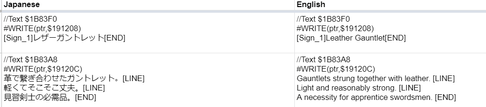

4. Most of the description in the menu can be translated using DeepL or Google Translate. In case of a doubt, you can ask in the specific [Discord channel](https://discord.com/channels/789882485029732363/789882485655339073) for advice (items, artes, enemies, etc.)

5. You can also add more columns to the right of column B if you want to have comments.  The next step is to reinsert these translations in a SLPS file we can use to test in the game.

### Creating a new SLPS file
1. Go inside the repo on your PC in `Tales-of-Destiny-DC/patch/SLPS/scripts`. You should have different `.bat` files  
   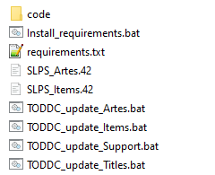
2. Double-click on the correct `TODDC_update_xxx.bat` based on what you've translated.  FOr exmple, I just translated one of the Unique items in the google sheet. I'll double-click on `TODDC_update_Items.bat`
3. After confirming that what you translated is inside this block, press Enter to continue.  For example, When I double-clicked on Items, I see that this script will update Unique items which contained my translation.  
   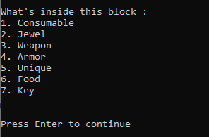
4. If all went well, the last step shown should be "Create the SLPS for this block":  
   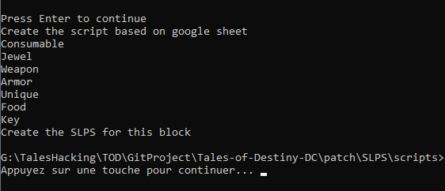

    What is happening under the hood is:
    - The script grabs the English text in the google sheet
    - It creates a text script to reinsert the text 
    - It creates the SLPS file using a tool called Atlas

5. You should know see a file called "SLPS_xxx.42" created in the same folder.  For example, since I used the script `TODDC_update_Items.bat`, a new file called `SLPS_Items.42` has been created  
   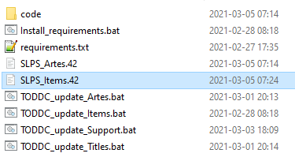

### Validating the Final Result
1. Open the PCSX2 emulator
2. Make sure you have the ISO inserted.  For these validations, we recommend using the original ISO (not patched)
3. Start the game using the new SLPS file
4. Under System, click on "Run ELF"  
   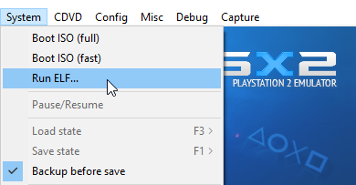
5. Make sure to select "All files" to see the new SLPS file  
   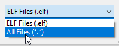

### Validation in the Game
1. Now you can validate your translation in the game to see if text looks good  
   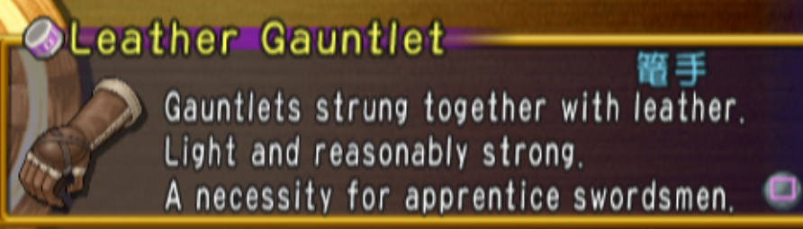
2. You might need to do some back and forth because if the text is too long on one line, the text might "squish" and the quality will decrease  
   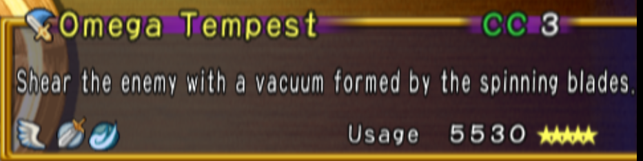
3. When this happens, you probably need to change some [LINE] and reduce the number of characters on a line.

### What happens after my validations are done?
When we re-insert text inside the SLPS file, the pointers are modified for the new text.  English text takes always more place than the Japenese one and we sometimes have issue when re-inserting the text because text might erase another part of the game. We now have a script to reinsert all the translation in the SLPS file used for the patch. The script is called `TODDC_update_All.bat`

1. If you run the script and you are able to see the step "Create the SLPS for this block" without any issues under it, it means the SLPS file has been generated without issue.  
   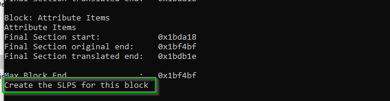
2. You'll find the SLPS file in the same directory with the name `SLPS_258.42`  
   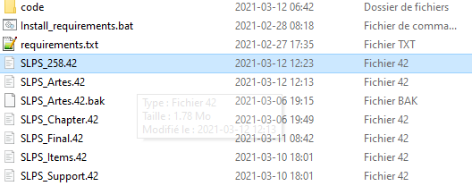

3. Now, the final step is to test this file and go look in different section of the game to see if the translations are correctly modified: 
- Artes
- Strategies
- Items
- Title
- Support

Just a quick look in these sections for 2-3 characters will be enough to detect weird issues with the text. You are looking for glitches or unexpected behavior. If you are unsure, if the file is correct, don't hesitate to send it in the general channel so other people can test it and approve.

Make a backup of the old file found in Tales-of-Destiny-DC\patch

If your file has been tested, you can copy the new `SLPS_258.42` file in the folder `\Tales-of-Destiny-DC\patch` (overwriting the current one).

