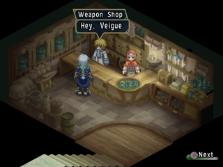
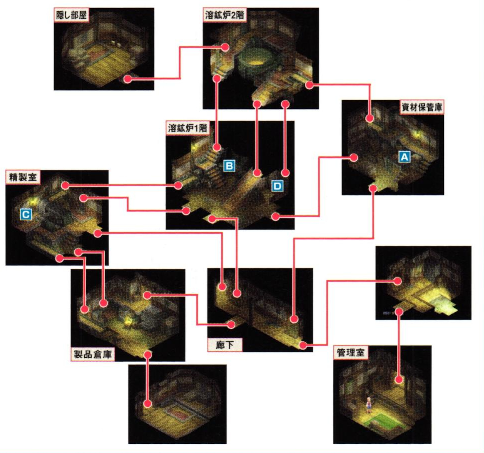
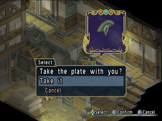
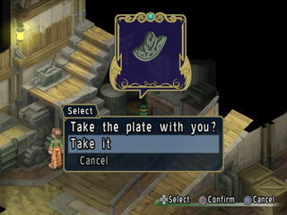
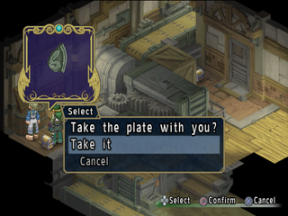
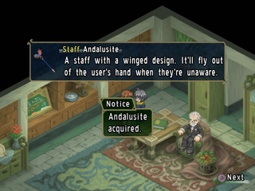
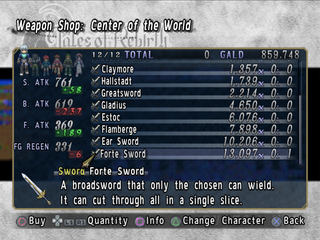

# Rebirth - Side-Quest Guide

## Side-Quest #001 - Monica and Steve

  

| | Weapon Shop in Sulz, etc. |
| :--------------------------------------------------------------------------------------- | :------------------ |
|  | ❶ Claire's kidnapping ~ Defeat of Saleh and Tohma at Callegea Castle (first time) |
|  | ❷ Claire joins you at Keketto Hostel ~ until you visit Scarabe's house in Belsas |
|  | ❸ First arrival at Shaorune's Azure Sanctuary ~ to mediation between Huma and Gajuma in Minal |
|  | ❹ During Aunt Poplar's peach pie party |
|    | Sword [Volsung], Title [Oblivious Matchmaker]    |

This event brings Veigue's neighbors, Monica and Steve, together, and if you make it to the end, you will receive the weapon [Volsung] for Veigue. This is a sub-event that can easily be missed, so be careful when it the different parts unlocks. The most problematic is the timing of the second and third visits to the Weapon shop. The second visit requires Claire (with Agathe inside), and the third visit requires Agathe (with Claire inside). In the third case, if Veigue goes out of control, Claire will leave the party, so you must go to Sulz before she does so. 

  
▲ Without Claire, the conversation with Steve would progress, but the conversation with Monica would not.

|  |  |  |
| :---------------------------------------------------------------------------------------: | ------------------ | ------------------ |
| ❶  | Claire's kidnapping ~ Defeat of Saleh and Tohma at Callegea Castle (first time) | Talk to Steve, the clerk at the Weapon Shop |
| ❶  | Claire's kidnapping ~ Defeat of Saleh and Tohma at Callegea Castle (first time) | Talk to Monica in front of the Meeting House |
| ❷ | Claire joins you at Keketto Hostel ~ until you visit Scarabe's house in Belsas (Phases 26-43) | Talk to Steve at the Weapon Shop |
| ❷ | Claire joins you at Keketto Hostel ~ until you visit Scarabe's house in Belsas (Phases 26-43) | Talk to Monica in front of the Meeting House |
| ❸ | First arrival at Shaorune's Azure Sanctuary ~ to mediation between Huma and Gajuma in Minal (Phases 44~51) | Talk to Steve at the Weapon Shop |
| ❸ | First arrival at Shaorune's Azure Sanctuary ~ to mediation between Huma and Gajuma in Minal (Phases 44~51) | Talk to Monica in front of the Meeting House |
| ❹ | During Aunt Poplar's peach pie party (Phase 53) | Talk to Steve or Monica during the party at Meeting House. |

  
▲ If the side-quest is done successful, Steve will give you the weapon [Volsung] during the peach pie party.

---

## Side-Quest #002 - Completionist

 

| | Minal Gymnasium |
| :--------------------------------------------------------------------------------------- | :------------------ |
|  | First time in Minal ~ |
|    | Accessory [Demon Spirit] and others (see list) |

The “Ex-Warrior” NPC in the Minal's gymnasium will give you items according to the number of enemies you catalogued in the Battle Book. The items he gives you, known as “XX Spirit,” are special gems that change Veigue's special [skills](https://aselia.fandom.com/wiki/ToR_-_Veigue_Lungberg:_Force). The “Earliest Period” in the table bellow indicates at what time you will receive the reward if you advance through the game (excluding enemies you fight in events) while keeping the completion of all enemies at 100.

■ Items you get from the Completionist

| Completion  | Reward           | Earliest Period     |
| ----------- | ---------------- | ------------------- |
| 5 Entries   | Step Boots       | Sulz Area           |
| 10 Entries  | Demon Spirit     | Alvan Mountains     |
| 20 Entries  | Apple Gel        | Petnadjanka Area    |
| 30 Entries  | Hurricane Spirit | Karez               |
| 40 Entries  | Regen Ore        | Babilograd Area     |
| 50 Entries  | Peach Gel        | Balka Area          |
| 60 Entries  | Camomile         | Razilda Area        |
| 70 Entries  | Tiger Spirit     | Pipista Area        |
| 80 Entries  | Grape Gel        | Kyogen Area         |
| 90 Entries  | Lavender         | Ocean               |
| 100 Entries | Shining Spirit   | Belsas Area         |
| 110 Entries | Comeback Gel     | Shrine of Gilione   |
| 120 Entries | Dragon Spirit    | Outer Yuris's Realm |
| 130 Entries | Sage             | Cyglorg's Chambers  |
| 140 Entries | Awakening Ore    | Cyglorg's Chambers  |
| 150 Entries | Chilling Spirit  | Cyglorg's Chambers  

---

## Side-Quest #003 - Mobile Library

 

---

## Side-Quest #004 - Mystery at the Iron Factory

 

| | Pennadjanka's Iron Factory |
| :---- | :------------------ |
|  | Defeat Berserk Eugene ~ Meet Sacred Beast Randgriz (Chapters 30~47) |
|    | Title [Great Detective] [Great Defective], Item [Elixir], 5000 Gald |

The Factory Manager asks you to help him solve the mystery of a mysterious phenomenon that is occurring in the factory. The investigation will lead to the collection of the original pieces of a brooch that will serve as the key to open a locked door in the factory. There are many steps to the process, so please refer to the flow chart. Be careful, because if you collect the wrong pieces, you will have to start all over again from the beginning.

▲If you talk to the workers in the image with Tytree as the onscreen character, you will see some interesting interactions.

| How to solve a mysterious case                                                                    |
| ----------------------------------------------------------------------------------------------------- |
| Go to the Office and talk to the Factory Manager                                                      |
| Go to the new worker's house and talk to him                                                          |
| Talk to all the workers in the factory, then go to the Corridor                                       |
| Choose “The suspicious location” as an option                                                         |
| Examine the hollow in the wall on the second floor of the blast furnace                               |
| Talk to the workers on the second floor of the blast furnace.                                         |
| Talk to all the workers on the second floor of the furnace.                                           |
| Go to the second floor of the blast furnace and examine the hollow in the wall.                       |
| Check the treasure chests A, B, C, and D and collect the pieces of the original plates.               |
| Talk to the workers on the first floor of the blast furnace and ask them to pour iron into the molds. |
| Give the mold to the worker in the Refining Room to make the [Lily Brooch].                           |
| Place the [Lily Brooch] in the hollow of the wall on the second floor of the blast furnace.           |  

  
▲[A] Treasure chest at the top of the material storeroom ladder.

  
▲[B] First floor of the blast furnace. Right in front of the stove.

  
▲[C] Against the wall, just behind one of the workers.

  
▲[D] Treasure chest on the second floor of the blast furnace, down the ladder

---

## Side-Quest #005 - Cat Lover

| | Residence near the south gate of Sunnytown |
| :---- | :------------------ |
|  | After arriving in Sunnytown |
|    | Titles [Traveler] [Wonders of the World] and others |

Cat Lover, an old man who lives in a house near the south gate, provides information related to Discoveries. He will give you hints on where the Discoveries are located, and if you find a certain number of Discoveries, he will give you titles as listed in the table below. However, in order to receive the title of [Traveler] or higher, you must give him one of the “ Lucky Cats” sold in the Minal, so buy one when you have enough money.

■Titles to be obtained

| Title                  | Condition                                               |
| ---------------------- | ------------------------------------------------------- |
| Traveler               | Finish listening to the initial talk.                   |
| Seven Stars Discoverer | Discover all the steles dedicated to the Sacred Beasts. |
| Adventurer             | More than 30 Discoveries found.                         |
| Experienced Explorer   | More than 40 Discoveries found.                         |
| Superb Adventurer      | More than 50 Discoveries found.                         |
| Wonders of the World   | All 64 Discoveries found.                                |

---

## Side-Quest #006 - Militsa and Hilda

 

| | Karez |
| :---- | :------------------ |
|  | Trial of the Sacred Beast Shaorune completed ~ Trial of the Sacred Beast Gilione completed. |
|    | — |

This event, which takes place in Karez, reveals a secret concerning Militsa's background. This event has a very short timespan, so go there as soon as you are able to ride Shaorune. Militsa is located where Karez's save point is. It is best to go there from Sunnytown side.

  
▲Climbing up the dry well, she finds Militsa. Anticipating a fight, Hilda quickly ducks, but...

---

## Side-Quest #007 - Kind Old Man

 

| | Climbers' Cavern |
| :---- | :------------------ |
|  | After defeating berserk Eugene. (Except during the journey to mediate around the world.) (Chapter 30 ~ 47, 51~) |
|    | Title [Kindhearted Gentleman], Gem [Life Emerald] |

When half-way through the Climber's Cavern, a Gajuma woman is stranded. Talking to her will trigger the event, so follow the step-by-step below. In the Climber's Caverns, combats will be triggered just by touching the smoke, but at this point your party should be strong enough to win easily. The [Holy Bottle] is ineffective, so proceed steadily while defeating the enemies. After receiving the [Nakako Ore] from the Iron Factory manager in Petnadjanka, go to Tytree and talk to the factory manager. It's not connected to the event, but you will know why Tytree knew about the [Nakako Ore].

| How to obtain the title [Kindhearted Gentleman]                        |
| ---------------------------------------------------------------------- |
| Head to where the child is trapped behind the iron grating door.       |
| Talk to Gajuma's mother at the door.                                   |
| Talk with the Iron Factory Manager at the Iron Factory in Petnadjanka. |
| Return to Climbers' Cavern and talk to the Gajuma's mother             |

  
▲After rescuing the child, a treasure chest is left in the room. Inside there's a [Life Emerald].

---

## Side-Quest #008 - Hack's Gratitude

 

| | Gibert's Home in Balka |
| :---- | :------------------ |
|  | Rescue Hack at Mesechina Cavern ~ Defeat Saleh and Tohma at Callegean Castle (first time) (Chapters 21 ~ 25) |
|    | Annie's Rod [Andalusite] |

The event in which Hack, who you repeatedly rescue, gives Annie her Rod, the [Andalusite] as a token of his appreciation. The locations and timing of these events are shown in the table below. If you see Hack after rescuing him, you can receive the weapon at any of the times shown in the table below. However, you can only receive the weapon once. After the second time, you will be asked if you have the weapon in your possession. No matter how you answer the question, it will not affect your future progress, and there is no need to keep the Andalusite itself. Even if it's a gift, you can inherit it onto another weapon.

| Location  | Timeline                     |
| ---------------- | ---------------------------- |
| Balka   | From the rescue from Mesechina Caverns until the completion of the trial of Eephon.          |
| Pipitsa   | After solving the riddle of the altar, until the appearance of the Sacred Shrine of Fenia.        |
| Razilda  | After hearing the story of "A tower which soars above a sea of clouds" in Razilda, until you leave the city. |
| Mesechina Cavern | Any time other than the above three periods, except after the appearance of Yuris's realm.         |

  
▲After Yuris's Realm appears, you will not be able to trigger the event. Get the Rod as early as possible.

---

## Side-Quest #009 - The Stele in Mesechina Caverns

  

| | Mesechina Caverns |
| :---- | :------------------ |
|  | Listen to the story of the flag at Razilda ~ until the completion of the trial of the Sacred Beast Eephon (first time) (Chapter 30~) |
|    | — |

After Veigue and his team found the Stele in Mesechina Caverns, Hack was assigned to decipher it. As time goes by, the decipherment progresses and the content gradually gets closer to the heart of the matter. The timing of the changes is shown in the table below, so it is a good idea to stop by from time to time and ask Hack about the contents. Be especially careful during Chapter 47, as it is a very short period of time. If Hack is not in the cave, a note will be left for you. The contents of the decipherment are written in the note, so check the Stele.

■Timing of changes in the deciphering content of steles.  

| Chapter | Specific Timing                                                                                                     |
| ------- | ------------------------------------------------------------------------------------------------------------------- |
| 30 \~ 31   | Listen to the story of the flag at Razilda \~ Completion of the trial of the Sacred Beast Eephon (first time)       |
| 35 \~ 41   | Encounter with Saleh in front of Razilda's inn \~ Completion of the trial of the Sacred Beast Wontiga                |
| 42 \~ 44   | First time in Belsas \~ Completion of the trial of the Sacred Beast Shaorune                                         |
| 45 \~ 46   | First time in Mocrado Village \~ Completion of the trial of the Sacred Beast Gilione                                 |
| 47      | Hearing information about the Island of Illusion from Franz \~ Encountering Sacred Beast Randgriz for the first time |
| 48      | After going on a journey to arbitrate around the world                                                              |

---

## Side-Quest #010 - Walto and Eugene

 

| | Callegea Castle Entrance in Balka |
| :---- | :------------------ |
|  | After arrival at Kyogen ~ until the end of the trials of the Sacred Beast Wontiga. (Chapters 36 ~ 41) |
|    | — |

When you try to enter Callegea Castle, Walto passes by and a conversation event with Eugene occurs. This is one of those side-quests that is easy to miss if you are proceeding normally with the main story, since it is during the time when you are in Kyogen or Nolzen, and since the duration of the event is short.

  
▲When you come to the position in the screenshot, the event begins. Note that it is not in front of Callegea Castle, where you get off the train.

  
▲Eugene does not explain himself to Walto. As the story progresses, we will know why.

---

## Side-Quest #011 - Auction

 

---

## Side-Quest #012 - Hilda's Fortune Telling

---

## Side-Quest #013 - New Weapons in Stock

| | Balka |
| :---- | :------------------ |
|  | After the apparition of Yuris's Realm (Chapter 55~) |
|    | New products in Various Shops |

If you visit Balka at the point where Yuris's Realm appears, Tytree will suggest that it is time to change weapons. After the event, several stores will have new merchandise. You can buy the best quality equipment, so be sure to stop by.

  
▲In the Weapon Shop “Center of the World”, which can be reached by train, all weapons and armor can be purchased.

■Accessories Shop New Items  

| Item Name       | Category    | Price |
| --------------- | ----------- | -----: |
| Feat            | Gems        | 8252  |
| Heal Emerald    | Gems        | 8784  |
| Force Emerald   | Gems        | 8890  |
| Mighty Emerald  | Gems        | 9583  |
| Charge Emerald  | Gems        | 9369  |
| Mystic Emerald  | Gems        | 10648 |
| Delay Charm     | Accessories | 1500  |
| Weak Charm      | Accessories | 2500  |
| Poison Charm    | Accessories | 1500  |
| Freeze Charm    | Accessories | 2500  |
| Paralysis Charm | Accessories | 2000  |
| Panic Charm     | Accessories | 2000  |
| Earth Bracelet  | Accessories | 2500  |
| Gale Bracelet   | Accessories | 1500  |
| Flare Bracelet  | Accessories | 2500  |
| Aqua Bracelet   | Accessories | 1500  |
| Light Bracelet  | Accessories | 2000  |
| Dark Bracelet   | Accessories | 2000  |

■Item Shop: City Comrades New Item  

| Item Name | Category | Price |
| --------- | -------- | ----- |
| Grape Gel | Item     | 2000   |

■Weapon Shop New Item  

| Item Name       | Category | Price |
| --------------- | -------- | -----: |
| Ear Sword       | Veigue   | 10415 |
| Forte Sword     | Veigue   | 13365 |
| Platinum Tonfas | Mao      | 12150 |
| Forte Tonfas    | Mao      | 15795 |
| Scythe          | Eugene   | 8680  |
| Forte Spear     | Eugene   | 18225 |
| Grand Scepter   | Annie    | 13015 |
| Forte Staff     | Annie    | 17010 |
| Mithril Arms    | Tytree   | 9545  |
| Forte Arms      | Tytree   | 12150 |
| Shining Cards   | Hilda    | 11280 |
| Forte Cards     | Hilda    | 14580 |

■Armor Shop New Item  

| Item Name      | Category | Price |
| -------------- | -------- | -----: |
| Platinum Armor | Veigue   | 9400  |
| Forte Armor    | Veigue   | 12150 |
| Prism Jacket   | Mao      | 7955  |
| Forte Jacket   | Mao      | 10125 |
| Platinum Mail  | Eugene   | 10845 |
| Forte Mail     | Eugene   | 14175 |
| Prism Cloak    | Annie    | 7230  |
| Forte Cloak    | Annie    | 15185 |
| Platinum Plate | Tytree   | 10125 |
| Forte Plate    | Tytree   | 13160 |
| Prism Robe     | Hilda    | 8680  |
| Forte Robe     | Hilda    | 11135 |

---

## Side-Quest #014 - Secret Diary

---

## Side-Quest #015 - Weapon Upgrade Craze?

---

## Side-Quest #016 - Thick Curtains

---

## Side-Quest #017 - Donel Again

---

## Side-Quest #018 - Girl with the Force of Feathers

---

## Side-Quest #019 - Gem Collector Lady

---

## Side-Quest #020 - Salvage

---

## Side-Quest #021 - Sneak-peek Katz

---

## Side-Quest #023 - Hidden Rabbitz

---

## Side-Quest #024 - Movie Rabbitz

  

---

## Side-Quest #025 - Game Over Katz

  

---

## Side-Quest #026 - Reuniting with the Beauties

---

## Side-Quest #027 - Special Recipes

---

## Side-Quest #028 - Gourmand
