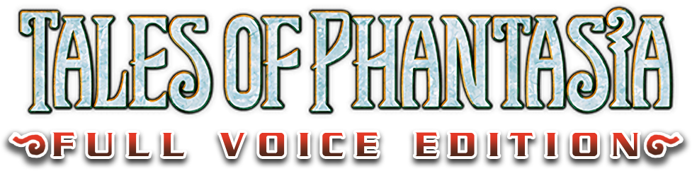

# Tales of Phantasia - Full Voice Edition 

Should I play this or Cross Edition? Play this version if you prefer the slower-paced battle system of the PSX version and don't want the extra Rondoline content. Otherwise, play Cross Edition.

Check out this project for the PSP here:  
https://github.com/lifebottle/Tales-of-Phantasia-Full-Voice-Edition

The online patcher here:  
https://www.lifebottle.org/projects/topfve/patcher/

- **Project Managers**
  - mziab
  - Pegi

- **Project Coordinator**
  - Dragonbleapiece

- **Lead Programmer**
  - mziab

- **Programmers**
  - Ethanol
  - Julian

- **Main Translator**
  - Goodguy3

- **Translators**
  - Mine
  - SymphoniaLauren
  - Pegi
  - mziab

- **Lead Editors**
  - mziab
  - Dragonbleapiece

- **Editors**
  - Kevan
  - gatordski
  - yoh
  - Khayyaam
  - FlamePurge

- **Graphic Artists**
  - Amarant
  - FlamePurge
  - WilliamTBOG
  
- **Pre-production Information Gathering**
  - Kevan

- **Lead Localization QA**
  - Dragonbleapiece

- **Lead Functional QA**
  - DobleC

- **Translation Feature Consultation**
   FlamePurge

- **QA Testers**
  - Kevan
  - flynnforthewin
  - Nanika
  - getterdrill
  - Torasouls
  - Flamepurge
  - dotaxis
  - ryuza
  - Trixarian
  - Negi
  - bobwhite
  - edgarfigaro
  - gatordski
  - Explorer

- **Original PSX Script and Translated Assets**
  - Phantasian Productions

  **Logo**
  - TheGershon
