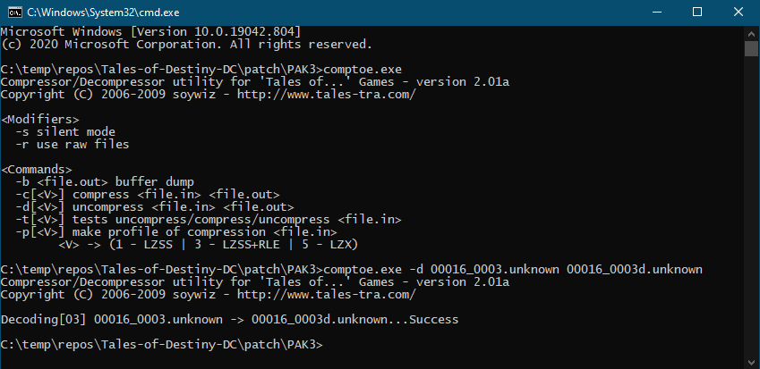
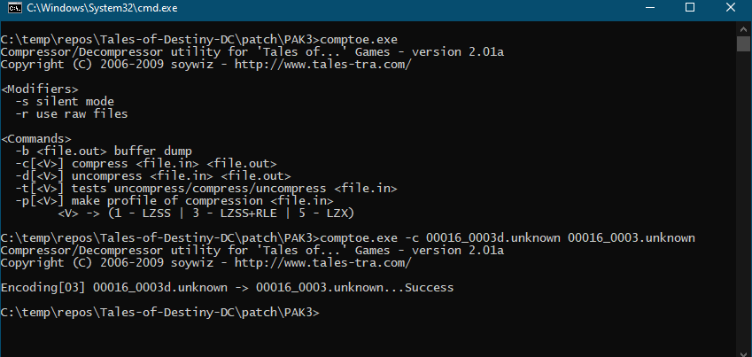

# Compto(e)
While `compto(e)` is rarely used on its own, it is usually required where `pakcompose` or `sceWork` fails to decompress files.  A good example is `*.unknown` files (without the "d" before the dot.  The "d" before .unknown probably means "decompressed", so if you don't see the "d", you can try using `compto(e)`.

## Example: Tales of Destiny DC
After unpacking 00016.pak3 with pakcomposer.exe, you have 4 files

1. `00016_0000d.unknown` (Battle text, e.g., BLAST CALIBER)
2. `00016_0001d.unknown`
3. `00016_0002d.unknown`
4. `00016_0003.unknown` (Enemy names, compressed)

To edit the enemy names, use the following command to decompress 00016_0003.unknown:
```cmd
comptoe.exe -d 00016_0003.unknown 00016_0003d.unknown
```


Edit `00016_0003d.unknown` with your favorite hex editor and save as usual

When repacking, make sure to compress `00016_0003d.unknown` back to `00016_0003.unknown` first:
```cmd
comptoe.exe -c 00016_0003d.unknown 00016_0003.unknown
```

Once `00016_0003.unknown` is compressed again, move `00016_0003d.unknown` out of the folder before repacking PAK3 files.

