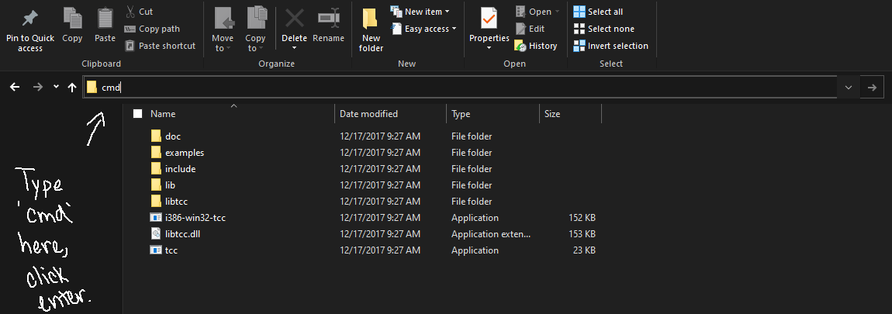
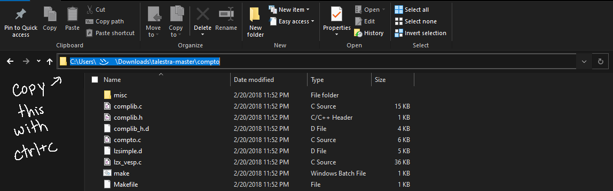
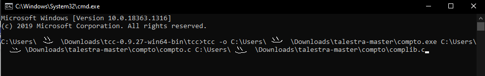
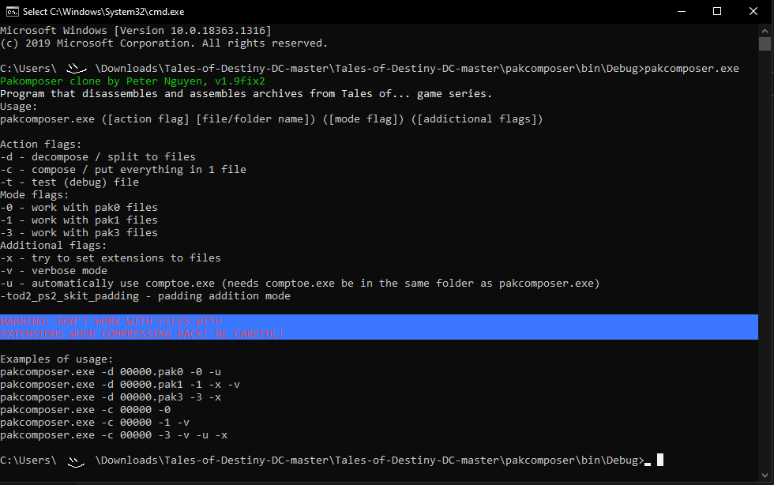

# Compto(e)
While `compto(e)` is rarely used on its own, it is usually required where `pakcompose` or `sceWork` fails to decompress files.  A good example is `*.unknown` files (without the "d" before the dot.  The "d" before .unknown probably means "decompressed", so if you don't see the "d", you can try using `compto(e)`.

## Example Usage: Tales of Destiny DC
After unpacking 00016.pak3 with pakcomposer.exe, you have 4 files

1. `00016_0000d.unknown` (Battle text, e.g., BLAST CALIBER)
2. `00016_0001d.unknown`
3. `00016_0002d.unknown`
4. `00016_0003.unknown` (Enemy names, compressed)

To edit the enemy names, use the following command to decompress 00016_0003.unknown:
```cmd
comptoe.exe -d 00016_0003.unknown 00016_0003d.unknown
```


Edit `00016_0003d.unknown` with your favorite hex editor and save as usual

When repacking, make sure to compress `00016_0003d.unknown` back to `00016_0003.unknown` first:
```cmd
comptoe.exe -c 00016_0003d.unknown 00016_0003.unknown
```

Once `00016_0003.unknown` is compressed again, move `00016_0003d.unknown` out of the folder before repacking PAK3 files.


## Compile Compto(e)
For this file, you will need to use [tinycc](https://download.savannah.gnu.org/releases/tinycc/) to compile it.  Get the files from the repository here: https://github.com/lifebottle/comptoe

Go to wherever you have `tinycc` stored on your computer. In the file browser at the top, type in `cmd` and click enter. This will open command prompt at the folder where `tinycc` is.



Then, go to where you have the comptoe repository stored on your computer and copy the link to the directory where the files `compto.c` and `complib.c` are located.



Now, in the command prompt that you opened

1. Type `tcc -o`
2. Paste the address of the directory that you copied, and add `.exe` to the end of it. This will be the target location of the file that we are building.
3. Paste the address of the directory that you copied, and append `\compto.c` to the end of it. Paste the address again and append `\complib.c` to the end of it. This tells tinycc what files are being used to compile our executable.

If you follow these instructions, the result should look something like this:



Then, press enter to build the file (you will probably get and error message like `__declspec redefined` but ignore it).

You should then have the file `comptoe.exe` in the root of your repository. Copy it into the same directory as `pakcomposer.exe` (if needed).

To use these programs, go to where you have `pakcomposer.exe` and `comptoe.exe` stored and type `cmd` in the file directory to access command prompt. Then type in the name of the executable that you want to use.

